# 1 深度强化学习简介

> 原文：<https://medium.com/mlearning-ai/1-an-introduction-to-deep-reinforcement-learning-c5ab792af013?source=collection_archive---------5----------------------->

这是我总结 Sergey Levine 教授的讲座系列文章的第一篇，所有的荣誉都归功于他。所有图片均取自他的讲座。

一方面，强化学习为专注于基于学习的决策的算法设计提供了一种数学形式。另一方面，深度学习提供了严重过度参数化的模型，这些模型将复杂的输入映射到输出，并允许我们处理现实世界的非结构化、不可预测的本质。

一些强化学习术语。我们可以将策略表示为基于观察的动作分布；状态满足马尔可夫性质，即 t + 1 时刻的状态独立于 t — 1 时刻的状态；另一方面，观测值是状态的某个随机函数，它可能包含也可能不包含推断完整状态所需的所有信息，并且它不满足马尔可夫性质。

在强化学习中，我们通过称为奖励函数的东西来定义目标:它是状态和动作的标量值函数，尽管有时它可能只依赖于状态。至关重要的是，强化学习的目标不仅仅是采取现在有高回报的行动，而是采取以后会带来更高回报的行动。状态、行动、回报和转移概率一起定义了我们所说的马尔可夫决策过程。让我们逐步建立马尔可夫决策过程的完整形式定义

*   马尔可夫链有一个非常简单的定义:它由一组状态 s 和一个转移函数 t 组成。状态空间就是一个集合，它可以是离散的，也可以是连续的。转移函数表示以时间 t 的状态为条件的时间 t + 1 的状态的概率

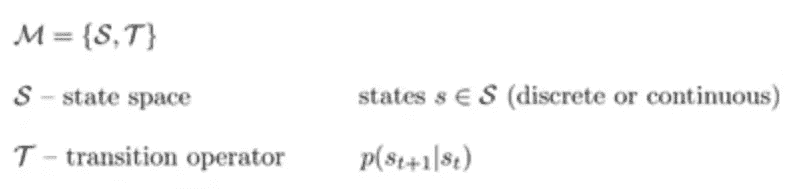

*   马尔可夫链本身不允许我们指定一个决策问题，因为没有行动的概念。因此，为了走向行动的概念，我们需要将马尔可夫链转变为马尔可夫决策过程，这增加了行动空间和奖励函数。动作空间和状态空间一样，也是一个离散或连续的集合。我们的转移概率现在取决于状态和动作，所以转移算子现在是张量，因为它有三个维度:下一个状态、当前状态和当前动作。部分观察的马尔可夫决策过程进一步增加了两个附加对象的定义:观察空间 o 和发射概率 e。

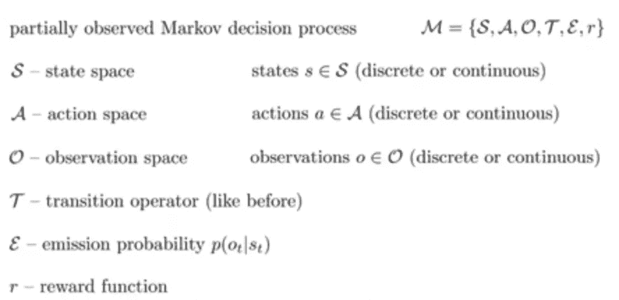

让我们为强化学习定义一个目标。我们将学习 **π** θ，其中 **π** 对应于策略，θ对应于作为策略的深度神经网络的参数。状态进入政策，行动出来，然后状态和行动进入转移概率——基本上是统治世界的物理学，它产生下一个状态。在这个过程中，我们可以写下轨迹的概率分布，轨迹是状态和动作的序列

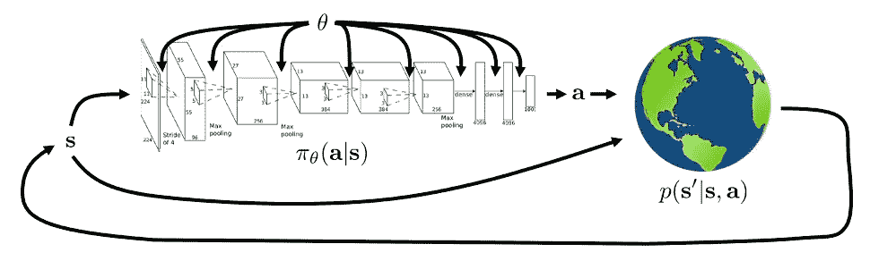

如果我们写下我们的状态和行为的联合分布，我们可以根据我们已经定义的概率分布，用链式法则来分解它。

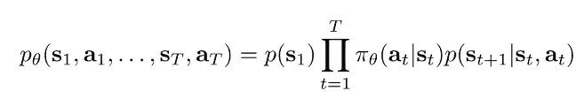

我们有一个初始状态分布 p(s1 ),然后我们有一个给定 s(t)的动作概率与给定 s(t)和 a(t)的下一个时间步 s(t+1)的转移概率的乘积。定义了轨迹分布后，我们实际上可以定义强化学习的目标，我们可以将该目标定义为轨迹分布下的期望值。目标是找到定义我们政策的参数θ，以便在轨迹上最大化总回报的期望值；所以，我们想要一个政策，它能产生在期望中有最高回报的轨迹，当然，期望考虑了政策的随机性，转移概率和初始状态分布。

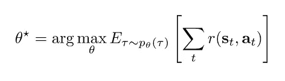

关于这种结构分布的因子分解，我们可能会注意到的一件事是，尽管它是根据我们在马尔可夫决策过程中拥有的对象来定义的，但它也可以被解释为马尔可夫链。为此，我们需要定义一种增广的状态空间。我们的原始状态空间是 s，但我们也有行动，使这成为一个马尔可夫决策过程；我们知道，基于策略，动作依赖于状态，因此，给定状态的策略允许我们根据状态得到动作的分布。因此，我们可以将状态和动作组合成一种扩充状态，现在这些扩充状态实际上形成了一个马尔可夫链:

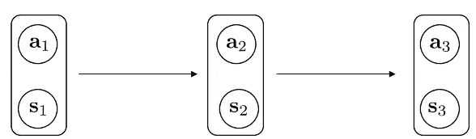

因此，这个增广马尔可夫链中的转移算子仅仅是马尔可夫决策过程中的转移算子和策略的乘积。

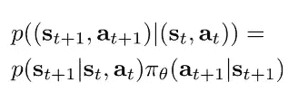

这可以让我们以稍微不同的方式定义目标，以便在我们后面的推导中使用

## 有限时域情况

到目前为止，我已经将目标定义为奖励总和的轨迹分布下的期望值，但请记住，我们的分布实际上遵循具有这一增广空间的马尔可夫链——而这一转移算子是 MDP 转移和政策的产物。所以我们也可以用线性期望来写目标，作为在那个时间步的回报的马尔可夫链中，在状态-行动边际下的期望值随时间的和。

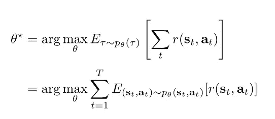

这只是用期望的线性度，把和从期望中去掉，这样你就有了一个超过期望 T 的和。然后，由于期望中的东西只依赖于状态和动作，我们可以将所有其他变量边缘化。如果我们想把它扩展到无限视界的情况，这证明是非常有用的。

## 无限地平线情况

如果 T 等于无穷大会怎么样？首先发生的是你的目标可能变得不明确。为了防止目标变得无限，有几种方法。一种方法是使用平均回报公式:你用预期回报的总和除以资本 t。

使目标有限是很容易的，但是让我们来谈谈如何定义一个无限的视野目标。我们有以前的马尔可夫链，我们的增广马尔可夫链有一个转移算子。这意味着，我们可以将向量 state(t+1)、action(t+1)写成在时间步长 t 应用于 state 和 action 的线性运算符。更一般地说，我们可以向前跳过 k 个时间步长，我们可以说:

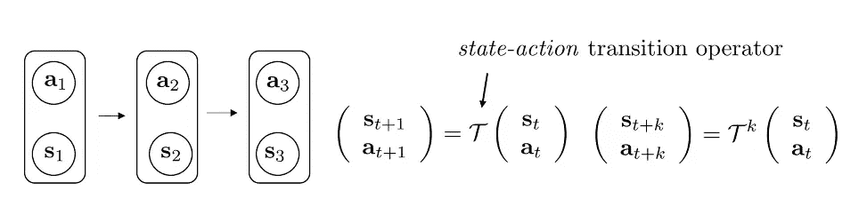

我们可以问的一个问题是:当小 k 趋于无穷大时，状态-行动边际 p(s(t)，a(t))收敛到平稳分布吗？如果这是真的，这意味着我们应该能够将平稳分布μ写为等于 t 乘以μ——在一些技术假设下，即遍历性(每个状态都可以从非零概率的每个其他状态到达)和链是非周期性的，我们实际上可以证明平稳分布的存在。

“平稳”是指过渡前后分布相同；如果这是真的，那么应用线性算子足够的次数将最终允许你达到它。

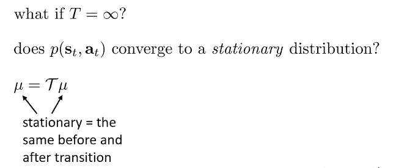

您可以简单地通过重新排列该等式来求解平稳分布，使其等于:

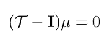

找到μ的一种方法是找到 T 定义的矩阵的特征值为 1 的特征向量，所以μ是 T 的特征值为 1 的特征向量，它总是存在于遍历性和非周期性假设下。如果我们知道，如果我们向前运行这个马尔可夫链足够多次，最终它会稳定在μ，这意味着当 t 趋于无穷大时，这个超过边际期望值的总和会被平稳分布项所支配。所以，你有一些有限数量的项，最初不在平稳分布中，但是你有无限多的项，非常非常接近平稳分布。这意味着一旦你放入平均回报的例子，然后当 t 趋于无穷大时取极限，极限基本上就是平稳分布下回报的期望值。这允许我们定义一个强化学习的目标，在无限地平线的情况下，当 t 趋于无穷大时。

## 期望和随机系统

强化学习实际上是优化期望值，所以尽管我们在选择导致高回报的行为方面谈论强化学习，我们总是真正关心回报的期望值。关于期望值的有趣的事情是，在相应分布的参数中，它们可以是连续的，即使我们取期望值的函数本身是高度不连续的。这对于理解为什么强化学习算法可以使用平滑优化方法(如梯度下降)来优化看似不可微的目标(如游戏输赢的二进制奖励)非常重要。

例子:让我们想象一下，你正开车走在山路上，如果你留在路上，你的奖励是+1，如果你掉下路，奖励是-1。这里的回报函数似乎是不连续的，如果你试图优化回报函数，例如，汽车的位置，优化问题不能真正用基于梯度的方法解决，因为回报不是连续的，更不是汽车位置的可微函数。但是，如果你有一个参数为θ的伯努利随机变量(以概率θ你掉了，以概率 1-θ你没掉)，报酬相对于 *π* θ的期望值实际上在θ中是光滑的。

这是一个非常重要的性质，它会一次又一次地出现，并真正解释了为什么强化算法可以优化看似不光滑甚至稀疏的回报函数:在可微和光滑概率分布下，非光滑和不可微函数的期望值本身是光滑和可微的。

## 价值函数

对于设计强化学习算法和从概念上思考强化学习目标来说，值函数都是非常有用的数学对象。正如我前面提到的，强化目标可以定义为关于轨迹分布的期望奖励总和，或者等价地，每个状态-行动边际的期望奖励随时间的总和。对于这个期望，我们可以做的一件事是，我们可以递归地写出来:

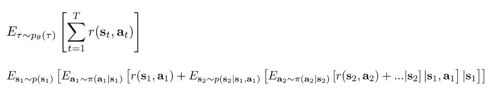

我们可以应用链式法则，写出一系列嵌套期望的分布期望值。这里最外层的期望是 s1 的概率。在它里面，我们有一个根据策略分布的关于 a1 的期望值(a1 给定 s1 的概率)。因为我们对 s1 和 a1 都有期望，我们可以放入第一个奖励 r(s1，a1)并注意到这个内在的期望，超过 a1 的那个，是以 s1 为条件的。除此之外，我们还增加了所有其他的奖励，但这些奖励需要在 s2 上加入另一个期望值，根据 p(s2|s1，a1)分布；在这里面，我们有另一个根据策略分布的对 a2 的期望(给定 s2，a2 的概率)。因为我们既有 s2 又有 a2，我们可以放入奖励并继续其他期望。

我们可以考虑的一件事是:如果我们有一些函数，告诉我们第二个期望的内容，会怎么样？让我们为此定义一个符号，比如说 Q(s1，a1):

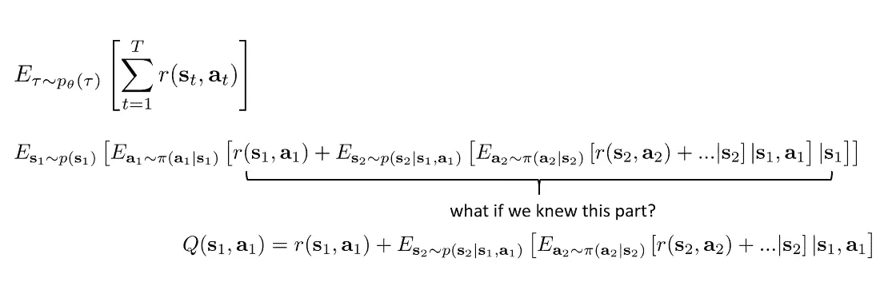

关于这个定义的重要一点是，如果你知道 Q(s1，a1)，那么在第一时间步优化策略将是非常容易的。

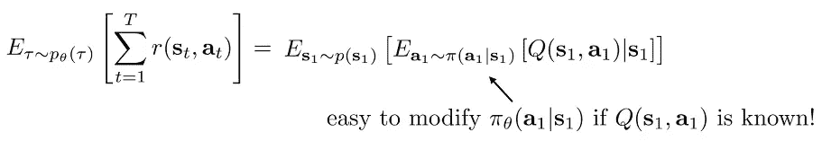

这个基本思想可以扩展到一个更一般的概念:Q 函数。

Q 函数可以在其他时间步长定义，而不仅仅是时间步长 1。定义是:

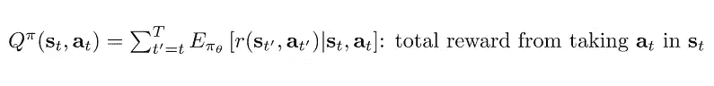

我们还可以定义一个密切相关的量，称为价值函数，它的定义方式大致相同，只是它只取决于一种状态，而不是一种状态和一种行为:

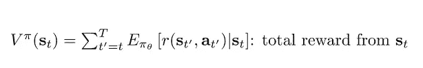

价值函数也可以写成 Q 函数作用下的期望值，因为如果 Q 函数告诉你从(st，at)开始时的期望总回报，那么对 at 取其期望值就会得到从 st 开始时的期望总回报:

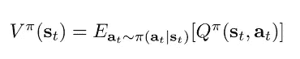

我们可以进行的一个观察是，状态 s1 的价值函数的期望值是强化学习目标的全部。

## 使用 Q 函数和值函数

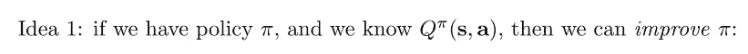

如果我们有一个策略，并且我们可以计算出它的完整 Q-函数，那么我们可以改进这个策略，例如通过选择一个新的策略，如果一个给定的动作是 Q 函数的 argmax，那么这个新的策略给这个动作分配一个概率 1。

直觉是，如果 Q 函数大于价值函数，那么行动优于平均水平。因此，您可以修改策略，以增加 Q 函数下的值大于该状态下的值的动作的概率。

## 算法的类型

我们将讨论的 RL 算法通常会优化我之前定义的 RL 目标:

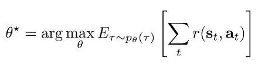

策略梯度算法试图直接计算该目标相对于θ的导数，然后使用该导数执行梯度下降过程。

基于值的方法估计最优策略的值函数或 Q 函数，然后使用这些值函数或 Q 函数来改进策略。通常，纯粹基于值的函数甚至不直接表示策略，而是将其隐式表示为类似于 Q 函数的 argmax。

演员-评论家方法是两者的一种混合。他们学习 Q 函数或价值函数，然后使用它来改进政策，通常是通过使用它们来计算更好的政策梯度

基于模型的强化学习算法将估计转换模型。他们会估计一些转移概率 T 的模型，然后他们要么直接使用转移模型进行规划，而不需要任何明确的政策，要么使用转移模型来改进政策。

如果我们考虑每个 RL 算法由三个组件组成，这就是各种算法相对于这些组件的不同之处:

*   生成样本(运行策略)
*   拟合模型/估计回报。**基于模型的算法**在给定状态(t)和动作(t)的情况下，为状态(t+1)的概率学习某种模型。**基于价值函数的算法**适合价值函数或 Q 函数的一些估计。**政策梯度算法**通过将首次展示期间获得的奖励相加，估算出每个轨迹的总奖励。**演员评论家算法**也适合价值函数或 Q 函数，就像基于价值的方法一样。
*   完善政策。**基于模型的算法**有不同的选项。一种选择是直接使用学习到的模型进行规划；另一种选择是使用学习的模型通过反向传播计算奖励函数相对于策略的导数；另一种选择是使用学习模型来学习价值函数，然后使用该函数来改进策略。**基于价值函数的算法**只需选择策略作为 Q 函数的 argmax。**策略-梯度算法**使用预期奖励值的梯度对θ采取梯度上升步骤。**基于价值函数的算法**在策略上采取梯度上升步骤，利用价值函数或 Q 函数来获得更好的估计。

## 算法之间的权衡

这些算法有许多权衡，将决定哪一个在您的特定情况下最适合您。

*权衡 1。*不同算法之间的一个重要权衡是样本效率，也就是说:当你在环境中生成样本时，你需要多少样本才能得到一个好的策略？

*权衡 2。*另一个权衡是稳定性和易用性:强化学习算法可能相当复杂，需要权衡许多不同的参数。如何收集样本，如何探索，如何拟合模型，如何拟合价值函数，如何更新策略。这些权衡和选择通常会引入额外的超参数，有时很难针对您的特定问题进行选择。

不同的方法也会有不同的假设，例如:它们处理随机环境还是只能处理确定性环境？它们是处理连续的状态和动作，还是只能处理离散的动作和离散的状态？他们是处理偶发问题，还是处理 t 趋于无穷大的无限地平线问题？

在某些设置中，即使环境的物理特性非常非常复杂，表示策略也可能更容易，而在其他设置中，学习模型可能比直接学习策略更容易。这些权衡中的每一个都会涉及到一些设计选择。例如，您可能会选择一个样本效率不是很高的算法，以获得更容易使用的东西，或者可能是为了获得可以处理随机和部分观察到的问题的东西。或者，您可能会选择一种非常高效的算法，因为您的样本非常昂贵，但也愿意接受一些其他限制，例如仅允许离散操作。

## 样本效率

样本效率指的是我们需要多少样本来获得一个好的策略，基本上就是我们需要从我们的策略中抽取多少次样本，直到我们能够使它表现良好。在确定算法的样本效率时，最重要的问题之一是该算法是否是所谓的非策略算法。

off policy 算法是一种可以通过使用以前收集的样本来改进策略的算法，而 onpolicy 算法必须在每次策略稍有变化时丢弃所有样本，并生成新的样本。由于这个原因，on 策略算法的效率可能会低很多

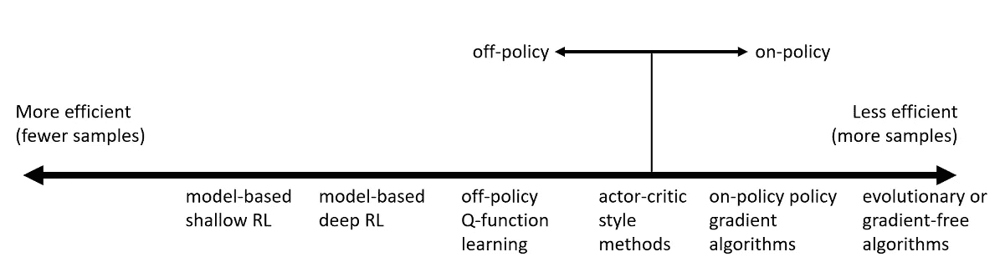

为什么我们要使用右边的算法呢？因为还有其他的权衡因素。例如，挂钟时间(算法需要的计算量)与样本效率不同。因此，为您的应用生成样本可能实际上非常便宜，在这种情况下，您可能不太关心样本效率，有趣的是，这些算法的挂钟时间经常翻转，因此，如果您的仿真非常便宜，您可能会发现频谱右端的东西计算成本较低，而频谱左端的东西计算成本高得多。

## 稳定性和易用性

当谈到稳定性和易用性时，我们可能会问这样的问题:我们的算法是否收敛，也就是说，如果我们运行它足够长的时间，它是否能保证最终收敛到一个固定的解决方案，或者它会保持振荡或发散？如果它收敛了，它会收敛到什么？它收敛到 RL 目标的局部最优还是任何其他明确定义的目标的局部最优？而且每次都会收敛吗？

在强化学习中，收敛算法是一种罕见的奢侈品，我们在实践中使用的许多方法通常不能保证收敛。其原因是强化学习通常不是纯梯度下降:许多强化算法实际上是定点算法，仅在非常简化的表格离散状态假设下具有收敛保证，这在实践中通常不成立。并且在理论上，许多最流行的 RL 算法(例如 Q 学习算法)的收敛性实际上是一个公开的问题

值函数拟合是不动点迭代。在最好的情况下，它将误差拟合最小化，并将所谓的贝尔曼误差最小化，这与预期报酬不同。在最坏的情况下，它不会优化任何东西，并且许多流行的深度强化学习值拟合算法不能保证在非线性情况下收敛到任何东西(在使用神经网络的情况下

在基于模型的 RL 中，模型使拟合误差最小化，这肯定会收敛到一个好的模型，但是不能保证一个好的模型会导致更好的策略。

政策梯度是唯一一个实际上在真实目标上执行梯度上升的方法，但是正如我所说的，它是所有方法中效率最低的。

## 假设

许多 RL 算法的一个常见假设是完全可观测性，这意味着您可以访问状态而不是观察值。这是大多数价值函数拟合方法通常假设的。它可以通过添加类似递归和记忆的东西来缓解，但一般来说，这可能是一个挑战。

另一个常见的假设是情景学习:代理人进行一次尝试，然后重置，然后进行另一次尝试。因此，这种重置和反复尝试的能力通常由纯策略梯度方法来假设，尽管大多数基于价值的方法在技术上并不假设，但当这种假设得到满足时，它们往往会工作得最好。一些基于模型的 RL 算法也是这样假设的。

另一个常见的假设是连续性或平滑性。这是由一些连续值函数学习方法假设的，并且通常由从最优控制导出的基于模型的 RL 方法假设，这些方法实际上需要连续性或平滑性才能很好地工作。

看看下一篇文章，是关于政策梯度的！

*随时给我留言或:*

1.  通过[LinkedIn](https://www.linkedin.com/in/samuele-bolotta-841b16160/) 和 [Twitter](https://twitter.com/SamBolotta) 联系我
2.  跟着我上[媒](/@samuelebolotta)

 [## Mlearning.ai 提交建议

### 如何成为 Mlearning.ai 上的作家

medium.com](/mlearning-ai/mlearning-ai-submission-suggestions-b51e2b130bfb)