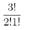
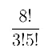
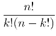

# 1.排列、配置、组合

> 原文：<https://medium.com/mlearning-ai/1-permutation-disposition-combination-c984e263b5ac?source=collection_archive---------3----------------------->

Orange and Red Nebula

在这篇文章中，我们将看到:

*简单排列*

*重复排列*

*单纯的性格*

*重复配置*

*简单组合*

*二项式系数*

考虑到:

n =元素

k =可用位置

# **简单排列**

当有 n 个可能的空间和 n 个元素时，我们有了这个排列。

例如，如果我在领奖台上有 7 个位置和 7 匹马，每匹马都将到达其中一个位置。我如何计算所有可能的组合？

我可以取 7(马)，计算 7 的阶乘。

那就是均值= 7 * 6 * 5 * 4 * 3 * 2 * 1。阶乘用！。所以 7！。

为什么？

每匹马都可以到达任何位置:

1.  第一个可以被所有的七匹马占据。
2.  第二个可以被六匹马占据，因为一匹已经在第一个位置了。
3.  第三个位置可以被 5 匹马占据，因为第一个位置有一匹马，第二个位置有一匹马。
4.  ….

这些是简单的排列！相当简单！目前…

# **重复排列**

但是如果我有重复的元素，我该怎么做呢？

例如，我有三个弹珠，两个黄色和一个红色。两个黄色弹珠占据的两个位置是相同的。

这种情况下怎么算？

对 3 颗弹珠做 3 的阶乘，除以每组弹珠的阶乘，在这种情况下是 2！1!两黄一红。

Factorial 3 divided by factorial2 * factorial1

# **简单处置**

当我想订购比可用位置更多的元素时。例如，如果我想在 7 个位置排列 3 个元素。我们做与简单置换相同的事情，但只针对要求的位置，在这种情况下:7 x 6 x 5。

# **重复处置**

当结果每次都可以重复的时候，比如我们扔骰子的时候。每次可能的数字都是一样的，从 1 到 6。

考虑到五次投掷，可能的结果是 6⁵.

n = 6(可能的元素)

k = 5(午餐次数)

# **简单组合**

在这种情况下，我们不得不考虑一组元素 n。

群体的每一个元素都是不同的。

所以我们想说这个组中所有可能的组合，由 8 个元素组成，只包含 3 个元素。考虑到每个元素都是唯一的，一个群不可能存在同一个元素，两个元素相同但位置不同的群就是同一个群。例如，考虑:

{a，b，c，d，e，f，g，h}所以 n = 8

我必须计算由 3 个元素组成的每个子集。

{a，b，c}和{c，a，b}是同一个集合。

我该如何继续？

Factorial 8 divided by factorial3 * factorial5

# **二项式系数**

那是什么？

计算从 n 个元素开始的 k 的子集，基本上它可以进行简单的组合，这和我们之前用过的公式一样。

Binomial Coefficiet formula

你不记得 n 和 k 是什么了吗？回到文章的开头！

 [## Mlearning.ai 提交建议

### 如何成为 Mlearning.ai 上的作家

medium.com](/mlearning-ai/mlearning-ai-submission-suggestions-b51e2b130bfb)