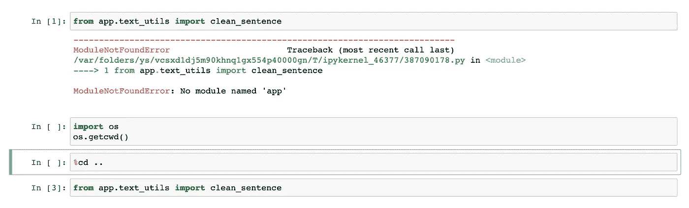
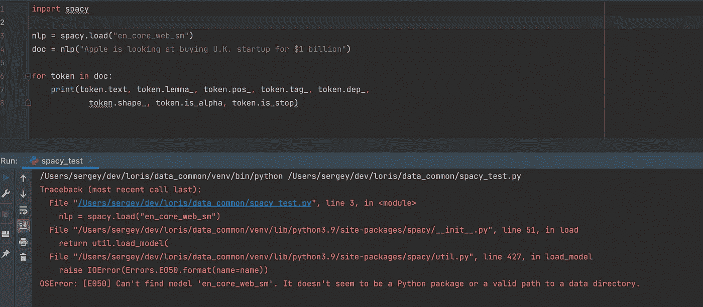

# #1 Python ML 开发技巧

> 原文：<https://medium.com/mlearning-ai/1-python-ml-dev-tricks-e1a29ee3f709?source=collection_archive---------0----------------------->

Pip 像 NPM 一样安装|笔记本电脑的符号链接|空间

我不时收集一些我喜欢分享的小妙招。大多数情况下，实际的解决方案已经存在于互联网的某个地方，但是解决方案的第一步是承认存在一个实际的问题，对吗？这个博客远远超过了我的 Evernote 笔记，公开了我的建议！

坐下来，因为你刚好赶上每周一次的代码治疗。


Jerry has issues, and so do you

你是否厌倦了通过 **pip** 安装依赖项，然后手动将**版本号**添加到 **requirements.txt** 中？

你是否有许多 **Jupyter 笔记本**到处乱放，但是由于 python 的**导入上下文中断**而不敢**将它们藏在子文件夹**中？

你是否曾经安装了 **Spacy** 而不得不**单独安装 en_core_web_sm** ？如果你在**生产**中需要这种能力呢？

# 1.NPM 一直都有

每个社区都有重要的经验可以借鉴。几年前，我涉足了全栈开发，尝试了 Node.js 和 NPM。NPM 是 Javascript 的 pip，也就是软件包经理。NPM 惯例是有一个 **package.json** 文件保存你的项目使用的各种库依赖版本(一个 requirements.txt 等价物)。开发人员通常不会手动编辑这个文件。那你怎么更新它呢？

```
npm install library —-save
```

save 参数将新库及其版本附加到 package.json 文件中。很酷吧？
还有其他选项，例如将不适合生产的包保存为开发包等等。

# 如何与皮普一起做到这一点？

你不能。pip 文档中的任何参数都不会编辑您的需求。但是在你垂头丧气地离开之前，这里有一个我在 SO 上找到的小片段来实现这一点:
[https://stackoverflow.com/a/49079378](https://stackoverflow.com/a/49079378)

Here’s the same snippet

## 功能分解

1.pip install $1 — $1 是库名的占位符变量(这只是第一个命令行参数。一些 bash 脚本总是有用的:))

2. **pip 冻结** —这将输出所有已安装的库

3. **grep $1** —将该行与 pip 冻结输出
4 中的库和版本相匹配。**>>requirements.txt**—将 grep 结果附加到 requirements . txt

## 实际怎么用？

将它添加到您的。zshrc 文件或您的。bashrc 取决于你最喜欢的外壳。这将允许您从命令行调用该函数。为了马上使用它，请

```
source ~/.zshrc 
```

如果你想知道为什么不在每次安装后做以下事情？

```
pip freeze > requirements.txt
```

可以在这里阅读:[https://medium . com/@ tomagee/pip-freeze-requirements-txt-considered-habitable-f 0 BCE 66 cf 895](/@tomagee/pip-freeze-requirements-txt-considered-harmful-f0bce66cf895)

此外，如果你有任何其他建议或任何其他保留意见，请在评论区与我们分享。

# 2.笔记本内部模块如何复用？

这不是关于是否使用 Jupyter 笔记本的争论。我认为它们绝对值得用于**数据探索**和 **EDA** ，但是我只停留在这些用例上。如果不小心的话，笔记本也会导致混乱的代码和混乱的项目结构，特别是因为很难重用笔记本内部模块的代码。我们将通过符号链接改变项目结构来解决代码重用问题。

我喜欢的项目结构是什么？我自己也写不出更好的了([看完](https://towardsdatascience.com/manage-your-data-science-project-structure-in-early-stage-95f91d4d0600)！).以下是它的简写:

```
app/ -> your python code
notebooks/ 
tests/
models/ -> models you create 
data/ -> current data 
```

你的笔记本在你的*笔记本*文件夹中，那么问题是什么？事情是这样的，如果你想导入驻留在 *app/* 的代码，你会遇到问题，因为 python 导入方案不允许。

假设您在 *app/utils.py* 下有一个很棒的方法，可以对文本进行一些预处理。

您还有一台 EDA 笔记本，位于 *notebooks/EDA.ipynb*

让我们从 *jupyter 笔记本*开始，尝试导入。


That’s a bummer

为什么会这样？因为 app 所在的文件夹是笔记本文件夹的同级文件夹。那么，我们可以将此笔记本移出笔记本子文件夹，这样它将“看到”应用程序包，或者我们可以像这样移动到正确的上下文:



We can change the working directory and try again — it works

**或者，我们可以在笔记本文件夹中有一个指向“app”包的符号链接！**

# 救援的象征性链接

什么是符号链接？它类似于一个文件，是指向另一个文件/文件夹的指针。这是一个 Linux 视角，Linux 中的一切都被建模为一个文件——这里有一个 [wiki](https://en.wikipedia.org/wiki/Everything_is_a_file) 来证明这一点。符号链接几乎无处不在，是一个需要熟悉的重要概念。

如何实现这一壮举？

```
$ cd notebooks
$ ln -s ../app # this is the actual symlink creation
```

现在，您可以拥有与主文件夹相同的上下文，但在子文件夹中，无需更改任何代码行！此外，您可以随意添加其他重要文件夹的附加符号链接，如*模型/* 、*数据/* 等。

对此有几个警告:

1.  IDE 有时会显示重复的搜索结果，包括来自*应用/* 和*笔记本/应用*的结果
2.  是否提交这些符号链接是一个偏好问题，取决于你的开发团队是否使用相同的操作系统

和以前一样，如果你遇到了这个问题，如果你有改进，请分享。

# 3.空间环境

多亏了这篇文章，我才意识到我知道如何用心打字*！我知道你没有多少注意力了，所以我就简单说一下。
你安装 Spacy，然后尝试使用它的 POS 标记方法。*

我已经为这个例子复制了 Spacy 的[文档](https://spacy.io/usage/linguistic-features)。



是的，我忘了这一步

```
$ python -m spacy download en_core_web_sm
```

人无完人，对吧？不对！

为什么这甚至是一个问题？你会如何制作？您可以将这一行添加到 Dockerfile 文件中。但是有一种方法可以做到这一点，就像上帝的意图一样，在 requirements.txt 后面附加一行。

```
# this will download en_core_web_sm! [https://github.com/explosion/spacy-models/releases/download/en_core_web_sm-3.0.0/en_core_web_sm-3.0.0.tar.gz](https://github.com/explosion/spacy-models/releases/download/en_core_web_sm-3.0.0/en_core_web_sm-3.0.0.tar.gz)# other packages 
```

只需*pip install-r requirements . txt*就可以了！

# 摘要

我希望你喜欢它，请使用以上所有的谷物盐，结果可能会有所不同，我不负责以任何方式造成的任何伤害。话虽如此，这些确实帮助了我，现在它们更容易找到和分享。

[](/mlearning-ai/mlearning-ai-submission-suggestions-b51e2b130bfb) [## Mlearning.ai 提交建议

### 如何成为 Mlearning.ai 上的作家

medium.com](/mlearning-ai/mlearning-ai-submission-suggestions-b51e2b130bfb)