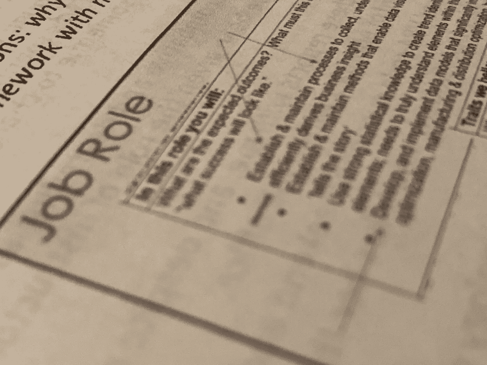

# 数据分析师在面试中应该问潜在雇主的 10 个问题

> 原文：<https://medium.com/mlearning-ai/10-essential-questions-to-ask-before-saying-to-your-data-dream-job-9a36d0994f11?source=collection_archive---------7----------------------->

## 并非所有的数据分析师职位都是表里如一。

太棒了，你得到了一份终身难忘的工作，而且薪水惊人！但是你看过细则了吗？有时职位描述并不能充分描述你作为数据分析师所要做的工作。