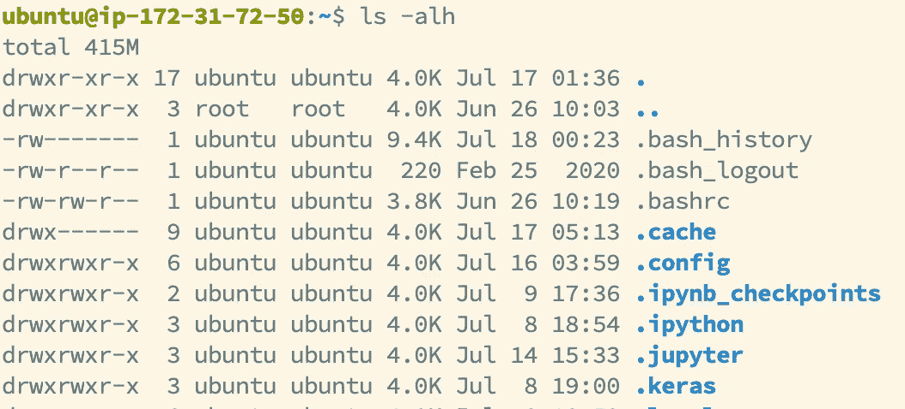
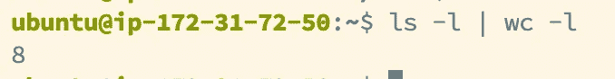
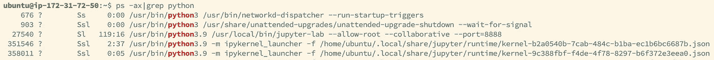
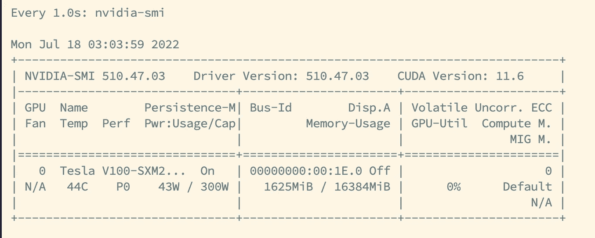
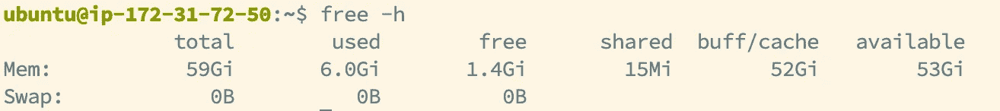
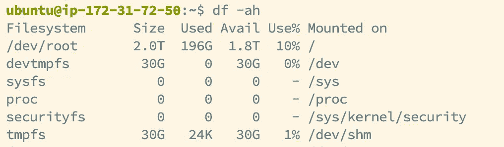
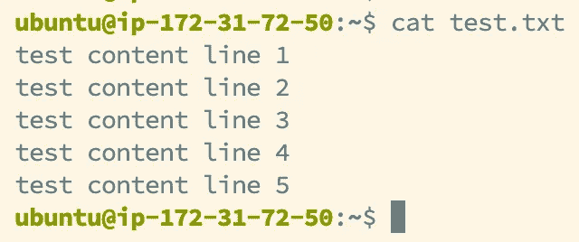
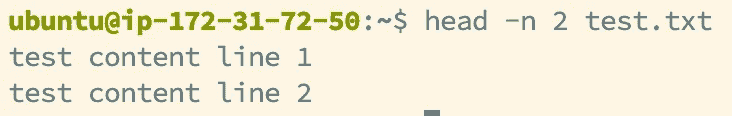
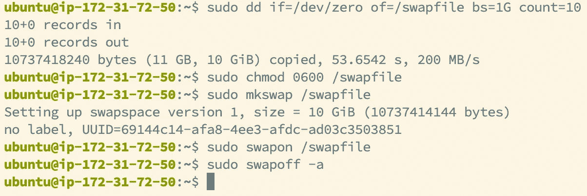

# 数据科学家的 10 个重要 Linux 命令

> 原文：<https://medium.com/mlearning-ai/10-important-linux-commands-for-data-scientist-d716c047a3b9?source=collection_archive---------5----------------------->


IC: Unsplash

作为一名数据科学家，您可能经常需要处理非常大的数据或模型，这些数据或模型无法放入您的计算机的存储中，或者即使如此，由于其他资源限制，也无法很好地执行。在这种情况下，使用一台性能更好的远程机器将是一个不错的选择。由于基于 Linux 的系统的流行，比如 Debian 和 Ubuntu，学习一些流行的命令来帮助你控制你的机器以提高效率是非常有益的。

本文将向您介绍 10 个带标志的命令(又名。options ),由于它们的普及性和实用性，它们在数据科学中通常被认为是极其重要的，但有时可能会被忽略。它会大大提高你的效率！(注意:以下命令基于 Ubuntu，一种流行的 Linux 变体)

# 🔥目录

[1。nohup](#c8f4)
[2。ls -alh](#564a)
[3。ls-al | WC-l](#acef)T8[4。PS-ax | grep[进程名] / kill](#27d0)
[5。手表-n【秒】【命令】](#bb79)
[6。free -h](#ad84)
[7。df -ah](#f6cf)
[8。sudo rm -rf $HOME/。本地/共享/垃圾桶/文件](#2fee)
[9。纳米/猫/头-n[计数] /尾-n[计数]](#fe4b)
[10。(添加互换记忆)](#eb97)
∘ [我们真诚地希望这些能有所帮助！](#ef4d)

# 1.诺胡普

*   即使当前会话已经停止，也在后台执行命令。当您不想在执行一个永无止境的任务时保持会话暂停，例如在您的机器上解压缩一个 500GB 的文件，或者在 Jupyter 笔记本上操作时，这是非常有用的。
*   用法:nohup[普通命令]
*   默认情况下，输出将被添加到 nohup.out。您可以通过添加 **> filename.ext** 来将输出重定向到 **filename.ext** 来进行更改
*   或者，如果您不想在每次使用 nohup 时都关闭您的会话，您可以在行尾添加 **&** 符号，这意味着它将在后台运行，这样您就可以自动返回到您现有的会话


# 2.ls -alh

*   列出包含重要信息的目录中的所有文件
*   **-a:** 列出当前目录下的所有文件(包括隐藏文件)
*   **-l:** 以列表形式显示文件(一行一个文件)，包括文件大小、修改日期和时间等更多信息。
*   **-h** :与 **-l** 一起使用，以更容易理解的方式显示文件大小(机器会进行转换)。



# 3.最小二乘法|最小二乘法

*   计算当前目录中文件和文件夹的数量
*   **|** 是连接 ls -l 的输出和 wc -l 的输入的管道符号。
*   **wc -l** 输出一个数字，显示输入中有多少行
*   当您将数据输出到一个目录中时，以及当您想通过查看已经处理了多少个文件来跟踪进度时，这尤其有用。(例如，在大拉链上使用 **unzip -q** )



# 4.PS-ax | grep[进程名] / kill

*   **ps -ax** 列出您系统中所有正在运行的进程(包括来自其他用户的进程和在后台运行的进程)
*   **| grep[进程名]** 管道操作后的 grep 命令查找并显示与输入[进程名]匹配的行。这有助于您了解该过程的详细信息，包括 PID
*   **kill** 命令是一个与 PID 号一起使用的独立命令，因此您可以在之后输入 PID 号来停止加工。注意:当进程由另一个用户(比如超级用户)运行时，您必须在该用户的范围内执行 kill。



# 5.**手表-n[秒][命令]**

*   以[秒]秒的间隔重复执行该命令。
*   如果您想实时监控一些值，但不想一次又一次地手动执行它们，这是非常有用的。



# 6.`free -h`

*   检查可用 RAM 空间的大小
*   **-h** :以人性化的方式显示结果



# 7.df -ah

*   显示磁盘的可用存储空间。
*   **-a** :显示所有磁盘的空闲空间，包括隐藏的磁盘
*   **-h** :以人类可读的格式显示剩余空间(机器会为您进行转换)



# 8.sudo rm -rf $HOME/。本地/共享/回收站/文件

*   清空电脑的废纸篓文件夹。
*   当您在服务器上运行应用程序并使用该应用程序删除一些文件时，这尤其有用，在这种情况下，文件通常会被移动到回收站文件夹，而不是立即被删除(例如当您使用 Jupyter Notebook 时会发生的情况)，因此该命令可以永久释放您的空间。
*   rm -rf 会递归地、强有力地、永久地删除你文件夹中的所有内容。
*   $HOME 是你的家庭住址。这相当于“**~”**

# 9.纳米/猫/头-n[计数] /尾-n[计数]

*   编辑文件/显示文件的完整内容/显示文件的开始[ **计数**行/显示文件的结束[ **计数**行
*   头部和尾部命令可以与管道操作一起使用



# 10.(添加交换存储器)

```
sudo dd if=/dev/zero of=/swapfile bs=1G count=10
sudo chmod 0600 /swapfile
sudo mkswap /swapfile 
sudo swapon /swapfile
```

*   添加交换内存，这将占用更多内存的存储空间。当您必须运行一个非常大的模型，或者有一个巨大的数据集需要首先加载到内存中时，这尤其有用。尽管交换存储器的速度比不上你的 RAM，但它在特殊场合仍然是可用的。
*   **bs=** 是单位
*   chmod 0600 给你刚刚创建的交换文件只有所有者才有读写权限。
*   **mkswap / swapon** 命令完成交换存储器的创建

要关闭它，请使用

```
sudo swapoff -a
```



IC: ABQ Biopark ([https://www.cabq.gov/artsculture/biopark/news/10-cool-facts-about-penguins](https://www.cabq.gov/artsculture/biopark/news/10-cool-facts-about-penguins))

## 我们真诚地希望这些能有所帮助！

[](/mlearning-ai/mlearning-ai-submission-suggestions-b51e2b130bfb) [## Mlearning.ai 提交建议

### 如何成为 Mlearning.ai 上的作家

medium.com](/mlearning-ai/mlearning-ai-submission-suggestions-b51e2b130bfb)