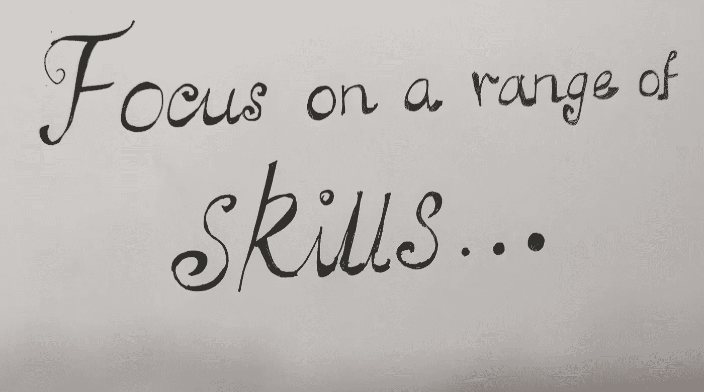
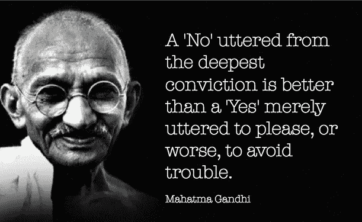

# 让你成为更好的数据科学家的 10 项基本非技术技能

> 原文：<https://medium.com/mlearning-ai/10-non-technical-skills-that-will-make-you-a-better-data-scientist-194178a77ebd?source=collection_archive---------7----------------------->

## 超越编程、模型构建和 AI/ML

随着对数据科学家的需求不断增加，培养自己成为数据科学家所需的技术技能的资源并不缺乏。你可以找到大量关于数学、算法、编程、机器学习模型和人工智能的资源，包括 MOOCs、像“走向数据科学”( TDS)这样的博客、新兵训练营以及像 datacamp 和 dataquest.io 这样的平台，它们将在项目上训练你。一旦你获得了做一些项目和建立一些模型的信心，下一步是什么？你应该建立更复杂的模型来做更酷的事情吗？应该去学那个刚上线的库吗？你应该发展到更复杂的神经网络来进行人脸识别，创作艺术和音乐吗？答案既可以是，也可以不是，这取决于你想如何将自己定位为一名数据科学家。虽然学会做所有很酷的事情很棒，但大多数数据科学家的努力不应该仅限于此。

从我的经验来看，有一些重要的非技术性技能会帮助你**传达你创造的价值**。毕竟，我们都在努力争取利益相关者对我们精心制作的花哨模型的认可。关于如何提高演讲技巧的建议[点击这里](/new-writers-welcome/how-i-overcame-my-shortcomings-in-public-speaking-1d7ddca68b5f)。

Image by Author

**讲故事:**你拿任何一个成功的领导者来说，他们都是**强有力的讲故事者**，句号。他们不卖服务或产品，他们卖的是故事！如果你只需要不断提高一项技能，这将是我的推荐。如果你有一个强有力的故事来传达价值、影响以及它如何符合公司的愿景，而不是一个吹嘘很酷的人工智能东西的高科技项目，那么一个 okay okay 项目可以成为投产的焦点。

**信念:**这是把**讲故事的技巧带到下一个层次**的东西。你对自己工作的信心以及表达这种信心的能力是赢得他人对你的想法/项目/产品的信心的关键。这也是首席执行官和伟大领袖的共同特征。不仅仅是他们说了什么，还有他们如何说，如何给每个人灌输信心。

Image by [Zoë B](https://simplelifestrategies.com/author/zoe-b/) on [simplelifestrategies](https://simplelifestrategies.com/quotes-gandhi/)

简化:虽然看起来很容易，但简化是人们无法学习和实现的最复杂的事情。很容易迷失在一个复杂的问题中，并将困惑转移给你的听众。一旦你想出了一个解决方案，你的努力应该是通过一个简单的演示，应用程序或故事板来让你的观众简单。有时候展示你的产品能做什么可能比理解你是如何做到的更重要。谷歌使用页面排名来对其搜索进行排名，**但每个人都不需要知道算法是如何工作的，他们只需要知道如何使用它！**

> “知识是一个堆积事实的过程；智慧在于它们的简化。”— **马丁·费希尔**

**领域知识:**使**解决方案与手头的问题**相关非常重要。比如，在你的学科领域，精确和回忆是什么意思？在特定领域中，哪一项是两者的重要指标？你应该容忍假阳性多于假阴性吗？例如，在诊断 COVID 时，假阴性比假阳性危险得多。领域知识可以帮助你解释结果，并把它们的意思传达给不同的受众。如果你在处理不同的问题，研究这个领域并学习基础知识来更恰当有效地设计你的解决方案总是一个好主意。

**解题:**掌握解题技巧，最复杂的问题也能解决。它从问题框架、提出问题和剖析问题、理解问题到将问题分成小块、适应不确定性以及尝试不同的解决方案开始。一旦你解决了足够多的问题，你的大脑就开始记忆那些能帮助你解决你不擅长的问题的关键部分。

网络和人际交往技巧:了解你的利益相关者，并与他们建立联系。一个**数据科学家永远不可能独立成功**。您将需要数据工程师、软件工程师、IT 来设置和支持基础架构、业务负责人、MLOPs 和 DevOps 来扩展您的产品。您还需要根据您产品的范围，与许多其他专家进行交流，如数据隐私官、法律团队和信息安全官。**除了一个温暖的微笑，**更有帮助的是理解他们在做什么，并让他们参与进来。这有助于你决定何时需要他们的支持，然后在适当的时候让他们参与进来。如果你刚刚加入一个组织，我要求你花一些时间了解你的组织结构和数据科学家如何运作。了解你的同龄人也有助于你调整信息，用他们的语言说话。

**结构化思维:**这有助于你**消除混乱，专注于业务问题**和我们试图解决的广泛问题。利用计算机视觉，通过使用足够多的干草图像和针的例子来训练模型，可以很容易地在干草堆中挑选针，它将自动学习干草和针的属性，并将形成决策边界(区分点)。但是你将如何在干草堆上应用图像识别算法呢？你会把它们组织成束，把每个束展开，然后应用你的模型吗？思考，**用步骤和流程图思考**，这有助于构建你的问题并找到解决方案。

**业务问题理解:**它始于问正确的问题，解释和重新表述给你的陈述，止于想象一个粗略的解决方案是什么样子。你可以试着和你的利益相关者这样说:“如果这是我们正在解决的问题，可能的解决方案看起来像这样…1，2，3…**这就是你要找的**？有几种技术，如设计思维、头脑风暴会议和框架，如菲尼克斯清单、根本原因分析等。你可以在这里找到。最重要的是，在你的头脑中固定下来，花一些时间去追逐这个问题，直到它在你的头脑中非常清晰，至少是方向性的。它会随着你的进步而发展，但绝不会与你的起点无关！

**产品思维:**你有没有想出一个很棒的解决方案，来解决一个让人紧张又惊天动地的问题，太棒了！现在专注于如何将它变成一个产品、平台或端到端解决方案，而不是一个点解决方案**。这将在很大程度上帮助你和你工作的公司，而不是每次遇到类似的问题都要重新发明轮子。花点时间，打造一款经久耐用的产品。我在整个帖子中提到“产品”是有意的，我可以写“项目”，但要改变任何事情，你首先需要改变心态。**

****保持条理:**从编写带有注释和分段的有条理的代码，到将你的工作组织成易于理解的块，从长远来看，这将会带来巨大的收益和利益。这不仅有助于他人理解和复制你的作品，而且当你以后重访时，还能找回你自己。**

> **“花在组织上的每一分钟，就赢得了一个小时，”–**本杰明·富兰克林**。**

**这些技巧都不是几天甚至几个月就能学会的。其中一些可能已经成为你的优势，认识到它们并制定一个计划，专注于你想要提高的技能并坚持不懈，你每天都会成为一名更好的数据科学家或任何专业人士！额外的好处是，这些技能对从新人到首席执行官的各种角色都有用，因此在你转换角色和晋升时仍然适用！**

** [## Mlearning.ai 提交建议

### 如何成为 Mlearning.ai 上的作家

medium.com](/mlearning-ai/mlearning-ai-submission-suggestions-b51e2b130bfb)**