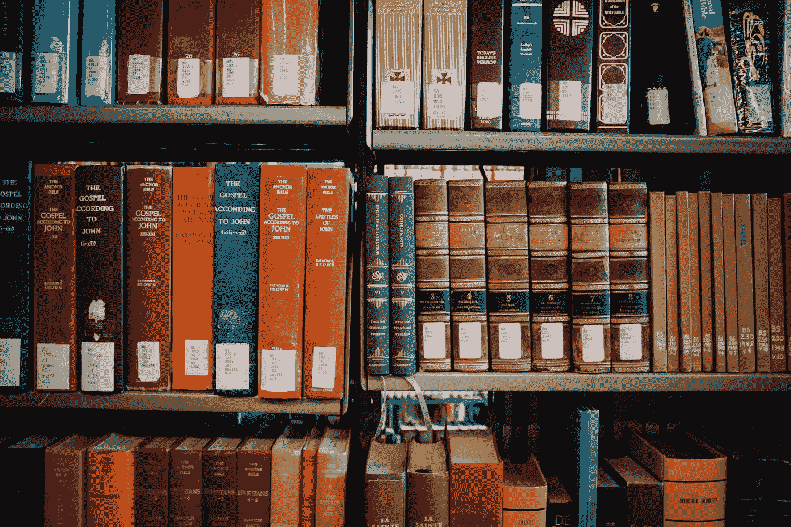

# 购买书架上的 10 本 Python 书籍

> 原文：<https://medium.com/mlearning-ai/10-python-books-to-buy-your-shelf-bddaa55ea5d7?source=collection_archive---------0----------------------->

## 纸张的触感和按键的咔嗒声

您可能还记得，书籍是科技界用来获取参考资料和通用最佳实践标准化的主要媒介。他们为社区提供了共性，现在仍然如此。

Photo by [Jonathan Simcoe](https://unsplash.com/@jdsimcoe?utm_source=medium&utm_medium=referral) on [Unsplash](https://unsplash.com?utm_source=medium&utm_medium=referral)

让我们深入到我们的现代图书馆中寻找优秀的编码。