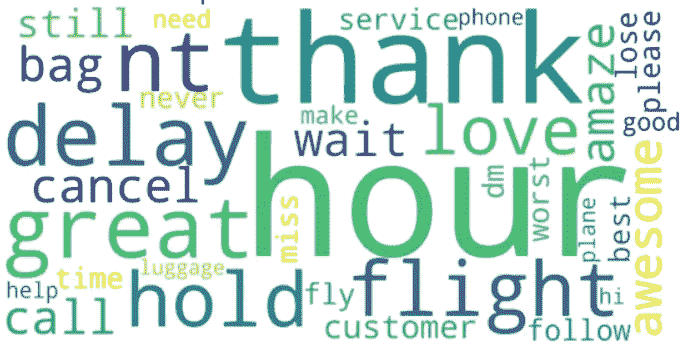

# 在构建 NLP 情感分析模型之前，您需要应用的 10 个 Python 函数

> 原文：<https://medium.com/mlearning-ai/10-python-functions-you-need-to-apply-before-you-build-your-nlp-sentiment-analysis-model-874a37e0217e?source=collection_archive---------2----------------------->

## 预处理文本比编码模型更重要

Words Cloud by author

我们都知道预处理工作对于任何收集到的数据(尤其是非结构化数据)有多么重要，抓取 web 来收集语言数据以对任何主题进行情感分析是一项简单的任务…