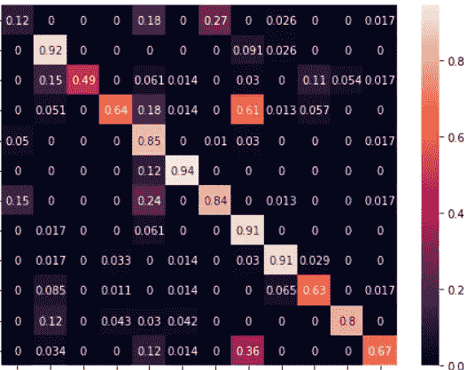

# 提高影像分类模型性能的 10 个步骤

> 原文：<https://medium.com/mlearning-ai/10-steps-to-improve-image-classification-model-performance-55073a182a90?source=collection_archive---------0----------------------->

获得最佳结果的简单步骤

Confusion matrix by author

我们都知道图像分类问题有点混乱，我们如何提高模型性能，如果我们增加更多的层或尽可能使模型变浅，它会增加吗？

在本文中，我将向您解释获得最佳模型的步骤，每一步我们…