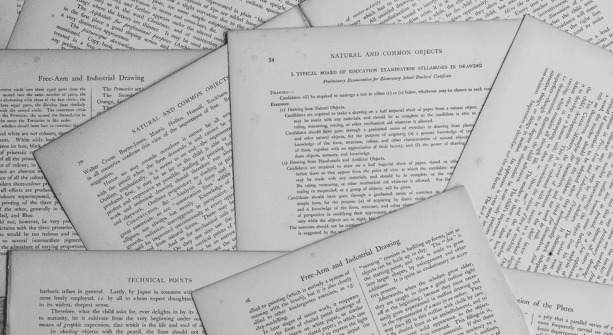

# 使用 NLP 的日常业务运营中的 10 个用例

> 原文：<https://medium.com/mlearning-ai/10-use-cases-in-everyday-business-operations-using-nlp-af49b9650d8f?source=collection_archive---------0----------------------->

## 自然语言处理

## 以及**spaCy 3.0 版**如何帮助您开始使用这些用例

Image Source : unsplash.com . Shout out to [Annie Spratt](https://unsplash.com/@anniespratt)

在本文中，我们将列出并解释不同的用例，并简要概述我们如何使用**空间**来做同样的事情。