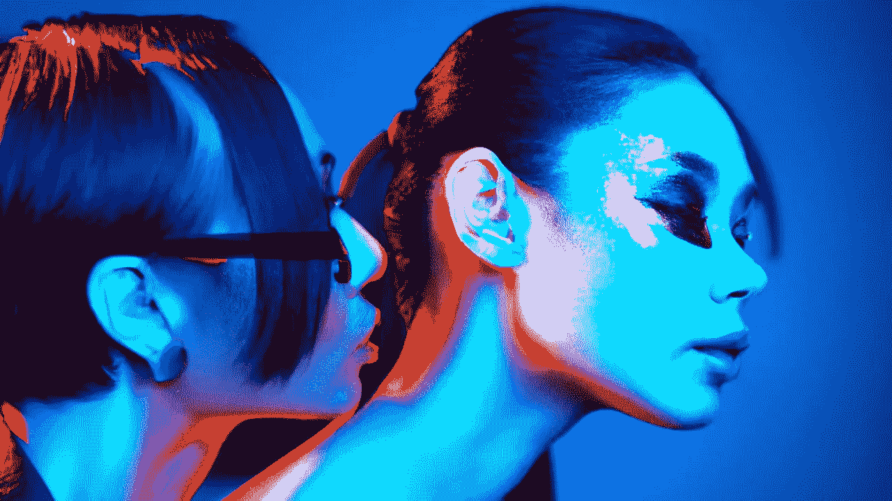

# 1.01 亿美元用于人工智能艺术生成器

> 原文：<https://medium.com/mlearning-ai/101-million-for-ai-art-generator-748b8b31749a?source=collection_archive---------3----------------------->

## [用你自己训练过的模型创作艺术作品](https://open.substack.com/pub/mlearning/p/tune-your-private-ai-art-generator?r=z7zu8&utm_campaign=post&utm_medium=web)

## ***唯一独立多模态 AI***

[LARGE congrats](https://mlearning.substack.com/about)

第一家由社区驱动的开源人工智能公司宣布筹集了 1.01 亿美元。Coatue，Lightspeed Venture Partners 和 O'Shaughnessy Ventures LLC 领投了这轮超额认购资金，这些资金将由 [Stability AI](#1fec) 用来加速创建…