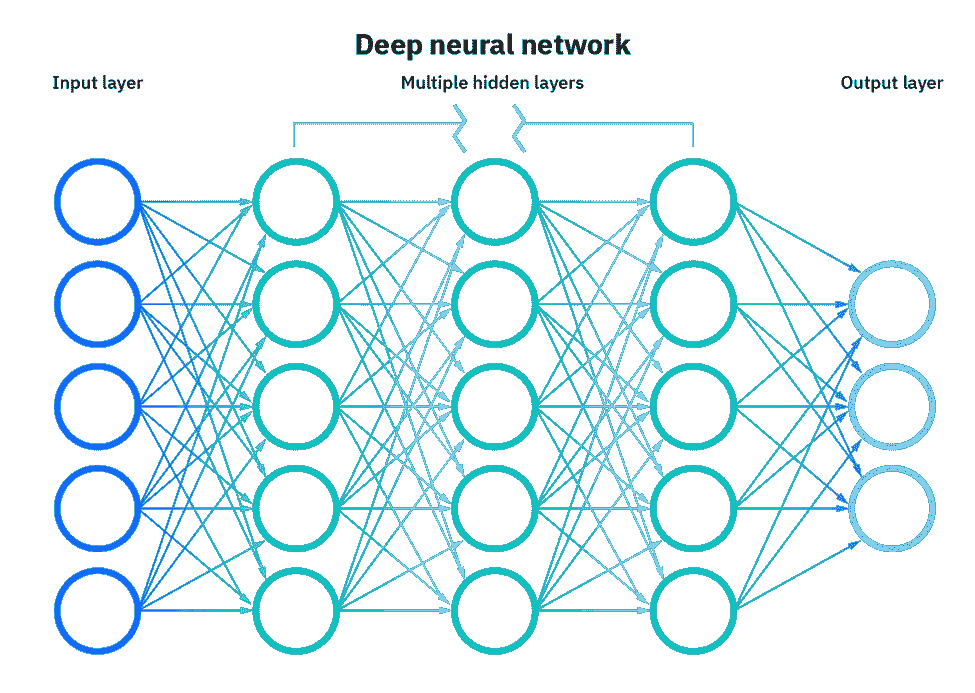
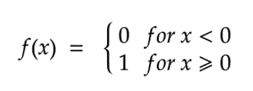
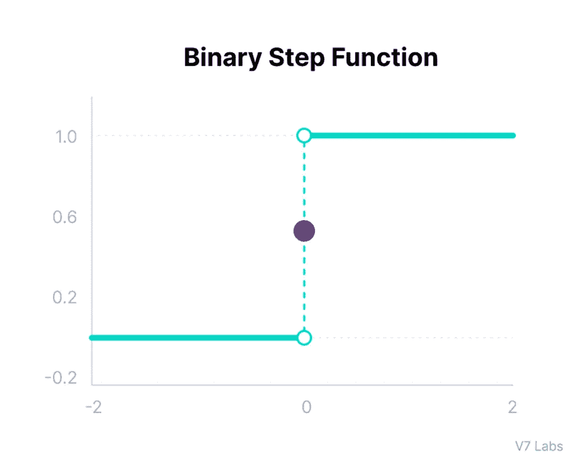
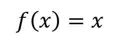
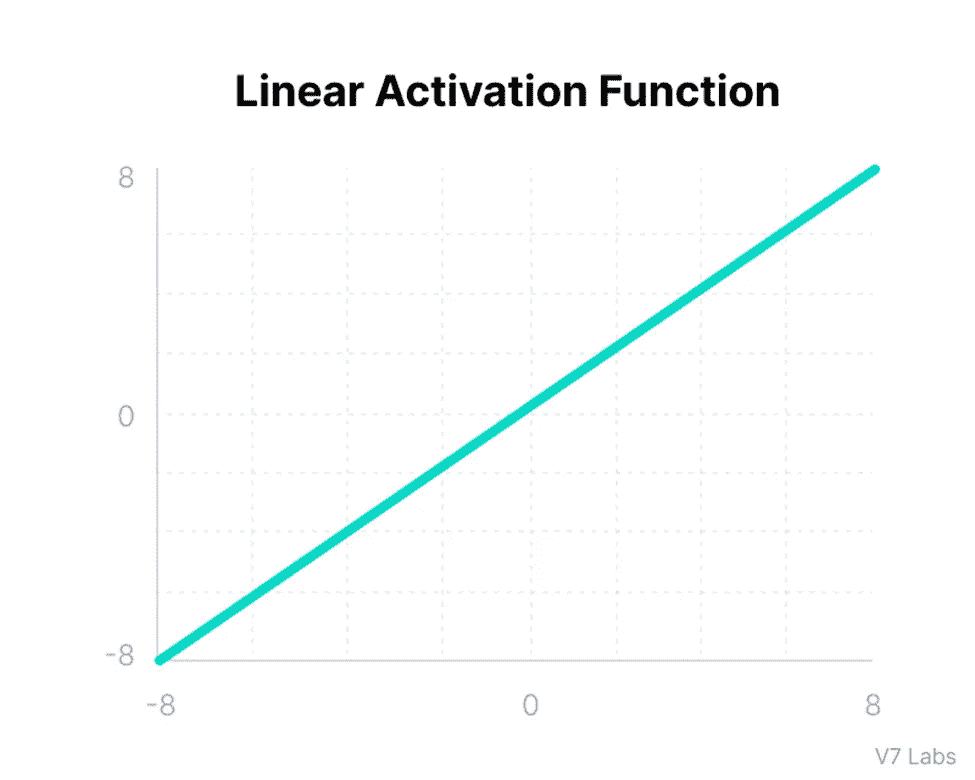
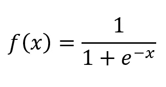
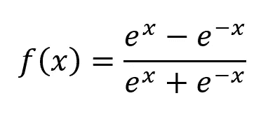
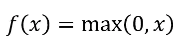
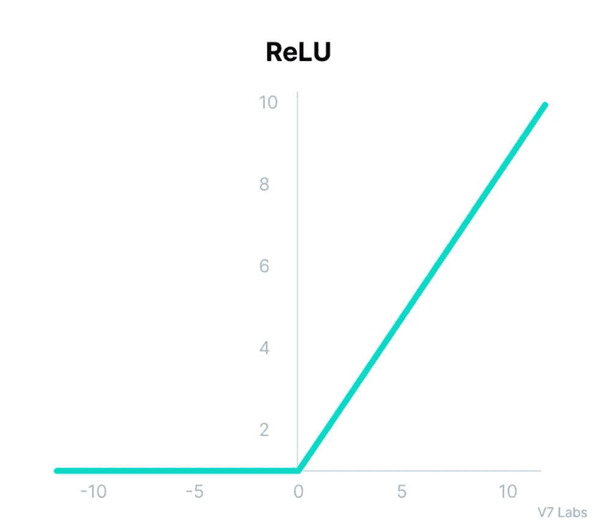
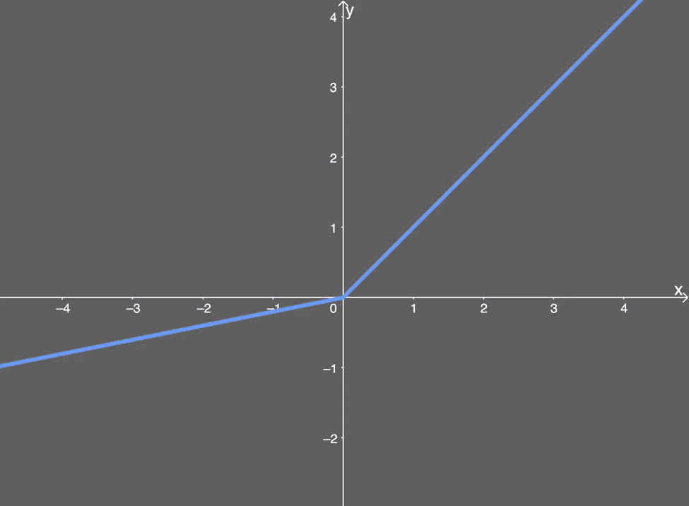

# 你可能要考虑的 12 个激活功能—第 1 部分

> 原文：<https://medium.com/mlearning-ai/12-activation-functions-that-you-may-want-to-consider-part-1-f863615c02c6?source=collection_archive---------3----------------------->

Photo by Gertrūda Valasevičiūtė on [Unsplash](https://unsplash.com/@skraidantisdrambliukas)

在深入探讨激活函数之前，我们先来了解一下这三个问题的答案:

**什么是神经网络？**

**什么是激活功能？**

**为什么需要它？**

**什么是神经网络？**

神经网络只不过是由相互连接的神经元组成的网络，这些神经元通过其**权重**、**偏差**和**激活函数**进一步识别。

神经网络的要素:

**输入层:**

这一层的唯一目的是从外界获取信息(特征)并传递给网络。此外，在该层中不执行任何计算，并且给定的信息直接传递到下一层(隐藏层)。

**隐藏层:**

顾名思义，这一层的节点是不暴露的。它是输入层和输出层之间的一层。这一层负责执行所有必要的计算，然后将计算结果传递给下一层(输出层)。此外，在神经网络中总会有最少的一个隐藏层。

**输出图层:**

最后，这一层将通过隐藏层学习到的所有信息作为最终结果交付。

下面是一个神经网络的图像:

[Source](https://www.ibm.com/cloud/learn/neural-networks)

**什么是激活功能？**

神经网络激活函数基本上决定是否应该激活神经元/节点(应该传递信息),并且它通过检查该值是否高于某个阈值来实现。

**为什么需要？**

*   激活函数最重要的目的是将**非线性**添加到我们的神经网络中。在正向传播期间，激活函数在每一层都引入了一个额外的步骤，因此质疑它的存在是很明显的。那么我们就通过一个例子来了解一下吧！

让我们考虑一个没有激活函数的神经网络。在这种情况下，每个神经元将使用权重和偏差对输入执行线性变换( **W*x+b** )。现在的要点是，这种线性变换对我们并没有真正的帮助，因为它的次数是 1 ( **W*x** )，即线性的，因此它只会像任何其他线性分类器一样工作，这不足以识别我们在计算机视觉或自然语言处理中遇到的复杂模式。因此，为了学习或识别这种非线性模式，使用了激活函数。

*   除了给我们的神经网络增加非线性之外，根据我们的要求，激活函数还有助于将来自神经元的输出值保持在一定的限度内。

为了前任。

在我们的激活函数( **W*x+b** )中发生线性变换操作，其中 **W** 是权重， **x** 是输入， **b** 是偏差。如果不受限制，该操作的价值可以达到非常大的程度(就数量而言)，特别是在深度(具有一个以上的隐藏层)神经网络中，这会导致一些计算问题。

既然我们已经具备了学习激活功能所需的所有知识，让我们开始吧！

**二进制步进功能:**

这是一个基于阈值的激活函数，这意味着如果该值能够越过特定阈值，则神经元将被激活，否则将被停用(输出不会传递到下一层)。

**范围:[-∞，∞]**

**数学表示:**

[Source](https://www.v7labs.com/blog/neural-networks-activation-functions#activation-function)

**图形:**

[Source](https://www.v7labs.com/blog/neural-networks-activation-functions#activation-function)

**优点:**

*   二元分类的好选择。
*   简单易懂。

**缺点:**

*   不能用于多类分类。
*   这个函数的梯度(导数)是**零，**因此在反向传播过程中造成阻碍。

**线性激活功能:**

该功能也被称为**身份功能。**这里激活与输入成正比。

**范围:[-∞，∞]**

**数学表示:**

Image by author

**图形:**

[Source](https://www.v7labs.com/blog/neural-networks-activation-functions#activation-function)

**优点:**

*   该函数的输出不限于任何范围。
*   简单易懂。

**缺点:**

*   这个函数的梯度是常数，因此不能用于反向传播。
*   神经网络不会学习任何东西，因为它没有改善误差项。
*   因为它的本质是线性的，所以你添加多少隐藏层都没有关系，因为最终它们都将被压缩到一个层中，或者我们可以说线性激活函数将神经网络转换为一个层。

**乙状结肠/逻辑激活功能:**

这个函数基本上接受一个输入并输出另一个介于 0 和 1 之间的值。输入越积极，值就越接近 1。同样，输入越负，值越接近 0。

**范围:[0，1]**

**数学表示:**

Image by author

**图表:**

[Source](https://www.v7labs.com/blog/neural-networks-activation-functions#activation-function)

**优点:**

*   伟大的选择，我们必须以概率的形式预测结果，因为概率的范围在 0 和 1 之间。
*   该函数的梯度(导数)是可微分的，并且还提供了平滑的梯度(避免突然中断或中间跳跃)。
*   梯度计算很简单。

**缺点:**

*   它受到**消失梯度问题**的困扰，因为在反向传播期间，梯度变得非常接近零，使得权重难以更新，因此收敛变得非常慢。此外，如果梯度变为**零**，则没有学习发生。

**双曲正切函数:**

该激活函数类似于 sigmoid 激活函数，唯一的主要区别是，其范围位于[-1，1]之间，而不像[0，1]。该功能也有一条 S 形曲线，但由于最小范围是-1(而不是 0)，所以是以**零为中心的**。

**范围:[-1，1]**

**数学表示:**

Image by author

**图形:**

[Source](https://www.v7labs.com/blog/neural-networks-activation-functions#activation-function)

**优点:**

*   它是**可微的**。
*   它将负输入映射为强负，将零输入映射为中性，将正输入映射为强正。
*   该函数使选择考虑哪个值和忽略哪个值变得更容易，因为我们能够根据其范围获得不同符号的值，即[-1，1]。
*   这是一个**零中心**激活功能。

**缺点:**

*   该函数也遭受类似于 sigmoid 激活函数的**消失梯度问题**。
*   这在计算上是昂贵的。

> 注:由于其**零中心**特性，双曲正切非线性始终优于 sigmoid 非线性。

**ReLU 功能:**

ReLU 代表**整流线性单元。**该函数是最常用的激活函数，因为它用于大多数卷积神经网络或深度学习。

这个函数的特别之处在于，它将所有负输入映射为零，并原样输出任何正值(像线性函数一样)。

**范围:****【0，∞】**

**数学表达式:**

Image by author

**图形:**

[Source](https://www.v7labs.com/blog/neural-networks-activation-functions#activation-function)

**优点:**

*   它不会一次激活所有的神经元，因此与其他激活函数(sigmoid 和 tanh)相比，它的计算效率更高。
*   ReLU 函数最重要的属性是它的**非饱和**属性，它鼓励梯度下降向它的全局最小值收敛。
*   最大阈值是**无穷大，**因此解决了**消失梯度问题**的问题。

**缺点:**

*   本质上是线性的。
*   有时它面临[垂死的 ReLU](https://towardsdatascience.com/the-dying-relu-problem-clearly-explained-42d0c54e0d24) 问题。
*   它只能在神经网络的**隐层**中使用。

**漏 ReLU 功能:**

这是 ReLU 函数的一个改进版本，创建它是为了纠正 ReLU 的死亡问题。它在负区域有一个小的正斜率**。它还具有通常在 0.1 和 0.3 之间的**α**值。**

**范围:** [-∞，∞]

**数学表达式:**

Image by author

**图形:**

[Source](https://mlfromscratch.com/activation-functions-explained/)

**优点:**

*   它修复了垂死的 ReLU 问题，因为它没有零中心的部分。
*   解决了**消失渐变**的问题。
*   当平均激活接近于 0 时，它加速了训练。
*   ReLU 激活功能的所有优点。

**缺点:**

*   遭遇**爆炸梯度**问题。
*   微分后，函数变为**线性**。

这篇文章里的都是这些家伙！

这是该系列的下一部— [第二部](https://pawarsaurav842.medium.com/12-activation-functions-that-you-may-want-to-consider-part-2-93037405c443)

如果你有任何问题，请告诉我！！

再见！

 [## Mlearning.ai 提交建议

### 如何成为 Mlearning.ai 上的作家

medium.com](/mlearning-ai/mlearning-ai-submission-suggestions-b51e2b130bfb)