# 你可能要考虑的 12 个激活功能—第 2 部分

> 原文：<https://medium.com/mlearning-ai/12-activation-functions-that-you-may-want-to-consider-part-2-93037405c443?source=collection_archive---------3----------------------->

## 如果你还没有读过这个系列的第一部分，那么这就是第一部分。

那么，让我们从下一组激活函数开始吧！

# ***参数化热路:***

参数 ReLU 是 leaky ReLU 的变种，用来解决 ReLU(垂死 ReLU 问题)和 Leaky ReLU(对负输入值的不一致预测)问题。leaky ReLU 和 parametric ReLU 之间的唯一区别是，parametric ReLU 没有预定的或恒定的斜率 0.01，而是有一个**参数**(因此得名 parametric)供神经网络自行计算，即***a****(alpha)。*

***范围:(-∞，∞)***

***数学表达式:***

*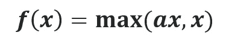*

*Image by author*

***图形:***

*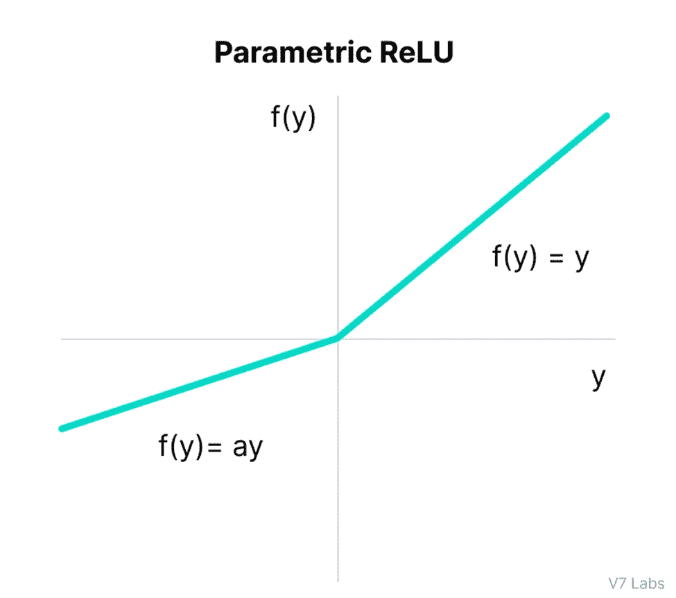*

*[Source](https://www.v7labs.com/blog/neural-networks-activation-functions)*

***优势:***

*   *由于参数*a*(α)的存在，它具有基于其学习率微调激活函数的灵活性，不同于 ReLU 情况下的 0 和泄漏 ReLU 情况下的 0.01。*
*   *ReLU 和漏 ReLU 的所有优点。*

***缺点:***

*   *遭遇**爆炸梯度**问题。*
*   *微分后，函数变为**线性**。*

# ***指数线性单位(ELU):***

*它是 ReLU 的变体。该激活函数的重要之处在于，它使用对数曲线修改函数负部分的斜率，以定义负值，这与使用直线的 ReLU 和 leaky ReLU 不同。*

***范围:(-∞，∞)***

***数学表达式:***

*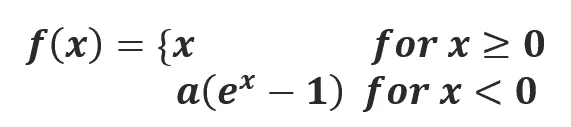*

*Image by author*

***图形:***

*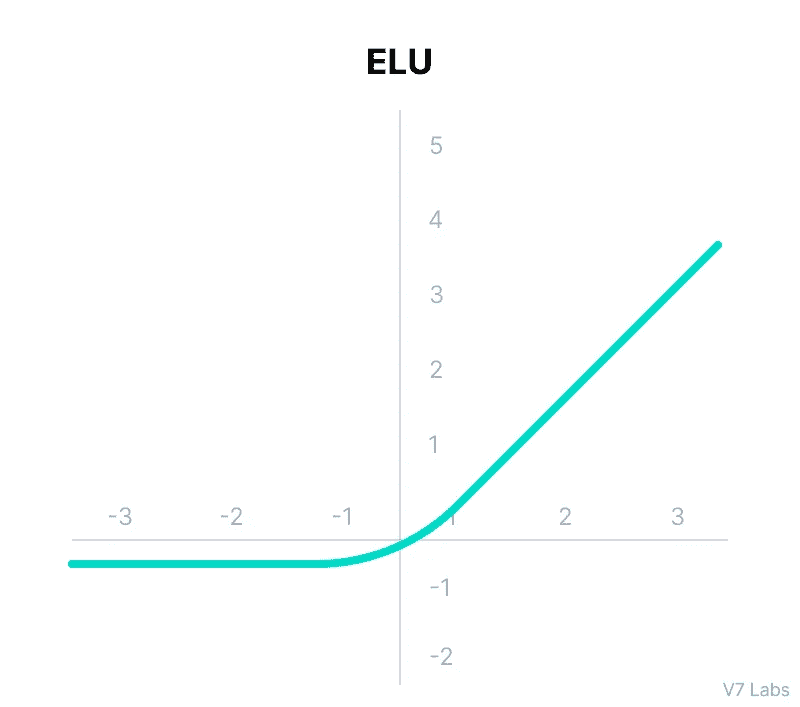*

*[Source](https://www.v7labs.com/blog/neural-networks-activation-functions)*

***优点:***

*   *它处理垂死的 ReLU 问题。*
*   *计算渐变时，产生激活而不是让它们为零。*
*   *产生负输出，这有助于网络向正确的方向推动权重和偏差。*

***缺点:***

*   *没有解决爆炸梯度的问题。*
*   *由于所涉及的指数运算，计算成本很高。*
*   *不学习α值(通常在 0.1 和 0.3 之间)。*

# ***Softmax 功能:***

*简单地说，softmax 函数只不过是多个 sigmoid 函数的组合，因为它也返回每个类的概率。在大多数情况下，该激活函数用于神经网络的最后一层，并用于多类分类。*

*但是…*

*你们可能都在想，当我们可以使用 sigmoid 或 logistic 函数时，为什么还需要使用 softmax 函数！*

*好吧，这就是答案！*

*假设我们有 5 个输出概率值-0.89、0.97、0.78、0.63 和 0.91。*

*当它们的和不等于 1(最大概率值总是 1)时，我们如何选择它们中的任何一个来推进我们的分类问题呢？*

*所以，为了解决这个问题，softmax 函数来拯救我们。它计算类似于 sigmoid/logistic 函数的相对概率，并返回每个类的概率。*

***范围:[0，1]***

***数学表达式:***

*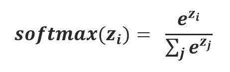*

*Image by author*

***图:***

*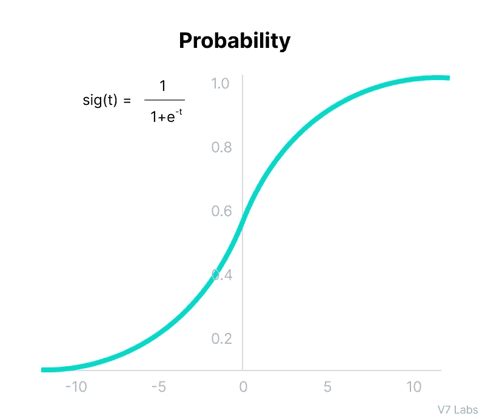*

*[Source](https://www.v7labs.com/blog/neural-networks-activation-functions)*

***优点:***

*   *这个函数的范围是从 **0 到 1** ，所有概率之和将是**等于 1**。如果 softmax 函数用于多分类问题，则它将返回每个类的概率，其中目标类的概率最高。*

***缺点:***

*   *计算开销很大。*

# ***唰功能:***

*这是谷歌研究人员开发的一种自我门控激活功能。该激活函数在图像分类和机器翻译领域表现非常好，优于 ReLU 激活函数。*

***范围:[0，∞)***

***数学表达式:***

*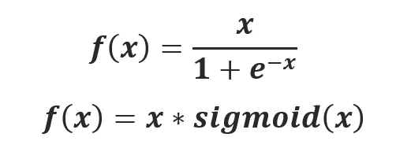*

*Image by author*

***图:***

*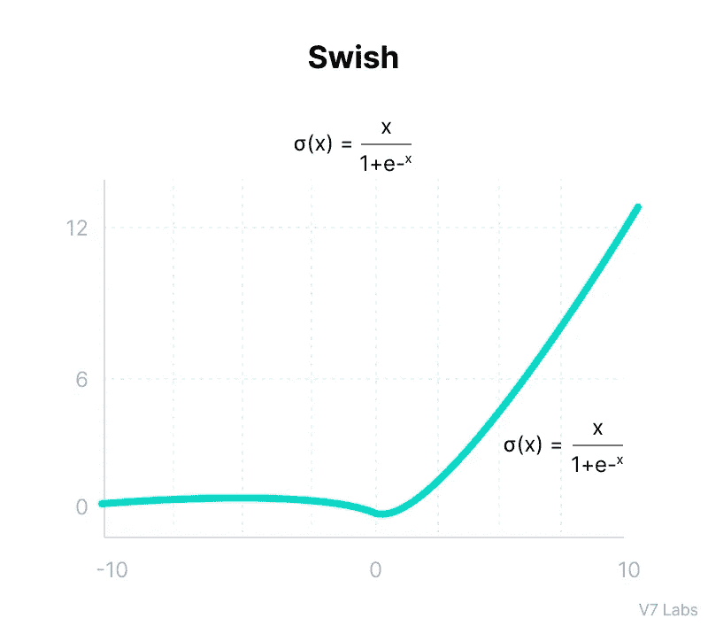*

*[Source](https://www.v7labs.com/blog/neural-networks-activation-functions)*

***优点:***

*   *本质上是非单调的。*
*   *这是一个**无界**函数，这意味着对于任何大的值，梯度都不会变为零，从而进行有效的学习。*
*   *下面是**无界**，这意味着随着输入趋于负无穷大，输出趋于某个常数，因此在模型中引入正则化。*

***缺点:***

*   *它的计算量很大(是的，你猜对了！).*

# *高斯误差线性单位(GELU):*

*这个激活功能比较新，也比较好。高斯误差线性单位或 GeLU 是一个简单地将其输入乘以输入处正态分布的累积密度函数的函数。*

*它对于 NLP 模型非常有效，并且与 BERT、ROBERTa 和 ALBERT 高度兼容。这个激活函数是由 dropout、zoneout 和 ReLUs 的属性组合而成的。*

***范围:[0，∞)***

***数学表达式:***

*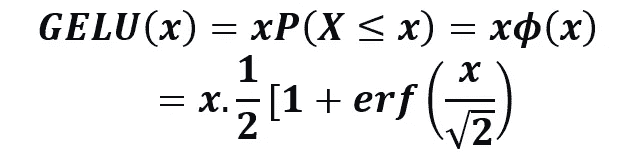*

*Image by author*

***图形:***

*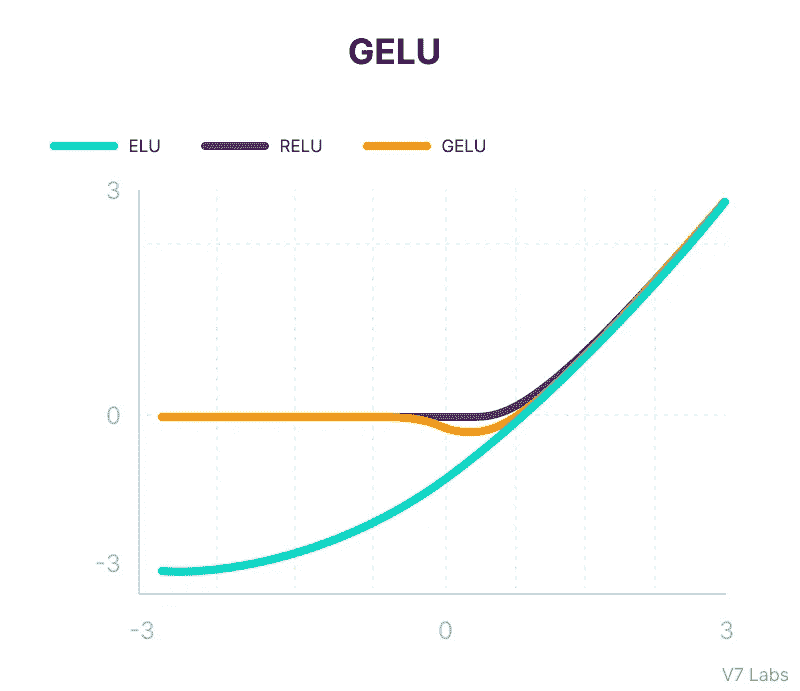*

*[Source](https://www.v7labs.com/blog/neural-networks-activation-functions)*

***优点:***

*   *它最适合 NLP 模型(尤其是变压器模型)，并且在 NLP 的情况下也优于所有其他激活函数。*
*   *解决渐变消失的问题。*

***缺点:***

*   *2016 年上线，所以实际应用还是新手。*

# ***标度指数线性单位(SELU):***

*SELU(标度指数线性单位)是诱导**自归一化**的激活函数。这个激活函数自动收敛于零均值和单位方差。为了移动平均值，它有正值和负值，这在 ReLU 的情况下是不可能的，因为它不输出负值。*

***范围:[-2，∞)***

***数学表达式:***

*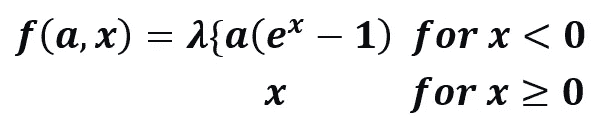*

*Image by author*

***图表:***

*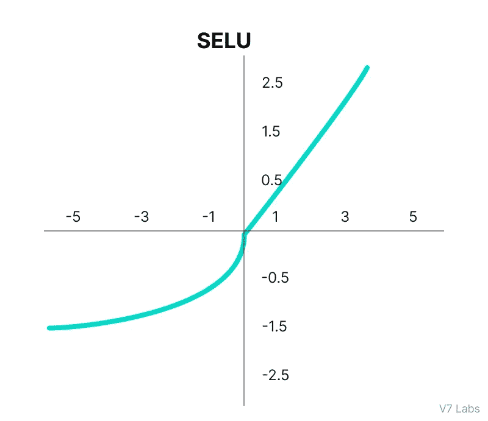*

*[Source](https://www.v7labs.com/blog/neural-networks-activation-functions)*

***优点:***

*   *和瑞鲁相比，SELU 不会死。*
*   *SELUs **比其他激活函数**学习得更快更好，无需进一步处理。*

***缺点:***

*   *这是一个新的激活函数，仍然需要大量的探索，因此对于实际应用来说是新的。*

*这就是我今天的全部内容！*

*我希望你喜欢这个博客！如果是的话，不要忘记给一些掌声(你想给多少就给多少)😉).*

*非常感谢你坚持到最后！*

*再见！*

*** [## Mlearning.ai 提交建议

### 如何成为 Mlearning.ai 上的作家

medium.com](/mlearning-ai/mlearning-ai-submission-suggestions-b51e2b130bfb)*