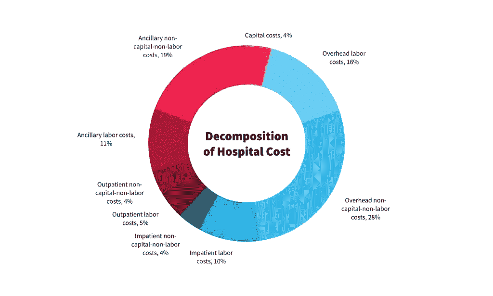
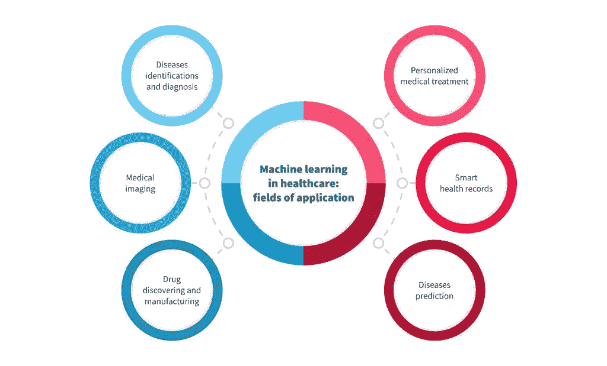
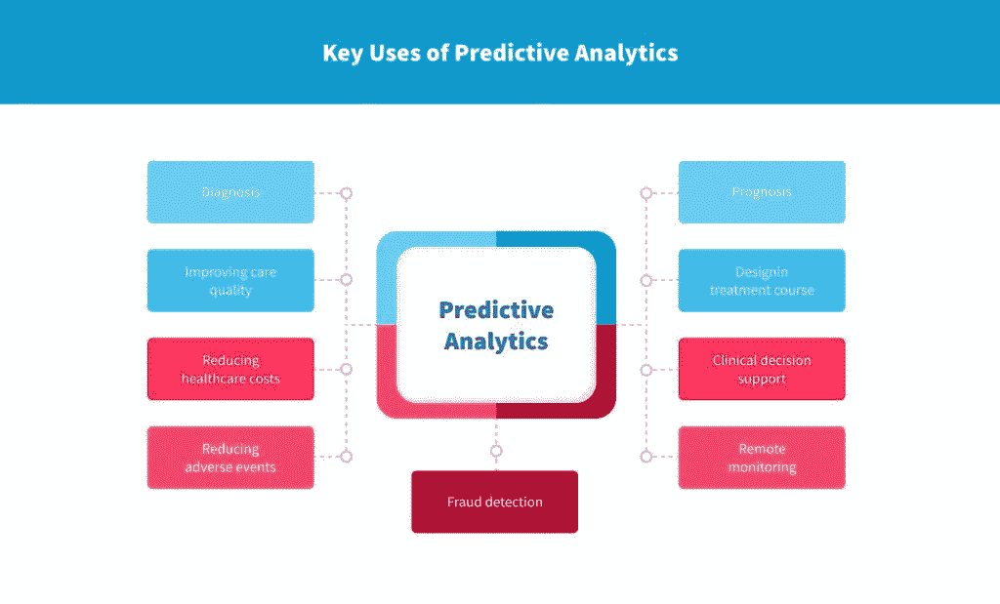
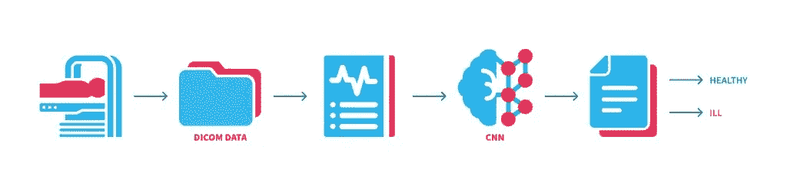

# 12 医疗保健用例中的预测分析— NIX United

> 原文：<https://medium.com/mlearning-ai/12-predictive-analytics-in-healthcare-use-cases-nix-united-3eef11f79746?source=collection_archive---------4----------------------->

医疗工作者必须处理他们处理的每个病例中来自多个来源的大量数据。这包括患者的电子医疗记录、医学图像、筛查结果和各种管理数据。此外，根据这些信息，他们通常必须尽快做出明智的决策。

在医疗保健中使用预测分析可以从多方面帮助该行业。医疗保健预测分析的最大优势之一是数据处理和分析的有效性。然而，医疗保健领域的预测分析还有其他可以改变行业的使用案例。

根据精算师协会进行的调查， [89%的医疗保健提供商](https://www.soa.org/globalassets/assets/Files/programs/predictive-analytics/2019-health-care-trend.pdf)已经在使用预测建模方法，或者正计划在未来实施这些方法。因此，让我们更深入地了解一下预测分析在医疗保健中的重要性，以及目前一些最具创新性的使用案例。

# 预测分析在医疗保健行业的优势

在我们描述其优势之前，让我们首先回答这个问题:什么是医疗保健中的预测分析？预测分析是高级分析的一个分支，旨在根据可用数据预测未来事件。然后，这些预测可用于做出关键决策，及早发现病情，并避免并发症的风险。

使用来自多个来源的数据，借助高级预测分析方法，医疗保健行业将能够:

*   改善慢性病管理；
*   避免再次住院；
*   获得医学研究的帮助；
*   降低管理费用(占[医院总预算的 44%](https://www.ncbi.nlm.nih.gov/pmc/articles/PMC7326305/))。

# 预测分析中的主要技术

# 数据挖掘

作为预测分析在医疗保健中应用的一部分，数据挖掘可以描述为一套方法，帮助[将相关医疗数据收集到数据库中，对其进行转换和预处理](https://nix-united.com/blog/what-is-etl-process-overview-tools-and-best-practices/)，以用于以后的建模、分析和预测公式。

值得一提的重要一点是，根据 [HIPAA](https://nix-united.com/blog/how-to-develop-a-hipaa-compliant-software/) 的规定，任何与患者相关的数据都需要极其小心地处理，并且应该得到保护。这就是为什么数据挖掘需要与一个已建立的 [EHR 系统](https://nix-united.com/success_stories/health-information-management-and-medical-records-request/)一起使用，该系统提供足够级别的隐私和信息安全。

## 数据建模

数据建模是一种预测分析工具，采用统计方法来分析历史数据。因此，它有助于创建同一数据如何随时间演变的详细模型，从而预测未来事件。

作为一种基于统计的工具，数据挖掘概述了未来潜在结果的可能性。为了达到最好的保真度，模型必须定期更新和重新计算。在其他工具的帮助下，这个过程可以简化为一个实时建模工具。

## 人工智能

[人工智能](https://nix-united.com/services/ai-solutions-artificial-intelligence/)是计算机科学的一个领域，可以有效地描述为复杂的机器学习算法与数据处理方法的结合。其核心是，它的目的是复制智能人类行为。

作为医疗保健中预测分析的一个例子，人工智能用于管理患者数据，并基于这些数据产生计算预测。人工智能对行业的潜在影响不能被夸大，因为它可能会从整体上消除人为错误。

## 机器学习

[机器学习](https://nix-united.com/blog/artificial-intelligence-vs-machine-learning-vs-deep-learning-explaining-the-difference/#ml)是人工智能科学领域的一部分，正在开发特定的算法来实现机器的自主学习。算法随着时间的推移而发展，这意味着它们分析的数据集越多，它们就变得越好。

这使得机器学习成为医疗保健行业预测分析的完美工具。有了大型数据集，机器学习算法可以更快地获得经验，并根据这些数据提供更好的预测。

## 深度学习算法

[深度学习](https://nix-united.com/blog/artificial-intelligence-vs-machine-learning-vs-deep-learning-explaining-the-difference/#dl)是机器学习的一个子类，处理人工神经网络。它们是为了模仿人脑的生物神经网络而建造的。然而，借助现代多层处理能力，人工神经网络超越了人类思维的能力，可以有效地用于进行精确预测。

医疗保健中预测分析的一个主要用例是在医学成像分析中的使用。它有助于检测从 MRI 筛查到显微镜图像的各种医学图像中的微小偏差，从而有助于在早期诊断问题。

# 医疗保健领域预测分析的最新 12 个用例

在我们开始回顾医疗保健中的预测分析用例之前，让我们先确定预测分析的主要使用领域:

*   **诊断** —预测分析可用于根据患者状态的预测进展来确定患者的正确状况；
*   **预测** —基于当前和历史数据，预测分析可以帮助预见病情将如何发展，以及对特定治疗的反应；
*   **设计治疗过程** —根据诊断和预后，预测分析有助于确定正确的行动过程，从而对患者进行最有效的治疗；
*   **临床决策支持** —基于预测分析的临床决策支持系统将帮助医生在恰当的时间采取行动，抓住机会帮助患者；
*   **远程监控** —使用合适的设备，可以轻松地远程进行预测分析；
*   **减少不良事件** —在医疗保健领域使用预测分析有助于及早发现潜在的不良事件，如慢性疾病恶化、药物副作用表现等，从而提供避免不良事件的可能性；
*   **提高护理质量** —使用预测分析提高了护理的效率和准确性，因此比其他方法质量更高；
*   **降低医疗成本** —预测分析可用于更好地管理医院资源，从而降低与意外危机相关的某些费用；
*   **欺诈检测** —医疗保健行业的欺诈是一个常见问题，每年都有数十亿美元的损失。预测分析通过训练有素的机器学习模型得到增强，可以识别某些标志着欺诈行为的异常，从而有助于尽早发现这些行为。

现在，让我们回到预测分析医疗保健示例:

# 检测患者病情恶化的早期迹象

ICU 是需要快速决策和持续关注患者状况的医疗保健分支之一。由于 ICU 病房经常挤满了危重病人(尤其是在新冠肺炎疫情高峰期)，而且缺乏重症监护专家，护理质量经常下降。

由于对每个患者的生命体征进行持续监测，这些数据可用于预测分析。预测算法可以有效地用于确定在接下来的 60 分钟内具有病情恶化的高风险的患者。这使得响应团队能够尽早采取行动，以防止危机或将其影响降至最低。

# 用于 ICU 监护的生物传感器

预测分析在 ICU 中的另一个有效用途是它在远程重症监护中的应用。只有通过收集患者数据的生物传感器和分析所述数据并帮助团队有效应对患者病情恶化的预测分析，远程 ICU 才成为可能。

预测分析的使用减少了响应时间，允许提供更有效的护理，增加了单位的能力，并且还需要提到的是，提供了一种确保医疗保健工作者安全的方法。

# 慢性病的风险评分

十分之六的美国成年人患有不可治愈或正在发展的慢性疾病。他们中的一些人不断面临突发疾病和并发症的风险。为了在任何给定的时间正确地确定这种并发症的可能性，需要对关于患者状况的数据进行连续的分析。

这就是使用[大数据](https://nix-united.com/services/big-data-management-services-data-engineering/)的医疗保健预测分析发挥作用的地方。通过分析实验室结果、患者生成的关于其生活方式的数据以及他们的生物特征数据，该系统可以为该人分配特定的风险分数，该分数表示在最近的将来出现并发症的可能性。它也更有可能检测到恶化的早期迹象，并通知医生。

# 高危患者的预见性护理

除了慢性病患者，还有其他高危患者群体可以从预测性医疗保健中受益。这尤其关系到老年人和侵入性操作后刚出院的病人。

通过远程护理和预测分析的优势，这些患者可以避免不良事件或在危机事件中尽快获得帮助。通过历史数据处理，该软件甚至可以预测老年患者的跌倒事件，从而将他们从潜在的创伤和再次入院中解救出来。

# 防止病人自杀和自残

心理健康问题和其他慢性病一样值得关注。自杀、自残和其他暴力倾向似乎是随机发生的，甚至没有任何诱因，但预测算法可以检测特定的模式。

即使在最不稳定的患者中，适时提供专业帮助也有助于预防心理健康危机。因此，预测分析不仅可以用于改善患者的生活质量，还可以挽救他们的生命。

# 降低再住院率

虽然医院再入院减少计划已经实施了限制计划外 30 天患者再入院的措施，但这种情况仍在全国各地发生。[2018 年](https://hcup-us.ahrq.gov/reports/statbriefs/sb278-Conditions-Frequent-Readmissions-By-Payer-2018.jsp)，平均成人再入院率达到 14%，其中 20%指的是四种情况之一——败血症、心力衰竭、糖尿病和慢性阻塞性肺病。

在预测分析的帮助下，可以发现、警告具有高再入院风险的患者，并提供更好的预防护理。对于医疗保健中的预测分析的真实例子，看看这家[德克萨斯医院](https://healthitanalytics.com/news/is-smart-data-better-than-bigger-data-for-predictive-analytics)，它已经成功地将其再入院率降低了 5%。

# 基于基因研究的预测

在 T4，至少有 10%的成年人存在基因异常。在早期发现一些问题有助于控制它们，避免以后生活中的并发症。然而，分析遗传信息是一个复杂的过程，因为人类基因组是一个复杂的系统。

预测分析可以用来分析和比较人的基因数据和与之相关的可能缺陷和疾病的数据库。此外，它可以在新生儿阶段使用，警告父母他们的孩子可能患有的疾病。

# 新疗法和精准医疗的研究

除了患者护理，预测分析还可以有效地用于医疗保健的研究领域。这些算法可以根据患者的数据(遗传信息、临床病史等)准确预测患者对药物治疗或治疗计划的反应。)和早期研究的患者组的反应。

这可以有效地减少住院组的需求，并从整体上简化研究过程。此外，它允许人们将焦点缩小到单个患者，并针对他们的特定情况制定精确的解决方案。

# 提高患者参与度和满意度

在医疗保健中，建立信任的个人关系与选择正确的治疗方案同样重要。它可以帮助激励患者遵循他们的治疗，返回进行第二次检查，并从整体上形成更健康的习惯，从而避免并发症和更严重的问题。

使用预测分析来评估人的行为模式，使系统能够确定对他们的最佳方法。它还可以选择最有机会建立个人关系的最合适的专业人员。

# 管理供应链

任何医院的供应链都是一个复杂的系统，因为所需的供应取决于病人的数量和每个病人的具体情况。

使用预测分析可以帮助医院为未来的采购做出完全由数据驱动的决策。这样，通过减少不必要的购买和设备浪费，可以更容易地提高采购效率和成本效益。

# 管理员工

通过识别住院护理的模式，医院在预测模型的帮助下，可以确定在任何给定时刻应该有多少人在医院。这也有助于正确识别某些专家的需求，并允许他们在其他任何时候休假。

优化员工职业可以大大降低运营成本，从而有助于重组医院预算，提供更好的患者护理。

# 预先确定医疗设备的维护需求

物理是无情的——由于摩擦和阻力，没有机器能永远工作。这就是为什么一段时间以来，预测分析已被用于各种行业，以预测某些组件的潜在磨损和故障。

医疗保健工具也可以从这种分析中受益。例如，通过分析来自 MRI 机器中的传感器的数据，系统可以在故障发生之前预测其故障。这允许通过部分维修或单独的零件更换来解决问题。

# 保险欺诈检测

国家医疗保健反欺诈协会[估计](https://www.nhcaa.org/tools-insights/about-health-care-fraud/the-challenge-of-health-care-fraud/)医疗保健欺诈造成的财务损失占医疗保健支出的 3%到 10%,总计高达 3000 亿美元。保险公司已经花费了大量的时间和精力来减少这些金额，但只有少数公司采用预测分析来大规模解决这个问题。

有了足够的欺诈性保险索赔和保险基金管理不善的数据，就可以开发和训练量身定制的机器学习算法，以在早期确定案件背后是否存在任何恶意意图。因此，他们将有助于减少资金损失，并劝阻骗子从未来的企图。

# NIX United 在医疗保健领域的预测分析经验

我们在 NIX United 进行的一个项目是使用数据挖掘和人工神经网络的心力衰竭预测系统。该项目的挑战在于基于复杂的数学模型改进现有系统。

作为我们解决方案的一部分，我们采用了 CNN 深度学习技术来分析视觉图像。我们还计划使用核磁共振 4D 数据来建立一个更好的血流模式时间演变的预测模型。

# 最后的想法

医疗保健领域的大数据和预测分析具有不可思议的潜力[让行业变得更好](https://nix-united.com/blog/how-ai-can-improve-processes-in-healthcare-retail-and-banking/)。它不仅有助于提高治疗的质量和效果，还能降低成本，实现更好的患者参与，甚至开发新的方法和药物。

如果你想采用预测建模方法，但在这方面没有足够的知识或经验，[请通过 NIX United](https://nix-united.com/blog/12-predictive-analytics-in-healthcare-use-cases/#contact-us) 联系我们。我们将分享我们的专业知识，帮助您开发独特的解决方案来应对挑战。

# 常见问题解答

# 预测分析如何用于医疗保健？

医疗保健中的预测建模方法用于检测患者恶化的早期迹象和慢性患者的风险评分。

# 在医疗保健中使用预测分析的方法有哪些？

医疗保健中的预测分析可用于诊断、预后、疗程设计、临床决策支持、[远程监控](https://nix-united.com/blog/telemedicine-how-does-it-work-and-how-to-implement-properly-in-your-business/)、减少不良事件、提高护理质量和降低护理成本。

# 预测分析在医疗保健领域的主要机会是什么？

预测分析的一些机会包括基于基因的预测建模、改善患者参与度和员工管理。

*原载于 2021 年 9 月 17 日*[*https://nix-united.com*](https://nix-united.com/blog/12-predictive-analytics-in-healthcare-use-cases/)*。*