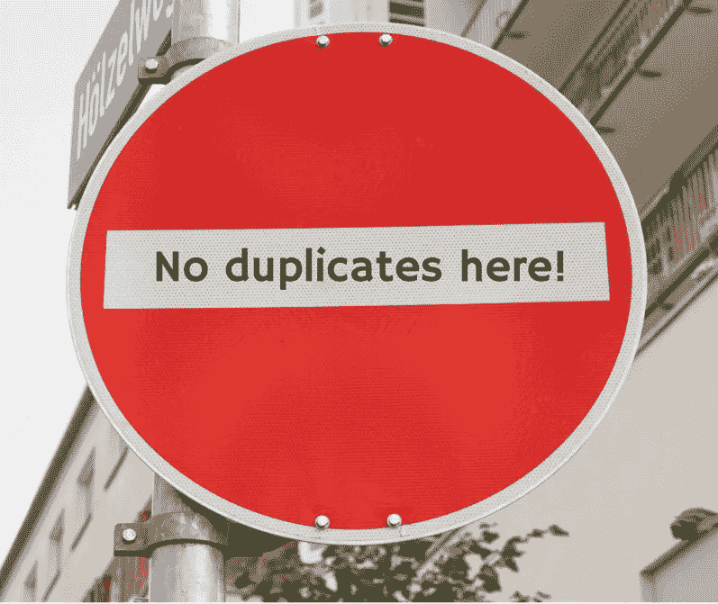

# #14 数据工程—转换数据—复制数据(ETL 管道)

> 原文：<https://medium.com/mlearning-ai/14-data-engineering-transform-data-duplicate-data-fa7af01cd372?source=collection_archive---------2----------------------->

这是与数据工程相关的系列文章中的第十四篇。作为数据科学家纳米学位项目 Udacity 的一部分，我一直在写我学到的所有重要的东西。我意识到这是测试我对课程材料的理解和保持学习纪律的最好方法。请检查其他职位以及。