# 2 深度强化学习:策略梯度

> 原文：<https://medium.com/mlearning-ai/2-deep-reinforcement-learning-policy-gradients-5a416a99700a?source=collection_archive---------9----------------------->

这是我总结 Sergey Levine 教授主持的 CS285 讲座系列文章的第二篇，所有的荣誉都归于他。所有图片均取自他的讲座。[我写的这篇文章](https://samuelebolotta.medium.com/1-an-introduction-to-deep-reinforcement-learning-c5ab792af013)是对深度强化学习的介绍。

策略梯度在某些方面是最简单的强化学习算法，因为它们直接尝试区分强化学习目标，然后对策略参数执行梯度下降以使策略更好。

RL 的目标可以写成一个期望。我们想取轨迹下报酬之和的期望值，其中轨迹按 pθ(τ)分布。

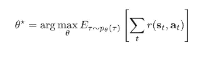

## 评估目标

因为我们假设我们可以在现实世界中运行我们的策略，这相当于从初始状态分布和转移概率中进行采样，所以我们可以通过简单地从我们的策略中展开来近似地评估目标。我们在现实世界中运行它 n 次，以收集 n 个采样轨迹:

t stands for timestep; i stands for sample

我们可以通过简单地将每个样本轨迹上的回报相加，然后对样本轨迹上的回报进行平均，得到总回报期望值的无偏估计

## 直接政策差异

当然，在现实中我们不只是想估计目标；我们实际上想改进它。要做到这一点，我们需要想出一种方法来估计它的导数，关键是导数本身的估计需要是可行的，而不需要知道初始状态概率和转移概率。

如果我有一个期望值，我可以将它展开为离散变量的和或连续变量的积分，即概率与值之间的乘积:

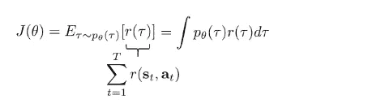

现在我们可以开始研究我们的导数了。因为微分算子是线性的，我们可以把它推进积分里面，所以这个导数等于:

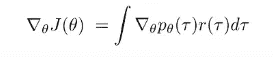

这实际上并没有给我们一个评估政策梯度的实用方法，因为 **∇** θpθ(τ)需要通过未知的初始状态分布和未知的转移概率进行微分。但是有一个非常有用的恒等式，可以让我们重写这个等式，我们可以只用样本来评估。方便的身份是:

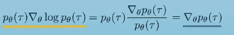

这是因为对数的导数等于 dx / x，我们要反过来应用这个恒等式。

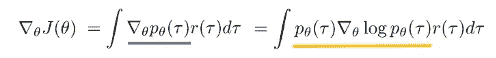

你会注意到，我们有一个 pθ(τ)乘以某个量的整体轨迹，这意味着我们也可以把它写成一个期望:

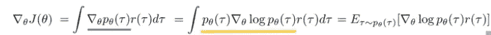

但是我们还没有完成，因为我们还有这个 **∇** θ log pθ(τ)项。所以让我们稍微努力一下。让我们再次提出我们的轨迹分布方程:

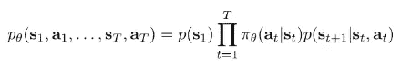

pθ(τ)等于初始状态分布的概率与动作概率和转移概率乘积之和的乘积。如果我们取两边的对数，乘积的对数就是对数的和，这意味着我们可以这样写:

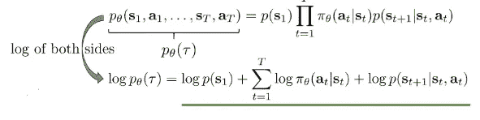

现在，我们将这一切代入 **∇** θpθ(τ)中，并对θ求导。现在，第一项和第三项对θ的导数为零，因为它们不依赖于θ。这意味着简化之后，我们只剩下这个:

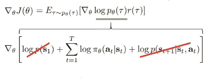

收集剩下的所有术语，扩展我们的符号，我们就剩下这个政策梯度的等式:

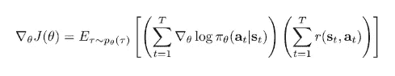

期望值内的一切都是已知的，因为我们可以访问策略，并且可以评估回报。如果我们想要评估策略梯度，我们可以简单地运行我们的策略，它将从 pθ(τ)生成样本，对它们的回报求和以确定哪个轨迹是好的或坏的，然后将这些乘以 **∇** logpθ的和。一旦我们以这种方式估计了梯度，我们就可以简单地通过采取梯度下降的步骤来改进我们的策略，采用旧的策略参数，并将策略梯度乘以学习率α

这个过程给我们提供了基本的策略梯度算法，也称为加强算法，它包括三个步骤:通过在真实世界中运行策略 n 次，根据 pθ(a|s)采样轨迹，对于方程评估策略梯度，然后采取梯度下降的步骤。

## 了解政策梯度

让我们花点时间培养一些直觉，看看政策梯度到底在做什么

什么是 **∇** logpθ？假设我们现在的策略只是一个离散的，从图像到离散动作空间的映射(左转或右转)。那么 logpθ就是这个策略分配给这两个动作之一的对数概率，而 **∇** logpθ是这个对数概率的导数。神经网络会输出这些概率，你可以对这些概率取对数。当你进行最大似然训练监督学习时，你通常会将观察到的标签的对数概率最大化，因此比较政策梯度和最大似然的做法可能会有所启发:在最大似然中，我们会收集一些人类选择行动的数据，然后我们会对这些数据进行监督学习，这将产生一个政策。最大似然目标只是分配给观察行为的对数概率的最大化，因此其梯度由所有样本和所有时间步长的总和 **∇** 对数 *π* θ(a|s)给出。当然，当我们做最大似然法时，我们假设数据中的行为是好行为。在策略梯度中，这不一定是真的，因为我们通过运行我们自己以前的策略生成那些动作，这可能不是很好。因此，最大似然梯度只是增加了所有行动的对数概率，而政策梯度可能会增加或减少它们，这取决于它们的回报值。直觉上，高回报轨迹的对数概率增加，而低回报轨迹的对数概率下降。所以，你可以把它看作是最大似然目标的梯度的一种加权形式。

如果我们有连续的行动呢？在这种情况下，我们需要为策略选择一个表示，它可以输出连续值操作的分布。例如，我们可以将策略表示为多元正态分布或高斯分布，其中平均值由神经网络给出。

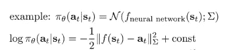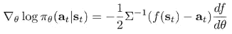

如果你推出一些轨迹并计算它们的回报，其中一些有很大的正回报，用绿色的勾号表示，而一些有很大的负回报，用红色的勾号表示，最后一些是中性的，你想要做的是沿着好的轨迹取对数概率并提高它们，沿着坏的轨迹取对数概率并降低它们。因此，政策梯度使得好的事情更有可能发生，而坏的事情不太可能发生。在某种意义上，你可以把政策梯度看作是一种试错学习的形式化

## 政策梯度出了什么问题？

我们可以思考一个问题:假设横轴代表轨迹，纵轴代表奖励:

假设我们有三个样本，这里的条形高度代表这些样本的回报:

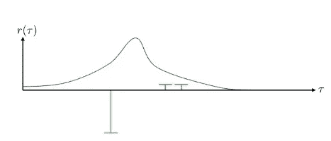

有了这三个样本，我们现在可以想象，当我们计算政策梯度时，蓝色政策分布将向哪个方向移动，轨迹分布将向哪个方向移动。我们要取这三点中的每一点，然后计算保单的对数，再乘以奖励值。

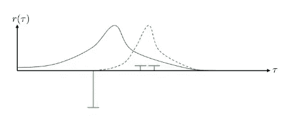

现在假设右边的样本还是比左边的好，但是都是正的。这是政策将如何改变:

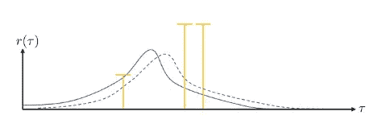

你可以想象奖励会有更多的病理变化:如果我改变奖励，右边的两个样本实际上会一直变为零呢？这个问题实际上是一个高方差的例子。本质上，我们之前描述的策略梯度估计器具有非常高的方差:根据你随机得到的样本，对于任何有限的样本大小，你可能得到非常不同的策略梯度值。随着样本数量趋于无穷大，策略梯度估计器将总是产生正确的答案，但是对于有限的样本大小，这使得策略梯度非常难以使用。事实上，策略梯度算法的许多进步基本上都围绕着减少它们的方差的不同方法。

## **减少差异**

我们要开始的第一个技巧是利用一个在我们的宇宙中永远成立的属性，那就是因果关系。因果关系表示，时间 t + 1 的政策不会影响另一个时间步长 t 的回报，这是另一种说法，即你现在做的事情不会改变你过去获得的回报。让我们再来看看政策梯度方程:

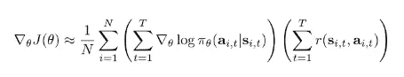

让我们这样重写它:

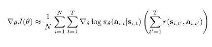

但是我们可以改变奖励的总和，丢弃过去的奖励，因为我们知道当前的政策不能影响它们:

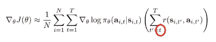

做出这一改变后，我们实际上最终得到了一个方差更低的估计量，原因是我们从总和中移除了一些项，这意味着总和是一个更小的数字，并且对更小数字的期望具有更小的方差。现在，我可能在这里提到的一点是，这个量有时被称为要去的奖励(因为它是从现在到时间结束的奖励):

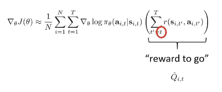

这个量实际上指的是对 Q 函数的估计。

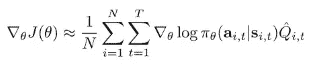

第二个技巧与基线有关。让我们回想一下这幅漫画，我们收集了一些轨迹，并评估了奖励，然后我们试图让好的轨迹更有可能出现，让坏的轨迹不太可能出现:

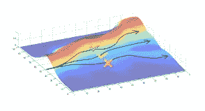

直觉上，如果回报集中，政策梯度会这样做，这意味着好的轨迹有正的回报，坏的轨迹有负的回报——但这不一定是真的。如果你所有的奖励都是积极的呢？我们想要做的是集中我们的奖励，这样比平均水平好的东西会增加，比平均水平差的东西会减少。例如，也许我们想从我们的奖励中减去一个量，这个量就是平均奖励:

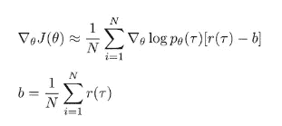

这将使政策梯度增加比平均水平更好的轨迹的概率，并降低比平均水平更差的轨迹的概率，然后这将是真实的，不管奖励函数实际上是什么。有趣的是，从你的政策梯度回报中减去一个常数 b 实际上不会改变预期的梯度，尽管它会改变它的方差——这意味着对任何 b 来说，做这个技巧都会让你的梯度估计器保持无偏。平均奖励实际上并不是最好的基线，但实际上已经很不错了。

## **政策外政策梯度**

我们如何将政策梯度从政策上的设置扩展到政策外的设置？我想介绍的第一部分是为什么策略梯度被认为是一种基于策略的算法:它们需要在每次修改策略时生成新的样本。这是一个问题的原因是，如果你看政策梯度的形式，它是 pθ(τ)下的期望值；我们在策略梯度中计算这一期望值的方法是通过使用最新策略对轨迹进行采样，但是由于在参数向量θ处评估的导数需要根据θ进行采样，因此我们必须在每次改变θ时丢弃我们的样本，这意味着策略梯度是一种偏离策略的算法。当我们想要进行深度强化学习时，这有点问题，因为神经网络在每个梯度步骤中只会发生一点点变化——神经网络是高度非线性的，所以我们不能采取真正巨大的梯度步骤，这意味着在实践中我们通常会采取大量小梯度步骤，但每个小梯度步骤都需要通过在系统中运行您的策略来生成新的样本。当生成样本的成本很高时——无论是计算成本还是实际货币成本——这会使政策梯度变得非常昂贵。

如果我们确实想使用非策略样本，我们可以使用一种叫做重要性抽样的东西来修改策略梯度，重要性抽样是一种通用技术，用于在只有来自不同分布的样本时评估一种分布下的期望。如果我们没有来自 pθ(τ)的样本呢？如果我们有其他发行版的样本呢？这可能是以前的政策，甚至是某人的示范。这是我们如何写出总体重要性抽样的方法。

假设我们想计算某个函数 f(x)在某个分布 p(x)下的期望值。我们知道 f(x)的期望值是 p(x)乘以 f(x)在 x 上的积分。如果我们只能得到其他的分布 q(x ),我们可以用 q(x)乘以 q(x)的积分值。然后，我们可以稍微重新排列一下这些项，把所有内容都重写为 q(x)下的期望值:

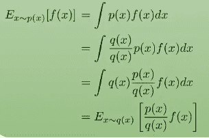

对于策略梯度，它看起来是这样的:

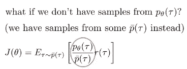

## **利用重要性抽样导出政策梯度**

假设我们有来自 pθ(τ)的样本，我们想估计某个新参数向量θ prime 的值。

θ prime 的目标是:

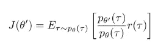

换句话说，就是重要性权重的 pθ(τ)下的期望值乘以报酬。请注意，在这里，这个目标中实际上取决于θ prime 的唯一部分是重要性权重中的分子，因为现在我们的样本来自不同策略的分布。这意味着，当我想计算关于θ素数的导数时，我只需要担心分子中的这一项。这是导数:

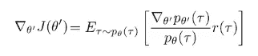

我已经用它的导数代替了唯一依赖于θ素数的项，然后我将把我有用的恒等式替换回来。

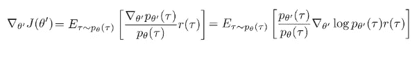

当你看这个等式的时候，你可能会马上意识到，这就是我们得到的等式，如果我们采用政策梯度，只是卡在一个重要的权重上。有趣的是，如果您在本地估计这个梯度(也就是说，您使用这个重要性抽样推导来评估θ = θ prime 处的梯度)，重要性权重等于 1，并且您恢复了原始策略梯度。但是在非策略设置中，θ prime 不等于θ，在这种情况下，我们必须依靠我们的重要性权重。如果我们现在在所有三个中替换这个政策梯度中的项，这就是我们如何重写等式:

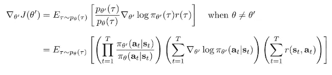

我们只是把这三项相乘。对于因果关系，如前所述，我们不需要考虑当前行为对过去奖励的影响，我们可以将奖励和重要性权重分布到策略对数梯度上的和中:

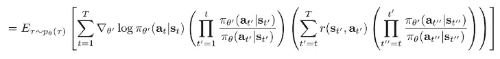

直观地说，这是您使用新策略达到该状态的概率(策略对数的梯度之和乘以过去重要性权重的乘积)乘以未来重要性权重加权的奖励之和。如果我们忽略奖励的权重(可能是指数级的大)，我们恢复一个叫做策略迭代算法的东西，你实际上可以证明一个策略迭代算法仍然会改进你的策略。它不再是梯度，但它是一个明确的方式，提供保证改善您的政策。对于过去的重要性权重来说，这是不正确的，这是有问题的，因为它们在 t 中是指数的。让我们说重要性权重都小于 1:这是一个非常合理的假设，因为你根据策略θ对你的行为进行采样，所以你的行为在策略θ下比在策略θ prime 下可能有更高的概率。所以，这意味着这些数字的乘积会以指数形式快速趋近于零:你的方差会以指数形式快速趋近于无穷大，政策梯度已经有很高的方差了。为了理解这个术语所扮演的角色，我们可以稍微改变一下我们的目标，我们这样做的原因是因为我们真的想要一个删除这个术语的借口。

这是我们的政策梯度:

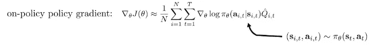

它是我们所有样本的总和，是我们所有时间步的总和，是政策的对数乘以奖励的梯度。现在，我们对动作和状态进行采样的方式是在环境中推出我们的策略，但你可以等效地将其视为在时间步长 t 从状态-动作边际中采样状态-动作对，因为当你对整个轨迹进行采样时，每个时间步长的相应状态和动作看起来与你在该时间步长从状态-动作边际中采样得到的结果没有什么区别。因此，你可以写一个不同的偏离政策的政策梯度，而不是在整个轨迹上的重要性采样，重要性采样发生在州行动的边缘。所以现在你的重要性权重是:

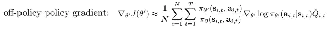

这本身不是很有用，因为在不知道初始状态分布和转移概率的情况下，实际计算这些裕度的概率是不可能的。但是以这种方式写出来，让我们可以玩一个小把戏:使用链式法则，我们可以将分子和分母中的边际分成两个项的乘积，一个状态边际和一个行动条件边际。然后，我们可以忽略状态边际:

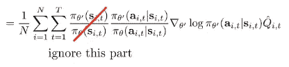

在这种情况下，我们得到了重要性抽样策略梯度的一个等式，其中乘积忽略了除 t prime = t 处之外的所有比率。因此，如果您不希望您的重要性权重为指数，您可以尝试忽略状态边际概率的比率。你仍然在考虑行动概率的比率，但是忽略了状态边际概率。这通常不会给你正确的政策梯度。然而，忽略状态边际概率是合理的，因为在θ prime 与θ相差不大的情况下，它给出了有界误差。这个简单的见解实际上对于推导实际重要性采样策略梯度算法非常重要，这些算法不会遭受方差的指数增长。

## **实施政策梯度**

如果我们想天真地实施政策梯度，我们可以简单地计算这个等式:

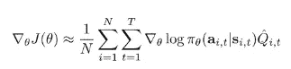

然而，这是非常低效的，因为神经网络可以具有非常大量的参数。事实上，参数的数量通常比我们产生的样本数量大得多。假设我们有 n 个参数，其中 n 可能是一百万，我们有 100 条轨迹，每条轨迹有 100 个时间步。所以我们总共有 10，000 个状态-动作对，这意味着我们需要计算这一百万个长度向量中的 10，000 个。就内存存储和计算而言，这将非常非常昂贵。

我们反其道而行之，而不是计算神经网络输出相对于输入的导数，然后乘以损失的导数。我们首先计算损失的导数，然后使用反向传播算法通过神经网络反向传播，这是我们的自动微分工具将为我们做的。为了做到这一点，我们需要建立一个图表，使该图表的导数给我们政策梯度。

我们解决这个问题的方法是从我们已经知道如何计算的梯度开始，这是最大似然梯度。如果我们想计算最大似然梯度，那么我们要做的是使用交叉熵损失等方法实现最大似然目标，然后调用点后退或点梯度，这取决于您的自动刷新包，并以这种方式获得梯度。

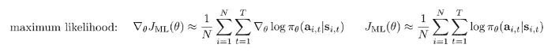

我们将实现策略梯度以使我们的包有效地计算它们的方法是通过实现一种伪损失作为加权最大似然。因此，我们将实现所有采样行为的对数概率之和乘以要获得的奖励。这个等式只是一个量，它的导数就是政策梯度。当然，这其中的一个关键部分是我们的自动差异化方案没有意识到奖励本身受到我们政策的影响。

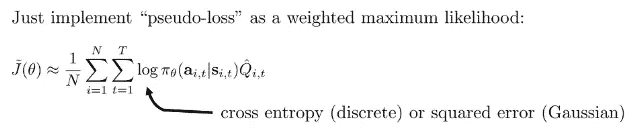

## **实践中的政策梯度**

*   请记住，策略梯度具有很高的方差，因此即使实现看起来很像监督学习，它的行为也会非常不同。政策梯度的高变化会使一些事情变得相当困难:你的梯度会非常嘈杂
*   这意味着你可能需要使用更大的批量，可能比你习惯于监督学习的要大得多——几千或几万的批量是相当典型的
*   调整学习速度将变得更加困难。像 ADAM 这样的自适应步长规则可能还可以，但是仅仅是带动量的常规 SGD 可能非常难以使用
*   总的来说，你只需要做比监督学习更多的超参数调整

## **高级政策梯度**

我想讨论的特别问题是影响政策梯度的数字问题，尤其是在连续行动空间中。为了说明这个问题，让我首先描述一个示例问题。假设你有一个一维的状态空间，那么你的状态本质上是一条数线，你的目标是达到状态 s = 0(下图中的星号)。你也有一个一维动作空间，所以让我们假设你位于图像中有蓝色球的状态:

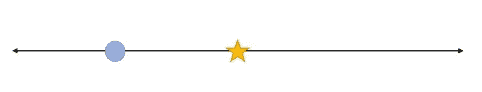

你的行动可以带你向左或向右；你的奖励是:

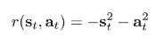

你得到一个基于距离 s0 的平方的惩罚，你也得到一个大动作的惩罚。你的策略是单变量正态分布的，只有两个参数，k 和σ:

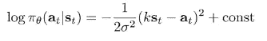

策略是一个以你当前位置为中心的高斯函数，你的行为是你当前状态的 k 倍。所以你要进行这种嘈杂的行走，满怀希望地走向 s =0 的目标。

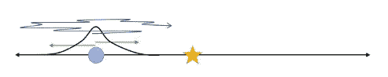

二维参数空间的便利之处在于，我们实际上可以可视化整个向量场，该向量场对应于参数空间中所有位置的梯度。

上图中，蓝色小箭头表示归一化到单位长度的梯度；横轴是第一个参数 k；纵轴是第二个参数σ。参数的最佳设置是 k = -1，sigma = 0，因此它位于该图底部的中间。但是，从这个图中你可能会注意到，箭头实际上并不指向最优值，原因是随着σ越来越小，相对于σ的梯度越来越大。相对于 k 的导数仍然存在，但相对于σ的导数相对更大，因此当我们重新归一化梯度时，σ部分完全占主导地位，因为σ变小了。这意味着，当我们遵循这一梯度时，将需要非常长的时间才能达到最佳参数设置，因为我们将花费所有时间来降低σ。你们中熟悉数值方法的人可能会认为这是一个条件差的问题；直觉是，这本质上与优化一个二次函数是同一个问题，其中对应矩阵的特征值有一个非常大的比率，所以如果你有一个二次函数，它的一些特征值非常大，一些特征值非常小，那么一阶梯度下降法真的会很困难。

## **自然政策梯度**

当我们通过策略梯度采取梯度步骤时，为这种类型的梯度选择步长可能非常微妙，因为一些参数对策略分布有很大影响，而一些则没有。对σ的导数会变得非常非常大，而对 k 的导数不会。所以，这里真正发生的是不同的参数对政策的影响程度不同；有些参数会大幅改变概率，有些则不会改变太多，但您希望所有参数都达到最佳值。直觉上，你想要做的是，对于那些不太改变政策的参数，要有较大的学习率，而对于那些改变很大的参数，要有较小的学习率。

我们想要做的是，我们想要以某种方式重新参数化这个过程，以便我们的步骤在策略空间而不是参数空间中具有相同的大小，这将从本质上重新调整梯度，以便大量改变策略的参数获得较小的比率，而改变策略很少的参数获得较大的比率。

我们可以通过使用自然梯度来解决这个问题，这只需要将您的梯度乘以 F 逆，其中 F 逆是 Fischer 信息矩阵的估计。你可以通过使用[共轭梯度有效地做到这一点。](https://en.wikipedia.org/wiki/Conjugate_gradient_method)

*随时给我留言或:*

1.  通过[LinkedIn](https://www.linkedin.com/in/samuele-bolotta-841b16160/) 和 [Twitter](https://twitter.com/SamBolotta) 联系我
2.  跟着我上[媒](/@samuelebolotta)

 [## Mlearning.ai 提交建议

### 如何成为 Mlearning.ai 上的作家

medium.com](/mlearning-ai/mlearning-ai-submission-suggestions-b51e2b130bfb)