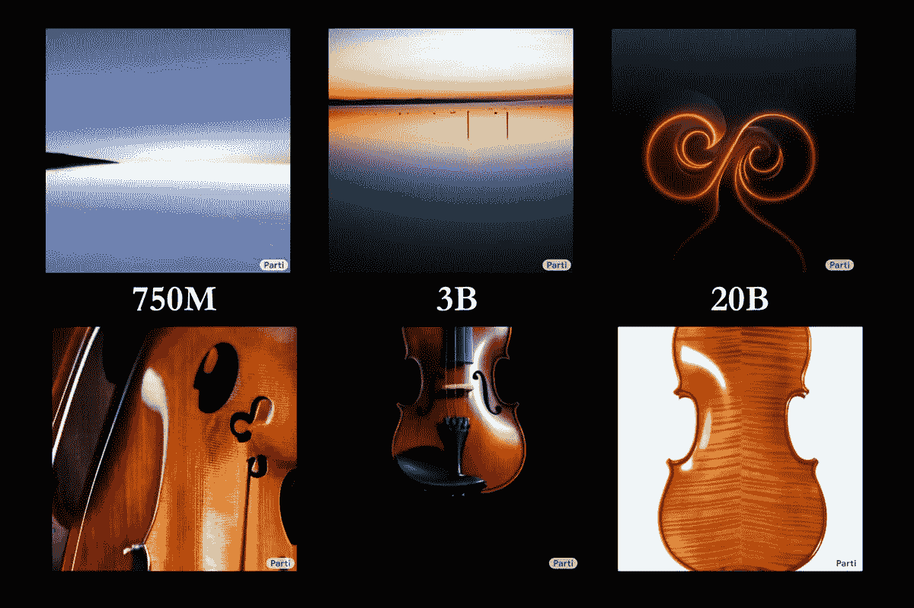

# 200 亿参数人工智能艺术模型

> 原文：<https://medium.com/mlearning-ai/20-billion-parameter-ai-art-model-c11c35e58200?source=collection_archive---------1----------------------->

## [机器学习艺术](https://mlearning.substack.com)

## *路径自回归文本到图像*模型第一部分

[the Parti models at three different scales — 750M, 3B, and 20B](https://evartology.substack.com/p/all-of-the-greatest-ai-powered-art?r=9hp4d&s=w&utm_campaign=post&utm_medium=web)

当**艺术家**阅读或谈论一个场景时，他们可以在脑海中描绘出它的细节。支持基于这些描述制作图像的能力可以在生活的许多领域打开创造性的可能性，例如艺术、设计和多媒体…