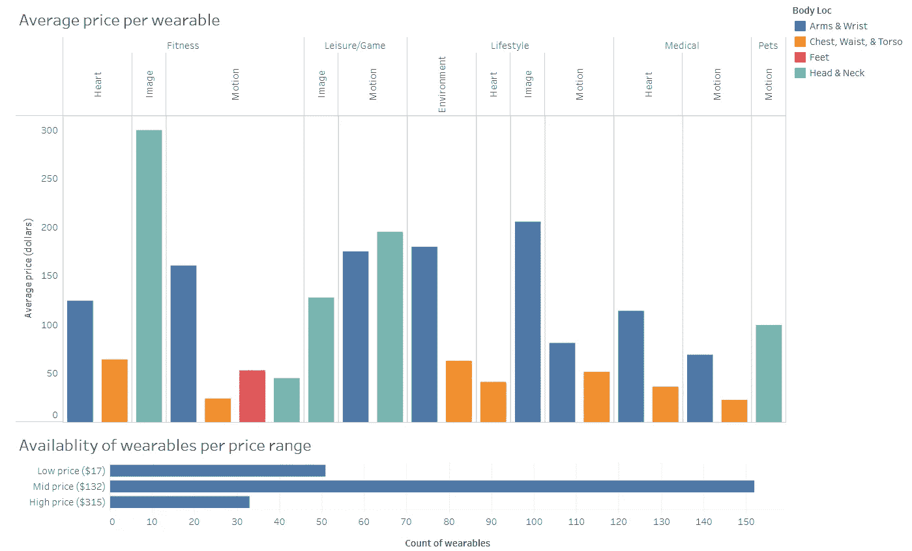
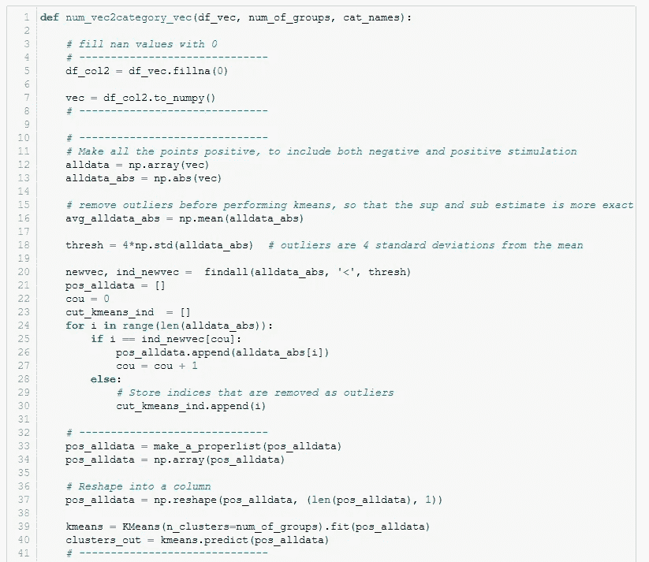
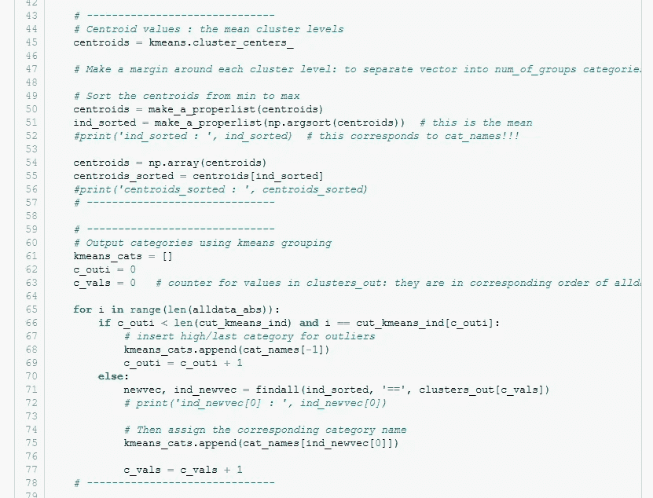
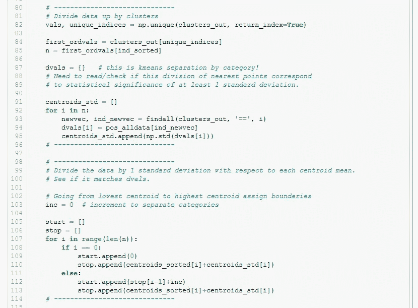
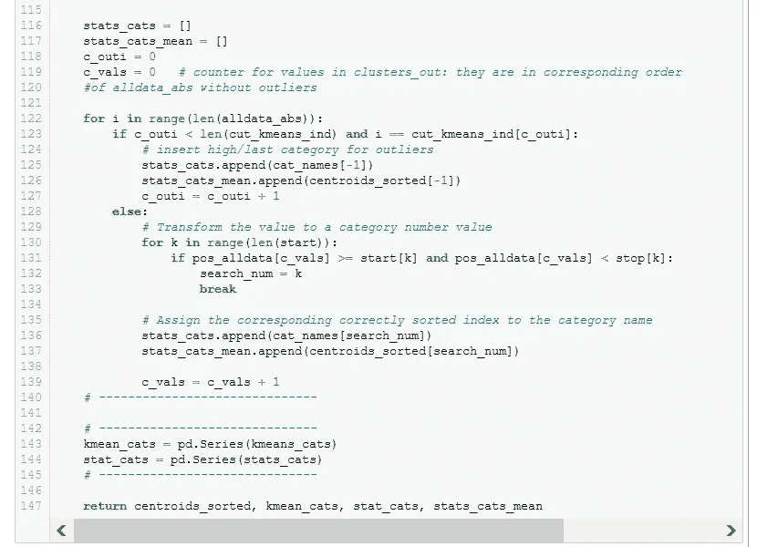
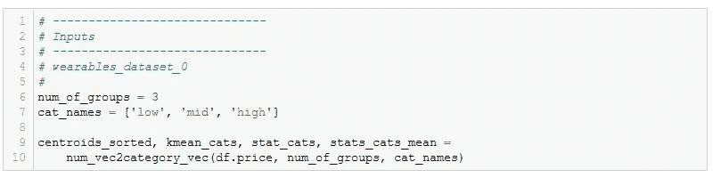
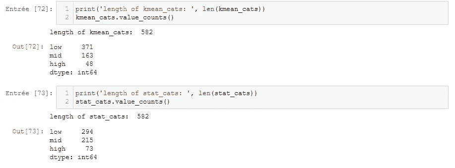

# 2018 年第 35 周 8 月 27 日改造周一数据集:可穿戴设备

> 原文：<https://medium.com/mlearning-ai/2018-week-35-aug-27-makeovermonday-dataset-wearables-84c036a7317a?source=collection_archive---------5----------------------->

我正在通过 Coursera 的“Tableau 可视化基础”课程学习一个名为 Tableau 的软件程序。对于期末项目，我们需要从 data.world 中选择一个数据集。在 data.world 上，他们有一个名为“改头换面星期一”的比赛，每周一他们都会发布一个新的数据集，并要求数据科学家或任何人做出比原始新闻文章更好的可视化效果。如果你有兴趣参加，完整的网址是[https://www.makeovermonday.co.uk/data/](https://www.makeovermonday.co.uk/data/)。

我选择了可穿戴设备上的数据集，因为我喜欢研究人类活动数据。下面是对现有可穿戴设备类型(使用、测量和在身体上使用的位置)及其价格的快速分析和可视化。原文在 https://tinyurl.com/35spzmsv 的[；他们只看到身体位置和可穿戴设备使用的数量。](https://tinyurl.com/35spzmsv)

你也可以使用 Tableau Public(【https://tinyurl.com/yezery3e】T4)来查看这个交互图。Tableau Public 是一个软件，它允许你导入一个数据集，制作一个可视化的图像，然后把它发布到网上，作为一种已发布的工作簿，供其他人查看。

# 有用的函数:一维向量到分类向量

当我第一次搜索一款光电容积描记(PPG)手表时，我真的很惊讶，只有 20-30 欧元的非常便宜的手表，或者 100 欧元或更贵的手表。看看上面的数字，一个可穿戴设备的平均价格，你看不到技术上的巨大价格差距。我认为通过将价格分类，然后计算不同的价格范围来显示这种价格差距会很有趣。下面是我使用 kmeans 函数编写的一些代码。

## 子函数

## 子函数的主调用

## 输出

因此，我们从 kmeans 质心(stat_cats)和 kmeans 分组(kmeans_cats)获得了一个分类向量。我使用 stats_cats_mean，这是 Tableau 中低、中和高文本位置的 kmeans 质心/价格水平平均值，以获得上面的“每个价格范围的可穿戴设备可用性”图。

享受和快乐的可穿戴购物！

 [## Mlearning.ai 提交建议

### 如何成为 Mlearning.ai 上的作家

medium.com](/mlearning-ai/mlearning-ai-submission-suggestions-b51e2b130bfb)