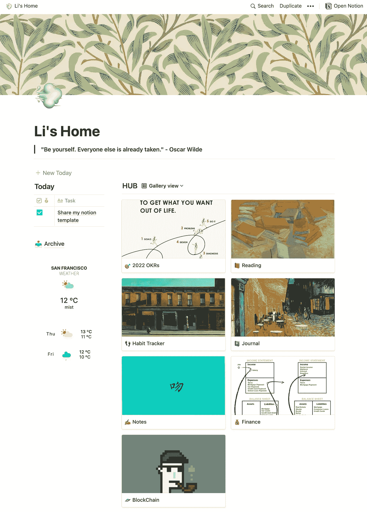
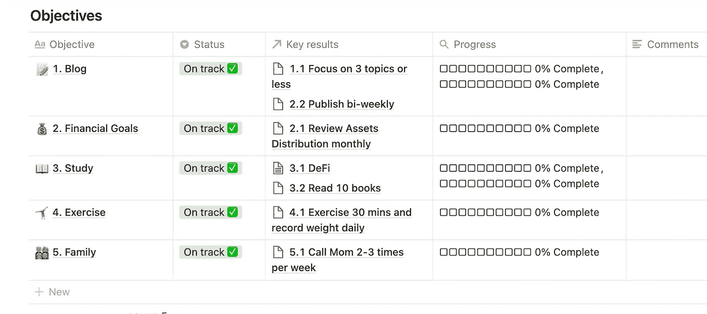
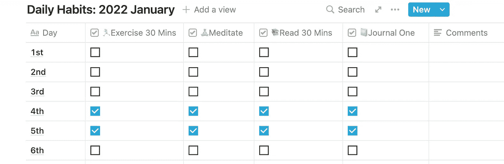
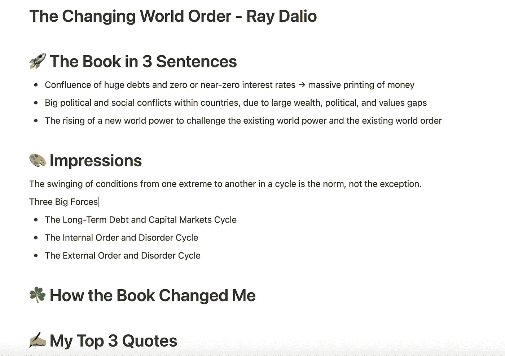

# 2022 始于理念—我的仪表板模板

> 原文：<https://medium.com/mlearning-ai/2022-starts-with-notion-my-dashboard-template-72c5014302ae?source=collection_archive---------0----------------------->

# 前言

时间总是过得很快，快得我忘记了熟人的名字，在博客上发帖。无意冒犯。我的恶习。

2022 踏进门，带着面具却穿着脏鞋。当我回顾我的 2021 年时，我无法对我得到的灵感、我遇到的人、我学到的知识和我做出的重要决定表达更多的感激。未来很难预测，但我仍然站着，紧握着舵。

那么，作为 2022 年的新起点，我们该怎么做呢？策划！2022 年帮助我们设计和管理生活的最好工具是什么？让我来介绍一下这个概念。

# 为什么是观念？

如果你和我一样是 YouTube 的忠实用户，如果你关注的 YouTube 用户中没有一个人没有对 Notion 发表评论，我会感到惊讶。人们称赞它是有史以来最好的一体化生产力工具，每个人都可以轻松使用。它非常灵活，可以成为任务管理、写作知识库、习惯跟踪器、目标规划器等等的首选。我用它的主要原因是什么？我必须坦白和坦率——其他工具是如此丑陋。是的，我说的就是你，OneNote。还有你 EverNote。角落里没有自鸣得意的地方。

免责声明——光相信好事会发生是不够的。如果计划没有被完全遵循，没有采取行动，任何生产力工具都不会帮助你。我从 James Clear 的*原子习惯*中学到的一件事就是让好习惯变得明显和有吸引力。如何让它变得有吸引力？分享！如果这个作品被任何人采用，我会很高兴。

# 我的仪表板包含什么？

当我设计仪表板时，我尽可能多地收集其他人的优秀作品，并坚持我的原则——少即是多。

主页以我最喜欢的奥斯卡·王尔德的名言开始— **做你自己。其他人都已经有人了。**在左侧面板上，有一个整洁的**今日待办事项**列表，你可以轻松添加新任务、标记完成、评论。当新的一天开始时，只需将块拖到*存档*，并点击 *+ New Today* 按钮创建一个新模板。别担心。一切都为你处理好了。

右边是今天的主菜**中枢**。我的日常生活有六个基本部分:

*   **2022 年 OKR** ( *目标和主要结果* ) —我 2022 年在个人项目、家庭关系、财务、锻炼和兴趣方面的目标
*   **阅读** —我对书籍和文章的笔记和印象。感谢 Ali Abdaal 提供了精彩的笔记模板。
*   **习惯跟踪器**——跟踪我的日常习惯，比如冥想、锻炼、日记等等
*   日志——每日日志、年度评论、个人原则和灵光一现
*   **财务** —每月预算跟踪和资产审查
*   **区块链** —不要小看学习之心(还有火) :)

My Homepage — by Li Miao

让我们体验一下这些部分的外观

## OKR

OKR by Li Miao

## 习惯跟踪器

Habit Tracker by Li Miao

## 阅读

Reading by Li Miao

# 这个模板怎么用？

1.  确保你已经有一个概念帐户和应用程序
2.  进入[李主页](https://scalloped-scarf-9c9.notion.site/Li-s-Home-9eff0a73df7d419f9754473417d6a5a6)
3.  在右上角，点击**复制**
4.  请随意对其进行任何编辑，以符合您的目的

# 下一步是什么

正如我把博客计划放在我的 2022 年 OKR 里一样，我希望我能坚持下去，继续分享我在 ML/AI 的工作，我在区块链/DeFi 的学习，我在硅谷的旅程。敬请期待，2024 年再见。

欢迎关注我的博客[www.thelimiao.com](http://www.thelimiao.com/)！

 [## Mlearning.ai 提交建议

### 如何成为 Mlearning.ai 上的作家

medium.com](/mlearning-ai/mlearning-ai-submission-suggestions-b51e2b130bfb)