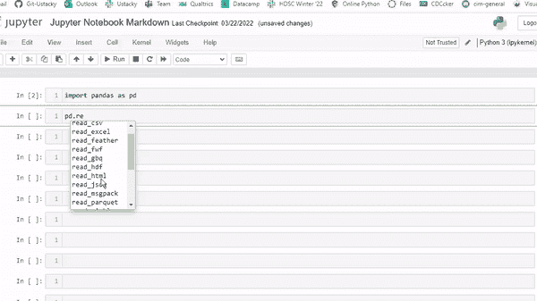

# 25 个 Jupyter 笔记本电脑技巧和快捷方式，提高您的工作效率

> 原文：<https://medium.com/mlearning-ai/25-jupyter-notebook-hacks-to-boost-your-productivity-3d0530340cf2?source=collection_archive---------1----------------------->

Jupyter Notebook 是由 Jupyter 项目开发的一个基于网络的交互式计算平台。Project Jupyter 是一个非盈利的开源项目，诞生于 2014 年的 IPython 项目，它已经发展到支持跨所有编程语言的交互式数据科学和科学计算。Jupyter 是 100%开源软件，所有人都可以免费使用，并根据修改后的 BSD 许可证的自由条款发布。

**Jupyter**

Jupyter 的其他项目包括: ***活页夹、JupyterHub、JupyterLab、Voilà*** *和* ***小工具。***

Jupyter notebook 允许数据科学家创建和共享文档，这些文档将实时代码、等式、计算输出、可视化、叙述性文本和其他多媒体资源集成到一个文档中。jupyter 笔记本离线工作，有一些在线版本。

在这里，我们将讨论一些在使用 jupyter 笔记本(在窗口上)时最大化工作效率的技巧和快捷方式。

Google Colab 和 Kaggle 内核是 jupyter 笔记本的云版本。虽然 Kaggle 笔记本的工作方式与本地 jupyter 笔记本完全一样，但 Google Colab 有更多的技术细节和高级功能，尤其是快捷键(我们可以稍后再讨论)。

**Jupyter 笔记本快捷键**

**命令模式** 这是当你在一个单元格之外的时候。选定的单元格变成蓝色。

1.  将代码单元格转换为 markdown → M
2.  将降价单元格转换为代码→ Y
3.  在当前单元格上方插入一个单元格→ A
4.  在当前单元格下插入一个单元格→ B
5.  删除当前单元格→ DD
6.  撤消单元格删除→ Z
7.  复制单元格→ C
8.  剪切单元格→ X
9.  粘贴单元格(下图)→ V
10.  粘贴单元格(上图)→ Shift + V
11.  运行单元格→ Ctrl+ Enter
12.  运行并选择下面的单元格→ Shift + Enter
13.  运行并在下面插入一个新单元格→ Alt + Enter
14.  中断内核→ II
15.  重启内核→ 00(零)
16.  保存→ S
17.  保存和检查点→ Ctrl + S
18.  向上滚动→空格
19.  向下滚动→ Shift +空格键
20.  合并单元格→ Shift + M

**编辑模式** 这是你在单元格中工作的时候。选定的单元格变成绿色。

21.全选→ Ctrl + A

22.注释→ Crl + /

23.删除一整行→ Ctrl + D

24.撤消→ Ctrl +Z

25.重做→ Ctrl + Y

26.撤消选择→ Ctrl + U

27.重做选择→ Alt + U

**更多快捷方式** 在一个函数/包方法后按 tab 键，给出我们可以对该函数或包执行的可能操作列表。

此外，在函数括号()内按 Shift + tab 键会显示出函数中可能包含的参数列表。

tab + shift.gif

这些只是我们众多快捷方式中的一部分，请不要犹豫，通过评论框添加您的快捷方式。

*   跟随[媒体](http://tiamiyu.medium.com)
*   在 [LinkedIn](https://www.linkedin.com/in/tiamiyu1/) 上连接

鼓掌，分享和联系…

 [## Mlearning.ai 提交建议

### 如何成为 Mlearning.ai 上的作家

medium.com](/mlearning-ai/mlearning-ai-submission-suggestions-b51e2b130bfb)