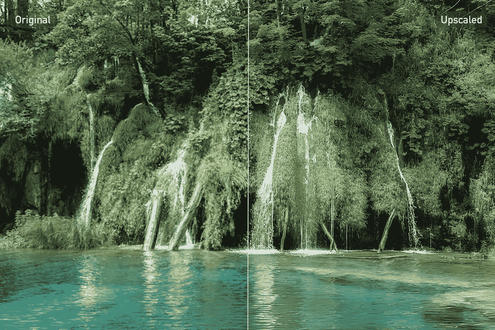
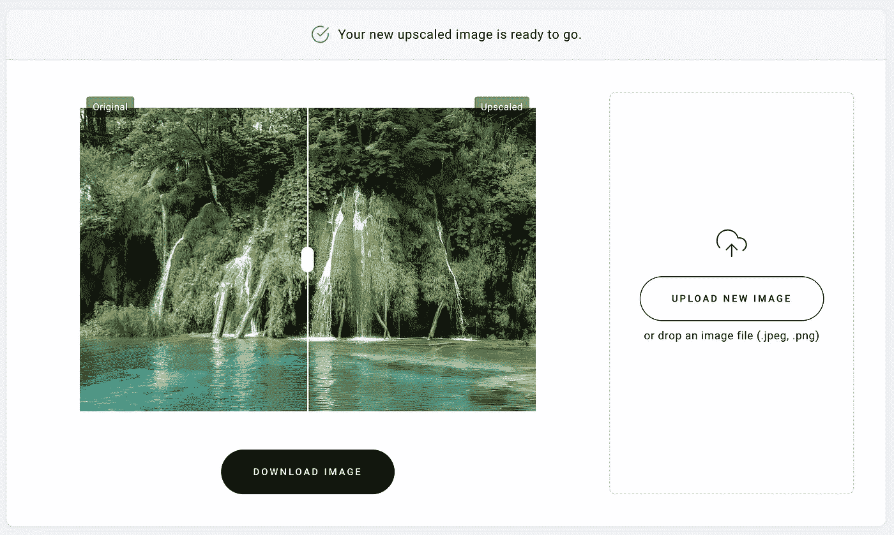
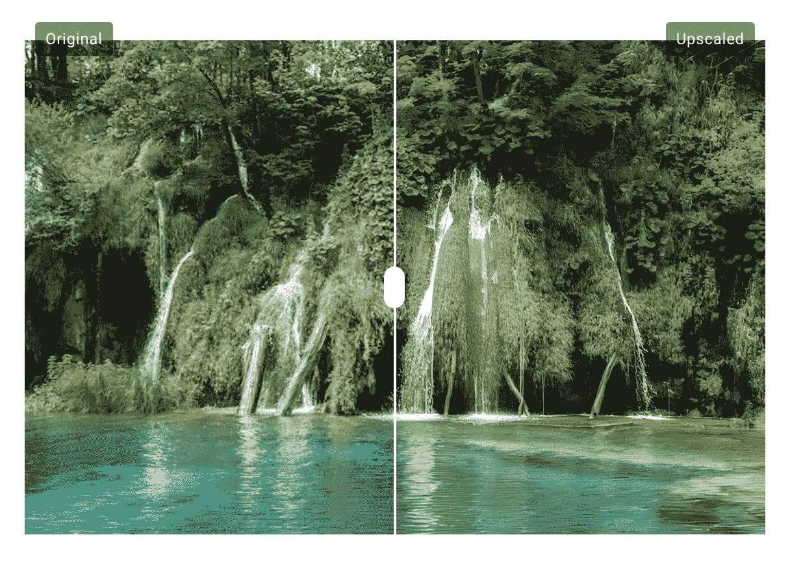
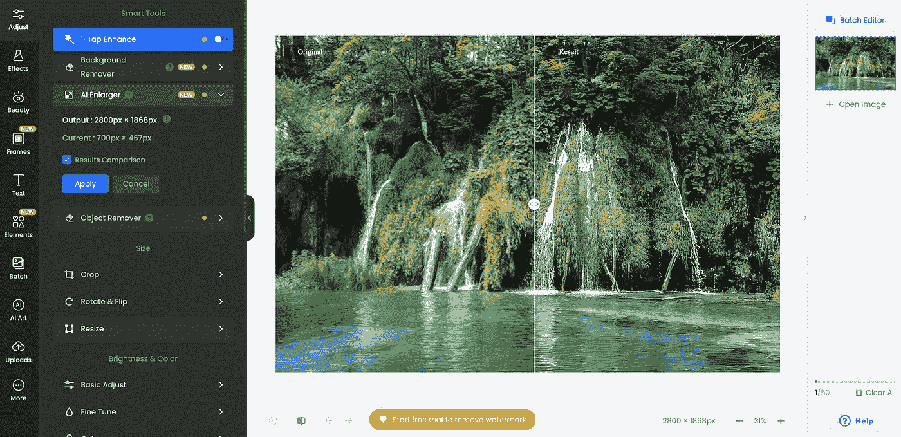
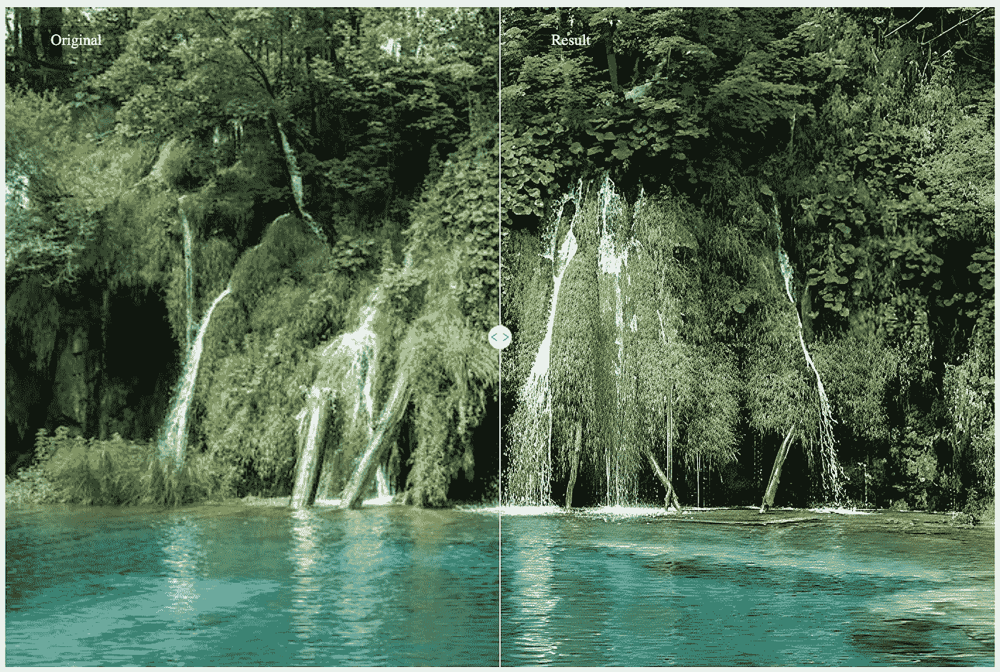
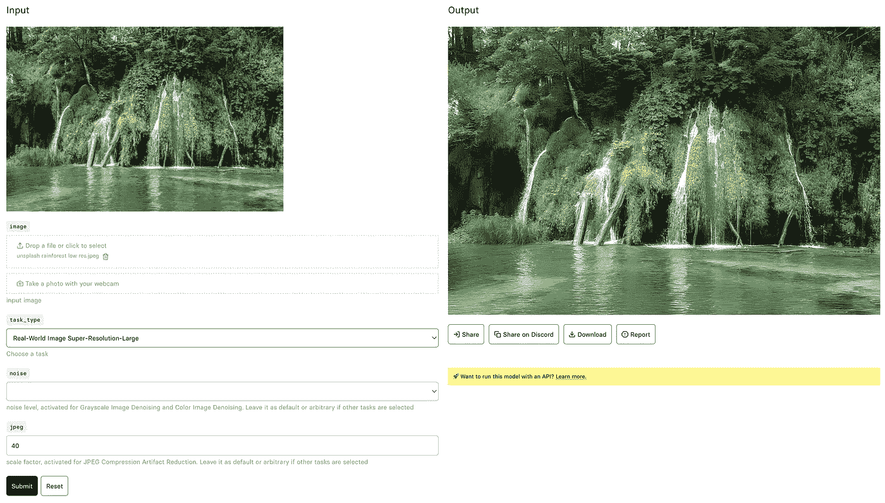

# 3 个最好的免费网站来升级你的图片

> 原文：<https://medium.com/mlearning-ai/3-best-free-websites-to-upscale-your-images-9f4e4529cdf0?source=collection_archive---------2----------------------->

## 利用人工智能的力量

> 这篇文章将向你展示 3 个最好的免费网站来轻松提升你的图片。

这些网页可以让你放入任何种类的数码艺术品、照片或其他种类的图像，极大地提高它们的质量。

请在下面的目录中随意选择一个感兴趣的主题，或者从头开始阅读。

## 目录

*   [**简介**](#4d03)
*   [**3。齐罗**](#e08e)
*   [**2。**照片](#2c2d)
*   [**1。SwinIR(我个人的最爱)**](#e00b)
*   [**期末注释**](#cf07)

# 介绍

使用人工智能来提高图像的信息丰富度似乎是未来的事情，但在对图像进行放大或降噪时，它实际上是可行的。

基于深度学习的模型的进步，特别是过去几年中计算机视觉的进步，使得图像放大的发展成为可能。

如果你想提高几年前拍摄的照片或数码艺术品的分辨率，这并不重要，现在任何类型的图像都可以提高分辨率。

这篇文章旨在提供一些在线资源，其中一个更具技术性，但更灵活，其他的是易于使用的即插即用解决方案。

对于下面显示的所有例子，我使用了相同的缩小 jpeg 图像，这样你就可以比较图像放大工具的质量。

# 3.齐罗

齐罗的 AI Image Upscaler 是一个简单的在线工具，允许你输入任意图像、照片、绘画或任何其他东西，并在几秒钟内返回更高分辨率的版本。

该网站是建立在一个简单的方式，使每个人都容易使用。

[Zyro](https://zyro.com/tools/image-upscaler?preventLanguageRedirect=1) Website

正如你在下面看到的，你甚至可以比较原始图像和升级后的新图像。

Original Photo by [Milada Vigerova](https://unsplash.com/@milada_vigerova?utm_source=medium&utm_medium=referral) on [Unsplash](https://unsplash.com?utm_source=medium&utm_medium=referral) upscaled with [Zyro](https://zyro.com/tools/image-upscaler?preventLanguageRedirect=1)

访问 zyro.com 的[T21，输入你的第一个 jpeg 或 png 来测试它。](https://zyro.com/tools/image-upscaler?preventLanguageRedirect=1)

# 2.福托尔

另一个高质量升级的好工具是 Fotor。作为齐罗，它非常用户友好，有一个很好的界面，让你做的不仅仅是放大你的图像。

该网站本身就像一个 photoshopping 工具，能够在图像放大的同时实现基于人工智能的功能，如对象或背景去除。

[Fotor](https://www.fotor.com/image-upscaler/) Website

下面原始图像和升级图像的对比似乎比齐罗提供的图像更令人印象深刻。

Original Photo by [Milada Vigerova](https://unsplash.com/@milada_vigerova?utm_source=medium&utm_medium=referral) on [Unsplash](https://unsplash.com?utm_source=medium&utm_medium=referral) upscaled with [Fotor](https://www.fotor.com/image-upscaler/)

查看 [**Fotor**](https://www.fotor.com/image-upscaler/) 并探索其功能。

# 1.SwinIR(我个人的最爱)

再来看一个更具技术性的工具，由 Jingyun Liang 开发的 SwinIR ，其基于变压器的神经网络架构提供了极大的放大和图像去噪能力。

> 我相信 SwinIR 是目前对图像进行放大和去噪的最佳方法。

在下图中，你可以看到你可以对你放入的图片进行调整。您可以选择一项任务，如极限放大、图像去噪等，并额外调整特定于任务的参数。

SwinIR served on [Replicate.com](https://replicate.com/jingyunliang/swinir)

下面你可以看到原始图像和升级图像之间的详细对比，在我看来，这真是太棒了。

Original Photo by [Milada Vigerova](https://unsplash.com/@milada_vigerova?utm_source=medium&utm_medium=referral) on [Unsplash](https://unsplash.com?utm_source=medium&utm_medium=referral) upscaled with [SwinIR](https://replicate.com/jingyunliang/swinir)

 [## 通过我的推荐链接加入 Medium-Jan Marcel Kezmann

### 成为会员，阅读 Jan 的每一篇文章(以及媒体上的所有其他作者)。您的会员费直接支持…

medium.com](/@jan_marcel_kezmann/membership) 

# 最终注释

我希望你喜欢这个小帖子。如果你真的想跟着我或者留下一些掌声。这将告诉我，如果这个内容是有趣的和相关的。

> 如果你有问题、建议或其他事情要说，请留下评论或通过 [**LinkedIn**](https://www.linkedin.com/in/jan-marcel-kezmann/) 直接联系我。
> 
> 也可以看看我的 [**GitHub**](https://github.com/JanMarcelKezmann) 等关于 [**中**](/@jan_marcel_kezmann) 的文章。

 [## Mlearning.ai 提交建议

### 如何成为 Mlearning.ai 上的作家

medium.com](/mlearning-ai/mlearning-ai-submission-suggestions-b51e2b130bfb)