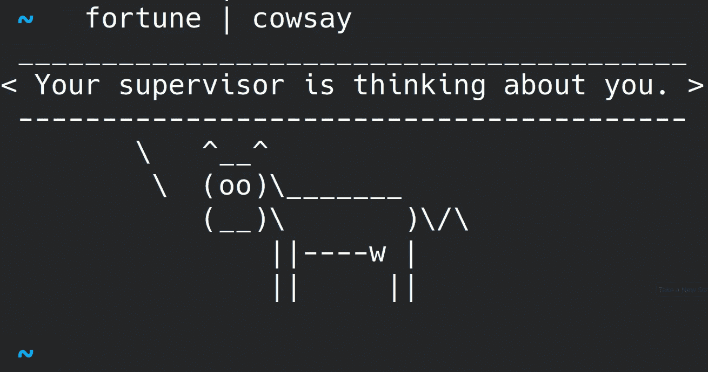

# 你需要知道的 3 个非常有用的 Linux 命令！

> 原文：<https://medium.com/mlearning-ai/3-incredibly-useful-linux-commands-you-need-to-know-208e5bcc149b?source=collection_archive---------0----------------------->

Linux 及其多用途的命令行是我软件开发的首选操作系统。这里有 3 个我在开发中常用的命令行工具，我**推荐你试用一下**！



## 1.可做文件内的字符串查找

我在开发时使用的 **#1 命令行工具**是`grep`。基本上这是一个简单的工具，在文件中搜索模式。但是你什么时候需要它？

好吧，假设你需要在你的代码库中找到变量`meow`的每一次出现。不幸的是，变量存在于许多不同的类和一些彼此不相关的函数中，所以 IDE 重构可能会很麻烦。**干脆**执行`grep -rn meow`！

`-r`标志将使`grep`递归地在所有子目录**中搜索**，并且`-n`标志将打印除文件名之外的行。这就是你需要的一切！

```
**~**/**linux_commands** grep -rn meow      

example_tree/dir_1/subdir_2/great_file.md:3:**meow** 
example_tree/dir_2/another_great_file.md:2:**meow** 
example_tree/dir_2/another_great_file.md:23:**meow**
```

## 2.树

你是否曾经需要查找一个文件而不知道它在哪里？或者您想知道一个目录及其子目录是如何构造的，但是没有任何概述？这就是`tree`的用武之地。

通过运行`tree`，你会得到一个**漂亮的目录树**，包含当前目录和所有子目录。

```
**~**/**linux_commands** tree                                                      
**.** 
└── **example_tree** 
    ├── **dir_1** 
    │   ├── **subdir_1** 
    │   └── **subdir_2** 
    │       └── **great_file.md** 
    └── **dir_2** 
        └── **another_great_file.md** 

5 directories, 2 files
```

很方便，不是吗？但是还有更多！如果您查阅手册页，您会看到，作为一个例子，您可以将`-l`标志附加到**后面的符号链接**，或者附加`-f`标志以打印**相对文件路径**，如果您需要代码库中的相对路径，这将非常有用。此外，如果您对一个有许多子目录的大目录执行`tree`，您可以**通过`tree -L 2`将子目录遍历的深度**限制为 2 级。

## 3.rsync

我们名单上的最后一位是`rsync`。它的主要能力是**复制文件**，听起来并不算特别。然而，当你想要限制你复制的内容，或者你想要从/向远程目录复制时，它被证明是有用的。

假设您在位于`me@myserver.com:/home/me`的**远程服务器**上有一些文件。您想要将一个几 GB 的大文件复制到您的本地文件系统，所以进度条也是不错的选择。此外，还有**子目录和符号链接**，所以你也想跟随它们。那么你可以使用

```
rsync -rL --info=progress2 me@myserver.com:/home/me/big_directory .
```

将整个远程`big_directory`复制到您的本地文件系统。整洁！

`rsync`的选项比我在这里列出的要多得多，所以只要看看它的**手册页**和`man rsync`就知道了。

## 奖金命令:财富|考赛

你今天工作不顺利吗？你的**合作开发者**有没有把你深思熟虑过的心爱的类搞得一团糟？还是你新买的一包咖啡不是你想要的？

通过`cowsay`改善你的心情！:)

```
**~**/**linux_commands** fortune | cowsay                                          
 ______________________________________ 
/ You will have domestic happiness and \ 
\ faithful friends.                    / 
 -------------------------------------- 
        \   ^__^ 
         \  (oo)\_______ 
            (__)\       )\/\ 
                ||----w | 
                ||     ||
```

如果你更喜欢图形用户界面类型，那么也有适合你的图形用户界面。

我希望*你喜欢我的 3 个非常有用的 Linux 命令(还有* `*cowsay*` *)！* 如果你做到了，请随意**给我留下一个掌声**！另外，如果你有一个话题想写得更详细，请在评论中告诉我。

[](/mlearning-ai/mlearning-ai-submission-suggestions-b51e2b130bfb) [## Mlearning.ai 提交建议

### 如何成为 Mlearning.ai 上的作家

medium.com](/mlearning-ai/mlearning-ai-submission-suggestions-b51e2b130bfb)