# 基于心脏数据的机器学习模型综述

> 原文：<https://medium.com/mlearning-ai/3-machine-learning-models-with-heart-data-8e0671d4e500?source=collection_archive---------1----------------------->

## 使用`heart`数据集，构建和评估 3 个机器学习模型来预测心脏病的存在

在这篇文章中，我将解释如何读取数据并建立 3 个机器学习模型来检测病人的病理。这些将是二元分类模型。我们将评估每个模型，并确定哪一个是最好的。这些模型是决策树、随机森林和朴素贝叶斯。此外，我将通过摆弄数据来比较这些模型。在文章的最后，我将尝试解释如何提高模型的精确度。这位是[心脏病 UCI](https://www.kaggle.com/ronitf/heart-disease-uci) 从[Kaggle](https://www.kaggle.com)【1】。数据的许可是 [Reddit API 条款](https://www.kaggle.com/ronitf/heart-disease-uci)。

为了更好地可视化和理解代码，点击[这里](https://github.com/esmasert/Medical-Image/blob/main/HeartData.ipynb)。

# 入门指南

我们需要下载数据。在这本笔记本中，我们将使用开源的心脏病数据集，在这里发布。

```
!pip install opendatasets
import opendatasets as od
od.download("https://www.kaggle.com/ronitf/heart-disease-uci")
```


Image by Author

## 数据准备

此数据集包含以下列:

**连续数值列**

*   `age`:以年为单位的年龄
*   `trestbps`:静息血压
*   `chol`:血清胆固醇，单位为毫克/分升
*   `thalach`:达到最大心率
*   `oldpeak`:运动相对于休息诱发的 ST 段压低

**分类列**

*   `sex` : 1 =男性；0 =女性
*   `cp`:胸痛类型(4 个数值)
*   `fbs`:空腹血糖> 120 mg/dl。1 =真；0 =假
*   `restecg`:静息心电图结果(数值 0，1，2)
*   `exang`:运动诱发心绞痛，1 =是；0 =否
*   `slope`:运动 ST 段峰值的斜率(3 个值)
*   `ca`:荧光染色的主要血管数(0-3)
*   `thal`:地中海贫血，1 =正常；2 =修复缺陷；3 =可逆转缺陷
*   `target`:存在心脏病。0 =正，1 =负

该数据集包含一个列`target`，它是一个二进制标志，表示存在心脏病。这是我们希望预测的目标列。

要查看表中数据的前五个和后五个索引:

```
*# Reading Data:*
df=pd.read_csv("/Users/esmasert/Desktop/CODES/Jupyter/DataAssessment/heart-disease-uci/heart.csv")
df.head()  *# Showing the First Five Rows:*
```

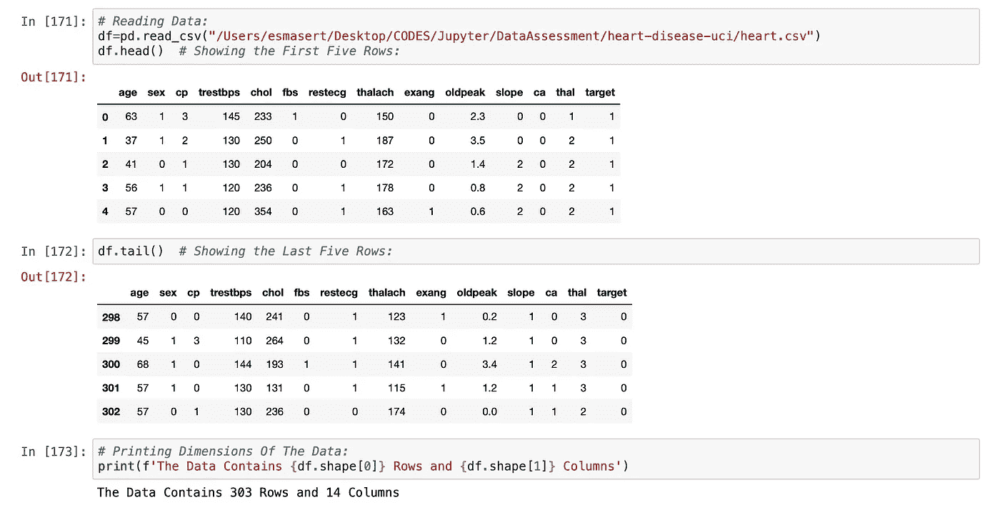

Image by Author

要查看列名和数据信息:

```
df.columns *# Column Names* df.info() *# Data Information*
```

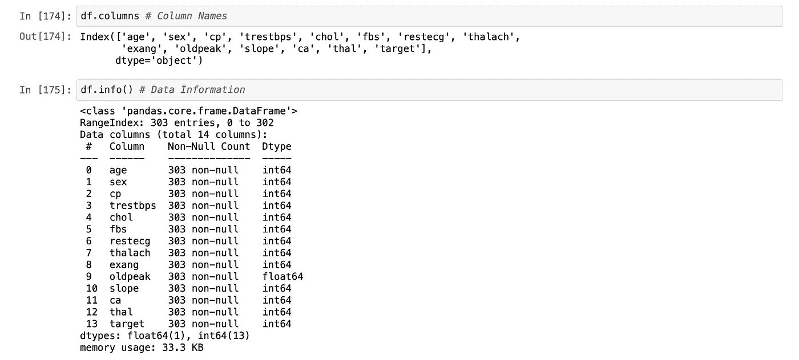

Image by Author

我们可以通过遍历所有列来查看行中是否有丢失的值。如果有，百分比是多少？

```
**for** clmn **in** df.columns:
    any_missing = df[clmn].isnull().sum()
    print(f'**{**clmn**}** - **{**any_missing **:**.1%**}**')
```

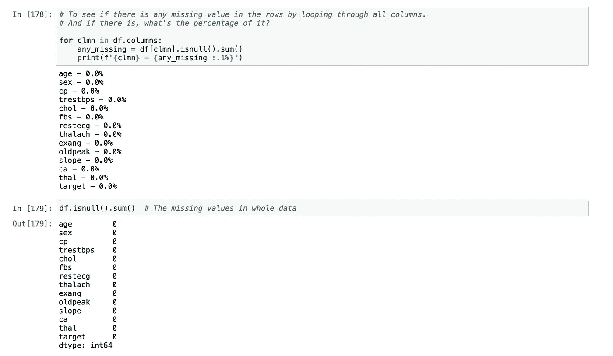

Image by Author

太好了！没有缺失值。

现在我们需要检查数据，看看是否有重复的行。看到这个:

```
df.duplicated().sum() *# Counting the duplicated rows*
```

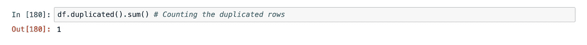

Image by Author

数据中有重复的行。现在，我们必须处理它，以防止任何负面影响的训练部分。因为，冗余会对数据分析产生负面影响，因为它们是不需要的值。为了克服这一点:

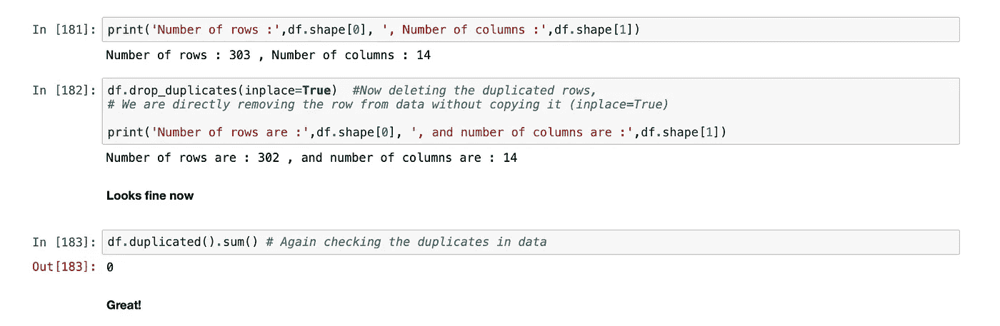

Image by Author

为了更好的可视化，我们可以调换列和索引。

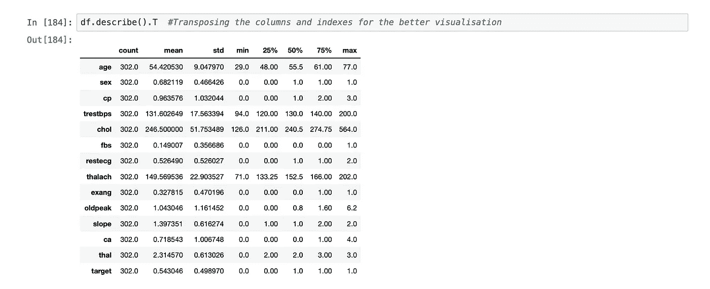

Image by Author

现在为了更好地理解数据，我们可以列出每个特性的唯一值。

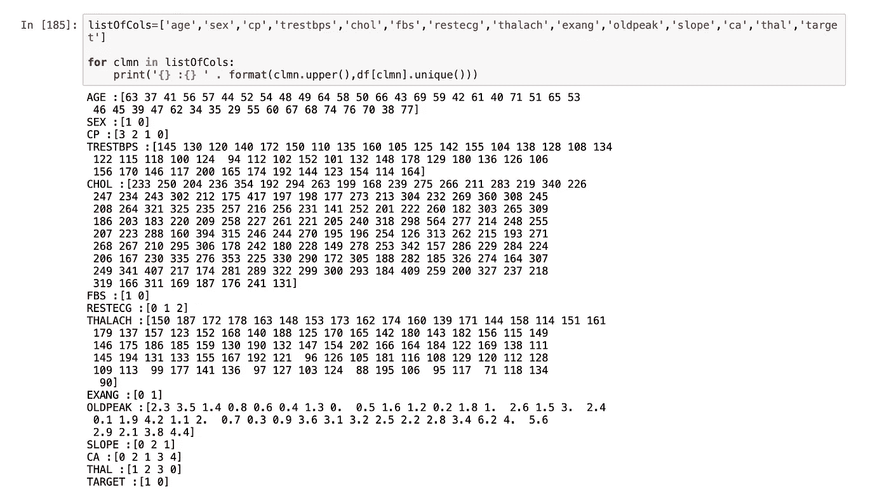

Image by Author

我们都完成了数字可视化，现在让我们使用图表！

```
print(f'Number of people identified as sex 0 are **{**df.sex.value_counts()[0]**}** and Number of people identified as sex 1 are **{**df.sex.value_counts()[1]**}**')
plt.figure(figsize=(7,7))
p = sns.set_theme(style="darkgrid")
p = sns.countplot(data=df, x="sex", palette='Set3')
```

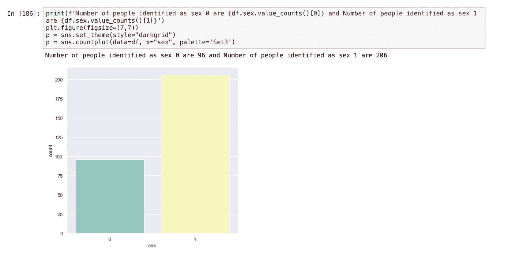

Image by Author

也试试这段代码！结果会让你大吃一惊:)

```
g = sns.PairGrid(df, hue="target")
g.map_diag(sns.histplot)
g.map_offdiag(sns.scatterplot)
g.add_legend()
```

现在我们来看看相同年龄和性别的人有多少。

```
**import** **seaborn** **as** **sns**
**import** **matplotlib.pyplot** **as** **plt**

plt.figure(figsize=(12,6))

*# count plot on two categorical variable*
sns.countplot(x ='age', hue = "sex", data = df)

*# Show the plot*
plt.show()
```

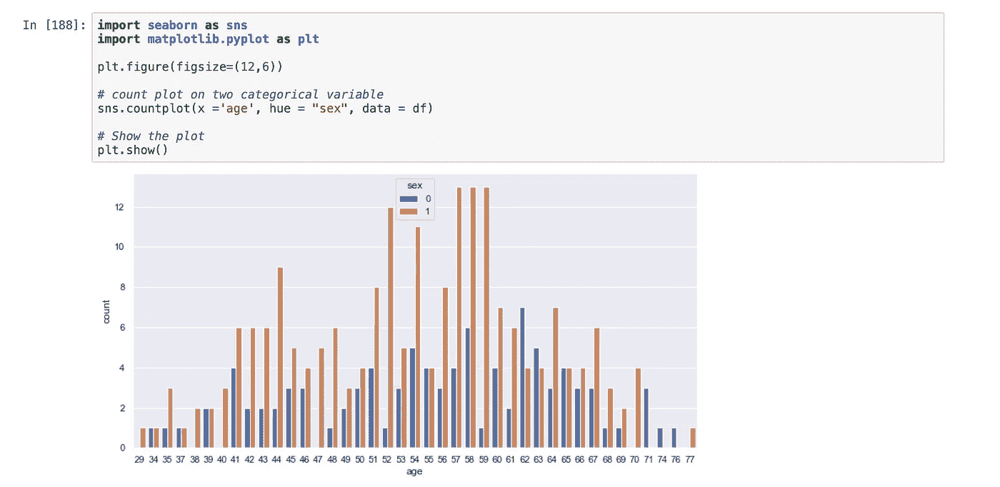

Image by Author

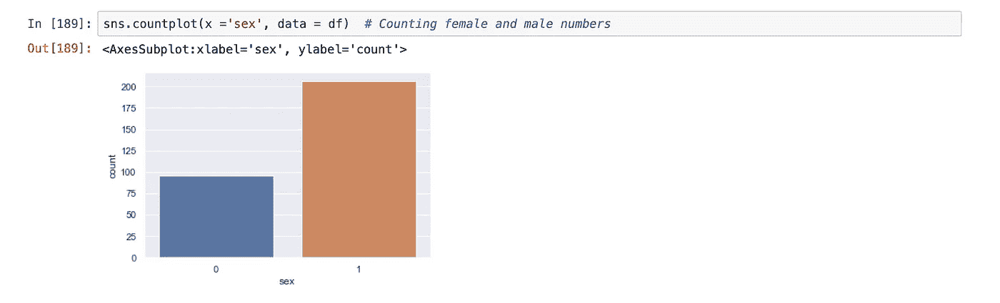

Image by Author

正如我们所看到的，我们从男性数据中获得了更多的信息。(1 =男性；0 =女性)

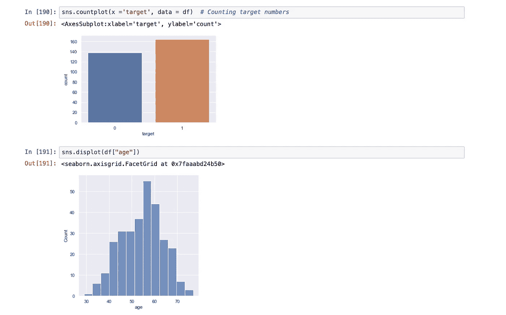

Image by Author

从图表中我们可以看出，男性患心脏病的比例更高。(目标；0 =正，1 =负)(性；1 =男性；0 =女性)

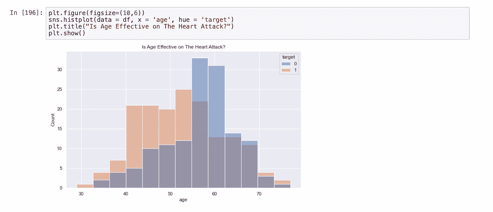

Image by Author

在 55 岁到 63 岁之间，患心脏病的风险要大得多。(目标；心脏病的存在。0 =正，1 =负)

更多图表:

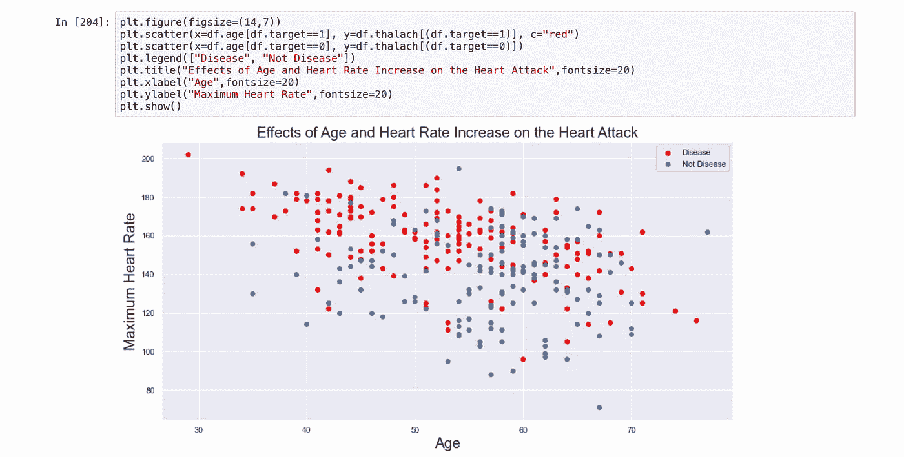

Image by Author

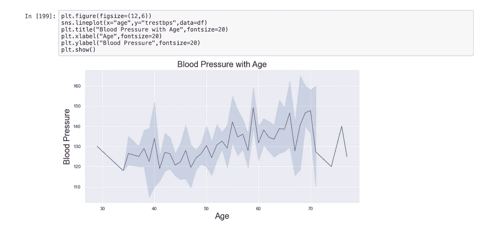

Image by Author

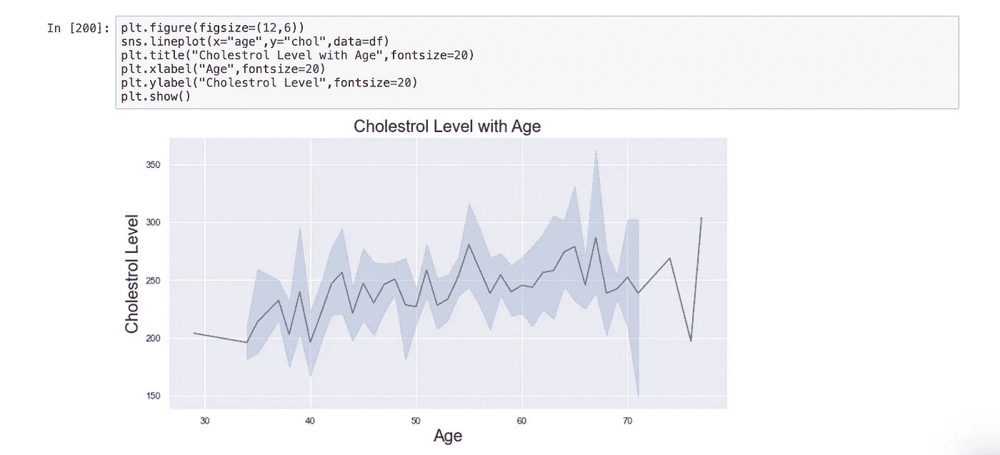

Image by Author

# 构建模型

## 准备数据

**功能选择**

首先，我们需要把给定的列分成两种类型的变量；自变量(特征变量)和因变量(目标变量)。

**拆分数据**

然后，我们将数据集分为训练集和测试集，将我们的数据分成 80%作为训练集，20%作为测试集。

```
**from** **sklearn.model_selection** **import** train_test_split *# to split the data*

X_train, X_test, y_train, y_test = train_test_split(df.drop('target', 1), df['target'], 
                                                    test_size = .2, random_state=10) *#split the data*
```

## 决策树分类

现在，让我们使用 Scikit-learn 创建一个决策树模型。

```
**import** **pandas** **as** **pd**
**from** **sklearn.tree** **import** DecisionTreeClassifier *# importing Decision Tree Classifier*
**from** **sklearn** **import** metrics *# metrics module for accuracy calculation**# Create Decision Tree Classifer object*
clfDT = DecisionTreeClassifier()

*# Train Decision Tree Classifer*
clfDT = clfDT.fit(X_train,y_train)

*#Predict the response for test dataset*
y_pred = clfDT.predict(X_test)
```

评估模型


Image by Author

并绘制决策树

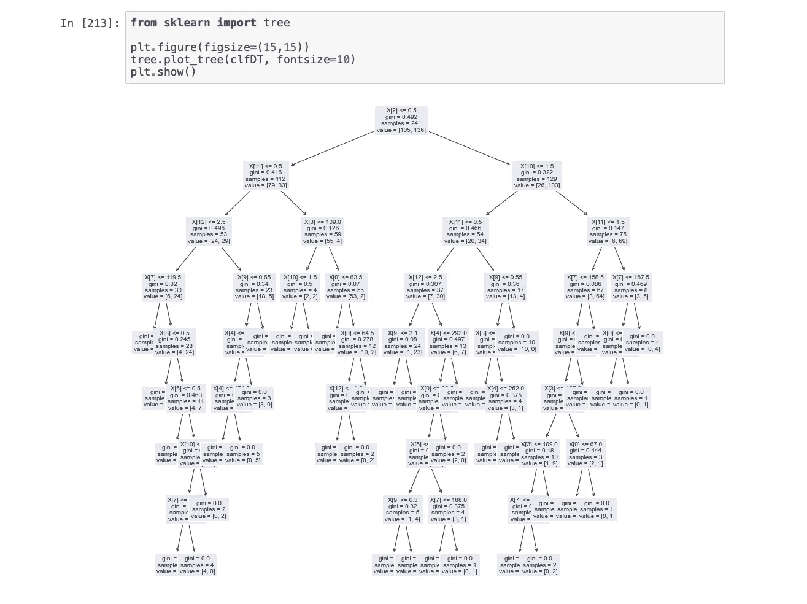

Image by Author

混淆矩阵

```
*# Print Accuracy*
print("Accuracy:",metrics.accuracy_score(y_test, y_pred))
print('**\n**')

**from** **sklearn.metrics** **import** plot_confusion_matrix

fig, axes = plt.subplots(nrows=1, ncols=2, figsize=(15,7))

titles_options = [("Confusion matrix for Decision Tree, without normalization", **None**, axes.flatten()[0]),
                  ("Normalized confusion matrix for Decision Tree", 'true', axes.flatten()[1])]

**for** title, normalize, ax **in** titles_options:

    disp = plot_confusion_matrix(clfDT, X_test, y_test, cmap=plt.cm.Blues, ax=ax, normalize = normalize)

    disp.ax_.set_title(title)

    plt.rcParams['axes.grid'] = **False**

    print(title)
    print(disp.confusion_matrix)

plt.show()
```

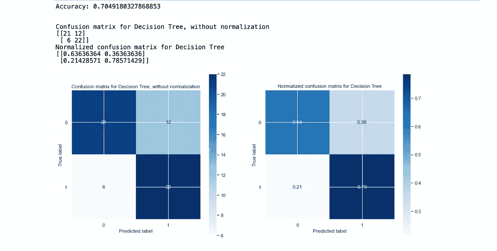

Image by Author

让我们将数据标准化:

```
b = df.target.values
a_data = df.drop(['target'], axis = 1)

*# Normalize*
a = (a_data - np.min(a_data)) / (np.max(a_data) - np.min(a_data)).valuesa_train, a_test, b_train, b_test = train_test_split(a, b, test_size = 0.2, random_state=0)*# Create Decision Tree classifer object*
clfNorm = DecisionTreeClassifier()

*# Train Decision Tree Classifer*
clfNorm = clfNorm.fit(a_train,b_train)

*#Predict the response for test dataset*
b_pred = clfNorm.predict(a_test)
```

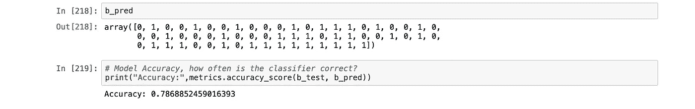

Image by Author

太好了！正如您在这里看到的，我们可以通过在训练前标准化数据来提高准确性。

## 随机森林分类

随机森林算法是一种基于随机决策树的集成平均算法。

```
*#Import Random Forest Model*
**from** **sklearn.ensemble** **import** RandomForestClassifier*#Create a Gaussian Classifier*
clfRF=RandomForestClassifier(n_estimators=100)

*#Train the model using the training sets y_pred=clf.predict(X_test)*
clfRF.fit(X_train,y_train)

y_pred=clfRF.predict(X_test)
```

评估模型:

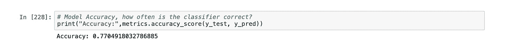

Image by Author

这个模型的混淆矩阵。

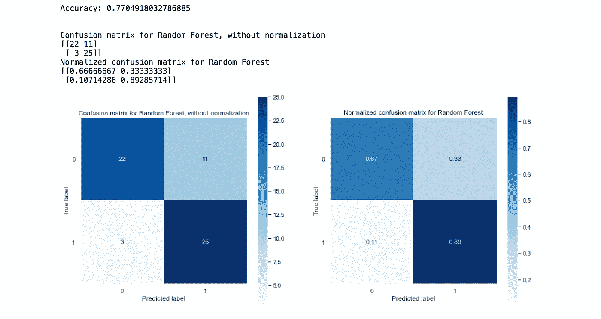

Image by Author

如果我们用标准化的数据训练模型，

```
*#Create a Gaussian Classifier*
clfRFNorm=RandomForestClassifier(n_estimators=100)

*#Train the model using the training sets y_pred=clf.predict(X_test)*
clfRFNorm.fit(a_train,b_train)

b_predNorm=clfRFNorm.predict(a_test)
```


Image by Author

太好了！正如您在这里看到的，我们通过将训练前的数据从 0.770 归一化到 0.868 来提高精确度。

**寻找重要特征**

我们使用特征重要性变量来查看特征重要性分数。然后我们将使用 seaborn 库可视化这些分数。

```
feature_imp = pd.Series(clfRF.feature_importances_, index=X_train.columns.values.tolist()).sort_values(ascending=**False**)
feature_imp**from** **matplotlib** **import** pyplot

*# Creating a bar plot*
fig, ax = pyplot.subplots(figsize=(14, 7))
sns.barplot(x=feature_imp, y=feature_imp.index)

*# Add labels to your graph*
plt.xlabel('Feature Importance Score',fontsize=15)
plt.ylabel('Features',fontsize=15)
plt.title("Visualizing Important Features",fontsize=18)
plt.legend()
plt.show()
```

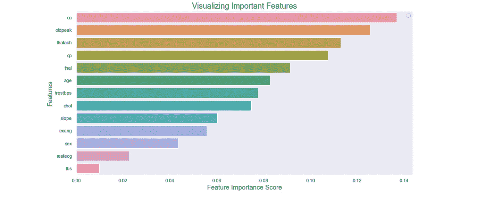

Image by Author

**在所选特征上生成模型**

这里，我们可以删除最后 4 个特征(fbs、restecg、sex、exang ),因为根据其他特征，它们的重要性非常低，并选择其余的剩余特征。

```
*# Split dataset into features and labels*
RmX= df[['age','cp','trestbps','chol','thalach','oldpeak','slope','ca','thal']]  *# Removed feature "sepal length"*
Rmy= df['target']                         

*# Split dataset into training set and test set*
RmX_train, RmX_test, Rmy_train, Rmy_test = train_test_split(RmX, Rmy, test_size=0.20, random_state=5) *# 80% training and 20% test**#Create a Gaussian Classifier*
Rmclf=RandomForestClassifier(n_estimators=100)

*#Train the model using the training sets y_pred=clf.predict(X_test)*
Rmclf.fit(RmX_train,Rmy_train)

*# prediction on test set*
Rmy_pred=Rmclf.predict(RmX_test)
```

评估模型:

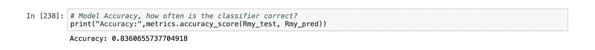

Image by Author

太棒了。！准确度从 0.770 提高到 0.836。

您可以看到，在删除最不重要的特征后，精确度提高了。这是因为我们去除了误导性的数据和噪音。较少的特征也减少了训练时间。因为我们删除了影响较小的特性，所以我们已经去掉了不必要的特性。这就是标准化数据可能不适用于这种方法原因。

## 朴素贝叶斯分类

```
*#Import Gaussian Naive Bayes model*
**from** **sklearn.naive_bayes** **import** GaussianNB*#Create a Gaussian Classifier*
NBclf = GaussianNB()

*# Train the model using the training sets*
NBclf.fit(X_train,y_train)

*#Predict Output*
NBy_pred = NBclf.predict(X_test) *# 0:Overcast, 2:Mild*
```

评估模型

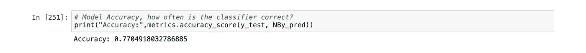

Image by Author

混淆矩阵:

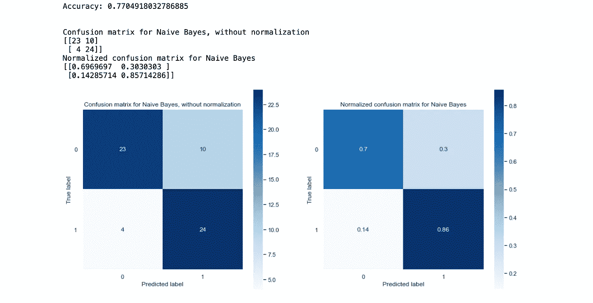

Image by Author

在接近尾声时，我创建了一个表格，显示了每个步骤，以了解模型精度是如何受到影响的。

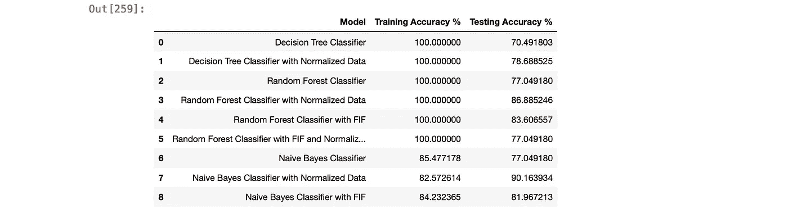

Image by Author

# 结论

## 比较模型

我们可以通过查看图表来比较这些模型，

```
colors = ['red','plum','slateblue','lavender','mediumaquamarine','silver','khaki','yellowgreen','lightskyblue']
plt.figure(figsize=(14,7))
plt.title("Accuracies of different models")
plt.xlabel("Algorithms")
plt.ylabel("Accuracy %")
plt.bar(results_df['Model'],results_df['Testing Accuracy %'], color = colors)
plt.xticks(rotation='vertical')

plt.show()
```

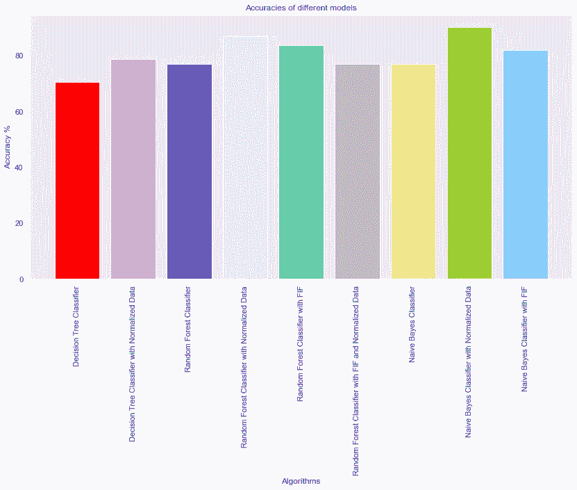

Image by Author

正如我们在这里看到的，实现最高准确性的最有效的算法是朴素贝叶斯和心脏病 UCI 数据集的归一化数据。即使朴素贝叶斯算法的训练精度低于其他算法，有趣的是测试精度结果却是最高的。

同样，我从具有 FIF 的朴素贝叶斯分类器和标准化数据结果中获得了较小的准确性。此外，由于我没有从带有标准化数据和 FIF 的随机森林中获得更高的结果，为了防止复杂的查找，我从表中排除了带有 FIF 和标准化数据结果的朴素贝叶斯分类器。

## 如何提高精确度

**归一化数据**

数据规范化本质上是一种过程，在这种过程中，数据被重新组织，以便用户可以正确地利用它进行进一步的查询和分析。规范化的目标是将数据集中数值列的值更改为一个通用的比例，而不会扭曲值范围的差异。

正如你所看到的，几乎在所有的方法中，归一化方法对精度都有很大的影响。因此，使用这种方法在大多数时候是有益的。

**组装**

为了提高模型的精度，我们可以使用集成技术。集成方法的目标是将几个基本估计量的预测与给定的学习算法结合起来，以提高单个估计量的可推广性/稳健性。

有两种类型的集合方法:

*   平均方法:驱动原理是独立地建立几个估计量，然后平均它们的预测。平均而言，组合估计量通常比任何单基估计量都好，因为它的方差减小了。
*   Boosting 方法:基本估计量是按顺序建立的，人们试图减少组合估计量的偏差。其动机是将几个弱模型组合起来，产生一个强大的集合。

我们已经使用了一种整体平均方法，随机森林。因此，我们将继续讨论其他问题。但是，为了证明集成方法的积极效果，我们可以只检查随机森林算法的结果。

**找到重要的特征，去掉最不重要的特征**

特征重要性指的是一类用于为预测模型的输入特征分配分数的技术，该预测模型在进行预测时指示每个特征的相对重要性。

分数非常有用，可用于预测建模问题中的各种情况，例如:

*   更好地理解数据。
*   更好地理解模型。
*   减少输入特征的数量。
*   减少训练时间，更少的数据点降低了算法复杂性，算法训练更快。
*   减少过度拟合，减少冗余数据意味着减少基于噪声做出决策的机会。
*   提高准确性，减少误导性数据意味着建模准确性提高。

**超参数调谐**

为了查看超参数调整效果，我们将调整随机森林模型的超参数。我们将调整的超参数包括 max_features 和 n_estimators。

```
**from** **sklearn.model_selection** **import** GridSearchCV

max_features_range = np.arange(1,6,1)
n_estimators_range = np.arange(10,210,10)
param_grid = dict(max_features=max_features_range, n_estimators=n_estimators_range)

RanFrstCls = RandomForestClassifier()

gridSCV = GridSearchCV(estimator=RanFrstCls, param_grid=param_grid, cv=5)gridSCV.fit(X_train, y_train)
```

scikit-learn 的 GridSearchCV()函数用于执行超参数调整。特别地，GridSearchCV()函数可以执行分类器的典型功能，例如拟合、评分和预测，以及 predict_proba、decision_function、transform 和 inverse_transform。

调整随机森林算法的超参数后，准确率从 80.327869 提高到 85.9439。

这是我们尝试过的所有随机森林分类方法中精度最高的！

# 结果

当我们用心脏病 UCI 数据集训练 3 个算法时，我们获得了如此多不同的准确性。

只要我们搜索，目前为止最好的准确率是使用归一化数据的朴素贝叶斯分类算法(90.1634)

第二高的精确度是具有调整的超参数的随机森林算法(85.9354)

第三高的精度是集成方法中的梯度树提升算法。(85.2459)

最后，第四高的准确性是随机森林分类器与发现重要特征的方法。(83.6065)

在这篇文章中，我尝试了；寻找重要的特征、集合、超参数调整和标准化数据，以了解它们如何影响精度。在训练或建模之前，我们有更多的方法可以改变数据。

从以上信息中，我们可以得出结论，我们尝试的所有算法都通过额外的算法和方法实现了更高的精度。所有方法和算法的效率都随着数据和建立的分类器而变化。

**非常感谢你的阅读！**

# 参考

https://www.kaggle.com/ronitf/heart-disease-uci

[2][https://scikit-learn.org/stable/modules/ensemble.html](https://scikit-learn.org/stable/modules/ensemble.html)

[3][https://medium . com/@ urvashilluniya/why-data-normalization-is-required-for-machine-learning-models-681 b65a 05029](/@urvashilluniya/why-data-normalization-is-necessary-for-machine-learning-models-681b65a05029)

[4][https://machine learning mastery . com/calculate-feature-importance-with-python/](https://machinelearningmastery.com/calculate-feature-importance-with-python/)

[5]https://github.com/dataprofessor/code/blob/master/python

[6][https://www.datacamp.com/community/tutorials/](https://www.datacamp.com/community/tutorials/)