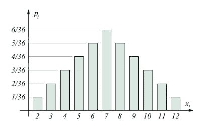
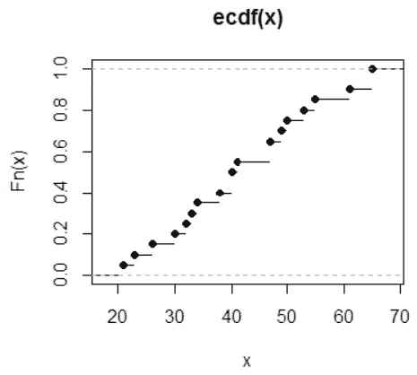

# 3.质量函数和伯努利分布。

> 原文：<https://medium.com/mlearning-ai/3-mass-function-and-bernoulli-distribution-71eda12abba3?source=collection_archive---------10----------------------->

Milky Way

*质量函数和分布函数*

*伯努利分布*

# **质量函数和分布函数**

这些函数都是用随机变量计算的。

**质量函数**

这是一个质量函数，它代表 x 轴上每个值的概率。比如 5 的概率是 4/36，10 的概率是 3/36。

**分配功能**

这是一个分布函数。可以看出，它不仅仅是一个点，而是一条线。该线显示了该点之后的分布。例如，点 x = 40 y = 0.6 比点 x = 30 y = 0.2 更有可能发生，因为线更短。

# **伯努利分布**

伯努利分布用于这样的问题:

"我吃一次骰子，得到 4 乘以 1 的概率是多少？"

直觉上，如果我在获得骰子的六个数字中的每一个时都有相同的可能结果，那么概率就是 6⁶.前六个代表午餐，第二个代表有六种结果的可能性。

这个关于概率的小演示到此结束。

希望大家喜欢，敬请期待:d。

 [## Mlearning.ai 提交建议

### 如何成为 Mlearning.ai 上的作家

medium.com](/mlearning-ai/mlearning-ai-submission-suggestions-b51e2b130bfb)