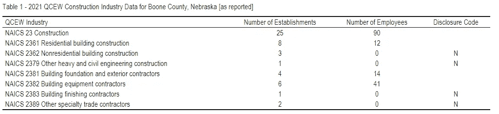
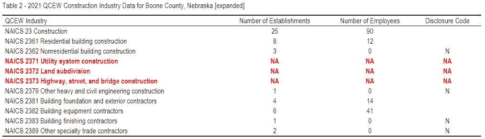
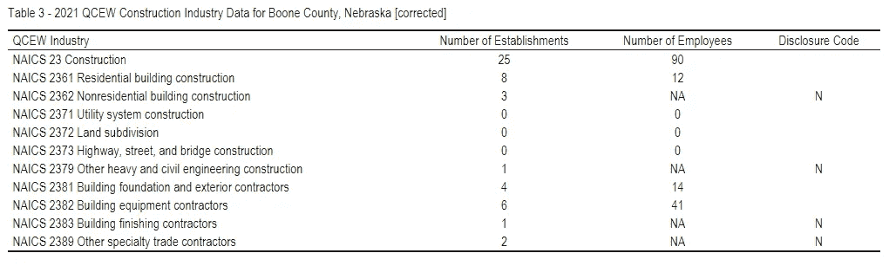
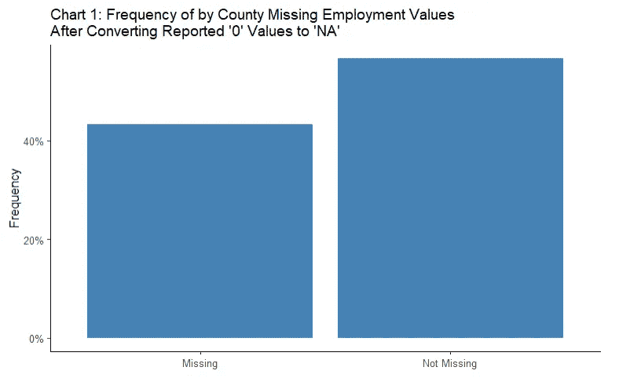
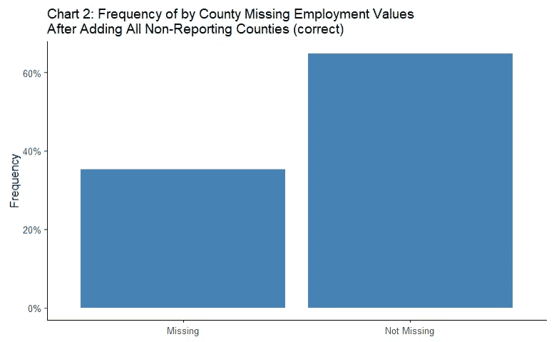

# 决定估算缺失数据前需要考虑的 3 个步骤

> 原文：<https://medium.com/mlearning-ai/3-steps-to-consider-before-deciding-to-impute-missing-data-692d57b76c4f?source=collection_archive---------5----------------------->

您的数据集通常会包含缺失值。每个数据分析师，不管经验如何，都要处理这个问题。当使用基于数据算法的模型时，缺失数据变得尤其成问题，因为当缺失值存在时，大多数模型将会失败。作为一名数据分析师，你有许多技术来估算丢失的数据。

这篇文章不是关于你应该使用哪种插补技术。相反，本文为您提供了三个提示，以更好地理解何时何地适合应用这些技术:1)为什么缺少值，2)缺少多少个数据点，我应该估算还是丢弃数据，以及 3)您将如何在分析中使用数据集。

# **提示 1:了解数据丢失的原因**

决定是否估算缺失值的第一步是了解数据缺失的原因。数据缺失主要有三个原因。在数据收集期间，有时数据是未知的、不可用的或未报告的。例如，当调查回答者没有提供对调查的所有答复，或者机器故障使组织无法暂时收集数据时，就会发生这种情况。您经常会在原始数据中发现此类错误，记录为空值、“NA”、“N/A”或“NaN”值，具体取决于生成或读取数据的软件。其次，数据丢失可能有多种原因。有时是因为技术问题，比如出于隐私原因从数据集中删除个人信息。其他时候，可能是因为数据未被收集或无法公开发布。数据文档通常描述丢失的值，以便用户知道会发生什么。第三，丢失的数据可能是由于人为错误造成的，比如有人打错字或分类错误。这些错误大部分时间都会留在数据中。由数据分析师决定如何处理这些信息。有时您可能会看到一个标志或数据符号，表示某个数据点可能不准确。

我在职业生涯中遇到的最好的数据集之一显示了理解数据的重要性，它是来自美国劳工统计局(BLS)(【https://www.bls.gov/cew/】T2)的季度就业工资普查(QCEW)数据。这是上述讨论的一个很好的例子。我将从这个数据集的一个子集开始，使用来自内布拉斯加州 Boone 县的建筑就业数据，这是一个人口稀少的农村县，到 2021 年。

上表 1 显示了该县建筑企业和就业的总数，以及 NAICS 4 位数水平的建筑子行业的相同数据。在布恩县，25 家建筑企业雇用了 90 名员工。质量和儿童福利委员会报告每个 NAICS 级机构的数量。但是，它需要隐藏所有其他数据，包括员工人数、机构工资总额和机构支付的税收总额，这可能允许数据分析师识别单个企业。披露代码“N”通知分析师隐藏的数据。隐藏数据中报告的员工人数(“0”)实际上具有误导性，因为根据定义，每个报告的机构至少有一名员工。在继续进一步的数据分析之前，应将“0”值替换为“NA”。

还有一个数据好奇心需要把握。表 1 报告了七个建筑分部门的企业。但实际上，下表所示的 QCEW 数据中有 10 个 4 位数的建筑子行业。与隐藏的数据一样，扩展数据集时生成的“NA”也具有误导性。企业和就业的数量不是因为上述原因。这具有误导性，因为在该县的这些子行业中既没有机构也没有雇员。所以 NA 实际上代表零值。表 3(下面)显示了正确的数据应该是什么样子。

# 提示 2:在决定是估算还是丢弃数据之前，考虑一下你的数据

根据数据集的大小，有些情况下可能倾向于输入或丢弃缺失值。缺失值的情况越极端，就越难以根据估算值对总体进行假设。一般来说，如果缺失值的数量相对于样本量较小(小于 5%)，您可以选择估算。如果丢失了大部分数据点(大于 20%)，丢弃这些数据更有意义。

我将重点关注技巧 1 中的非住宅建筑(NAICS 2362 ),并解释在决定是否估算缺失数据时理解数据的重要性。为该子行业输入缺失数据的一种方法是查询该子行业的机构和工资，并使用它来估计每个子行业企业的员工。如果我们使用所报告的美国所有县的原始 QCEW 数据，则不存在缺失值，因为正如您所记得的，原始数据中的“0”实际上是缺失的。图表 1 显示，当通过将员工人数的所有“0”值替换为“NA ”(其中披露代码等于“N ”)来纠正这一点时，43%的县报告了该子行业的企业隐瞒了数据。

但是我们仍然没有丢失数据的县的全部百分比。数据集不包括没有机构或工作的县。事实上，我们需要将这些缺失的 1，905 个县重新包含到数据集中，以便获得具有缺失就业值的县的真实数量。进行这些更改后，图表 2 显示该子行业中缺失值的真实百分比为 35 %,我们仍有可能决定将其从任何进一步的建模中排除。然而，在数据集中可能存在其他子行业，在校正数据时，这些子行业可能会给我们估算缺失数据的信心。

这一讨论再次强调了在直接输入缺失值之前，需要对数据有一个彻底的了解。

# 技巧 3:了解你将如何使用数据

输入数据时，理解值缺失的原因也很重要。为什么没有收集数据？这是疏忽或疏忽的结果吗？它的收购成本太高了吗？还是有一些技术原因导致某些数据无法收集？首先了解丢失数据的原因有助于您做出明智的决策，决定如何在分析中使用这些数据。

还要考虑如何使用插补后的数据。您计划将数据用于建模或可视化吗？在这种情况下，了解缺失值对模型输出或图表的影响程度至关重要。如果缺失值的影响可以忽略不计，那么输入它们可能是有意义的。如果您预计缺失值会对结果产生很大影响，那么丢弃数据可能是更好的选择。

最后，想想与缺失数据一起报告的其他信息。将其包含在您的模型中很重要吗？例如，在表格数据中，一些行/观察值是否有大部分缺失值？如果是这样，您可以决定丢弃这些行，然后重新评估剩余的缺失值，以确定插补现在是否有意义。根据我的经验，这些决定更多的是基于你对数据集的了解，而不是基于科学的方法。

最终，了解您将如何使用数据以及数据丢失的原因将有助于确定插补或丢弃是正确的做法。

 [## Mlearning.ai 提交建议

### 如何成为 Mlearning.ai 上的作家

medium.com](/mlearning-ai/mlearning-ai-submission-suggestions-b51e2b130bfb)