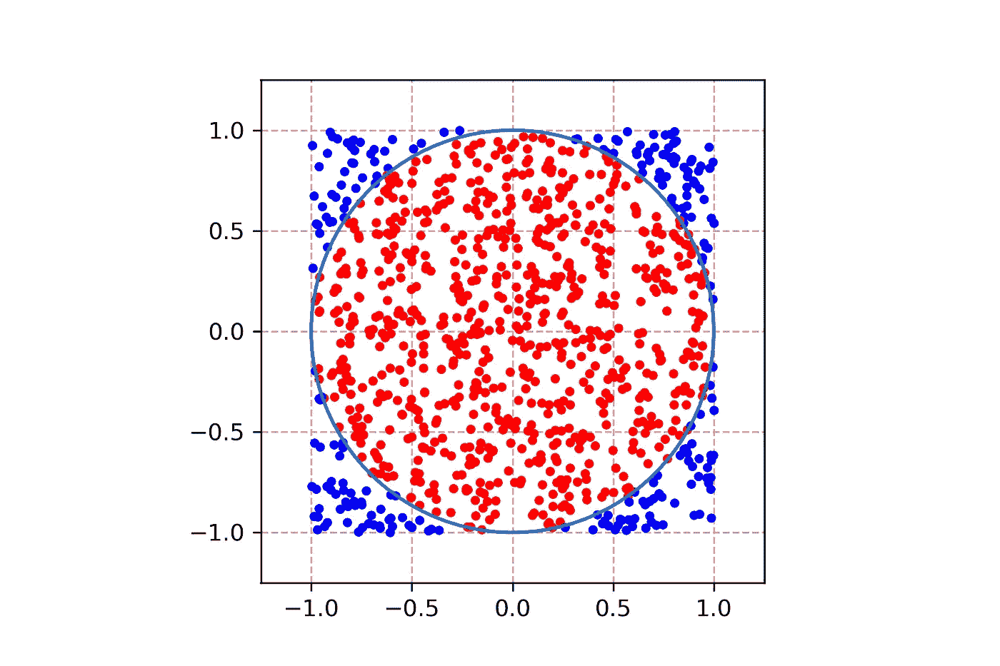
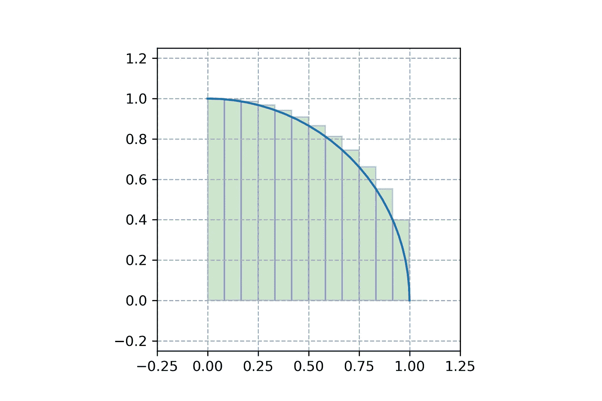
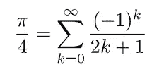
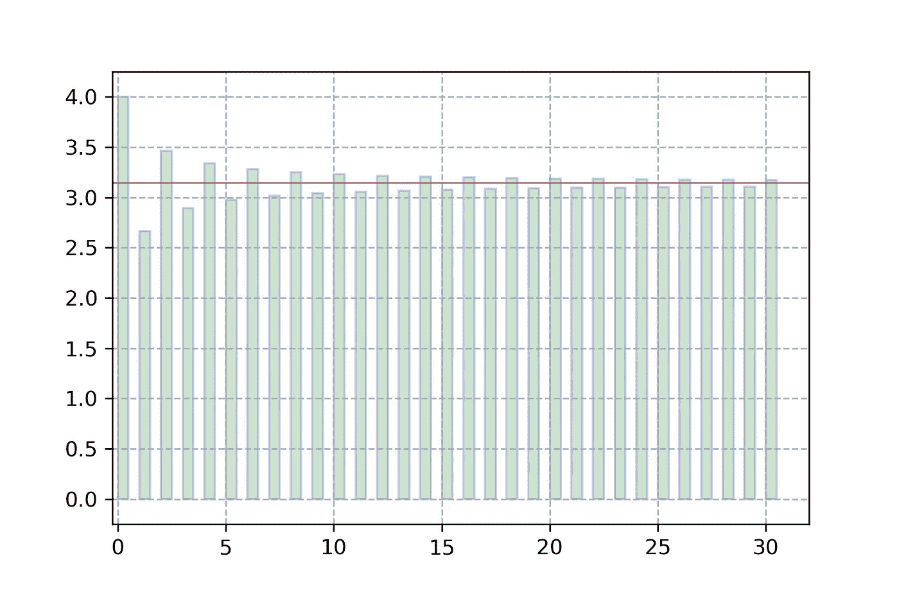

# 接近圆周率的 3 种方法

> 原文：<https://medium.com/mlearning-ai/3-ways-to-get-close-to-pi-a94182502b5b?source=collection_archive---------2----------------------->

我第一次接触面向对象编程。

Photo by [Hunter Haley](https://unsplash.com/@hnhmarketing) on [Unsplash](https://unsplash.com/)

# 介绍

欢迎来到我的下一篇关于媒体的文章。我目前正在学习面向对象编程，并决定在一个新项目中测试我的新技能。因为我的背景，我选了一个数学方面的题目。目标是开发不同的方法来估计和近似圆周率。在每个对象类的末尾，我创建了一个方法来绘制到底发生了什么。

你可以在这里找到相关的仓库。它包含三个 Python 文件，每种方法一个。选择了以下方法:

> 1.蒙特卡罗估算器
> 2。Riemann_Sum_Approximation
> 3。莱布尼兹级数近似

因为我想更深入地研究这个主题，所以这些方法包含不同的属性和方法。

# 蒙特卡罗估计量(自我，n=1000)

该估计器在 2x2 区域内生成随机点，并计算最终位于单位圆内的点的比率。既然我们知道单位圆的面积等于π，我们就可以把这个比值乘以 4(总面积)。

这个估计量的属性是模拟次数(n)。它包含两个方法，即`estimate_pi()`和`circle_plot()`。以下代码用于估算圆周率:

下面的图显示了该方法:

Monte Carlo Estimator Plot (n=1000)

这个估计器工作得很好，但是它仍然是一个估计器，并且依赖于随机方法。尽管如此，我认为这是一个很好的估算方法。

*备注:*为了得到更稳定的结果，可以重复该过程 m 次并取平均值。同样，我的目标是提高我的编程技能，所以我放弃了这个任务。

# Riemann_Sum_Approximation(self，n=100)

虽然这种方法不同于蒙特卡洛，但它有一个共同点:在这里，我们也试图近似单位圆的面积(众所周知，它是圆周率)。为了实现这一点，我们尝试从 0 到 1 近似函数 sqrt(1-x)的积分，并乘以 4。

这个近似值的属性是被加数的个数(n)。它提供了方法`approximate_pi()`和`bar_plot()`。以下代码用于近似圆周率:

下图显示了条形以及单位圆的相关部分:

Riemann Sum Approximation Plot (n=12)

这种圆周率逼近的方法工作得很好，并且用相对较少的被加数给出了好的结果。

# 莱布尼兹级数近似值(自身，n=100)

这种方法与其他方法不同。下面以戈特弗里德·莱布尼茨命名的关于圆周率的莱布尼茨公式已经提供了我们正在寻找的东西:

Liebniz Series for Pi

在这一点上，没有公式的证明。我想你必须相信我这个等式是真的。因此，在这种方法中，取前 n 个被加数，乘以 4。

这个对象的属性是 Lebniz 级数的被加数(n)。它包含方法`approximate_pi()`和`series_plot()`。以下代码用于近似圆周率:

为了直观显示这种方法，创建了以下图:

Leibniz Series Approximation Plot (n=31)

像黎曼求和近似一样，这种方法也为相对少量的被加数提供了好的结果。

# 结论

这是一个非常好的项目，提高了我的面向对象编程技能。我知道在这一点上没有给出数学证明，但我认为可视化对理解正在发生的事情很有帮助。

我意识到这些主题只是被触及，并没有一定的深度。我从练习中学到了很多，可以推荐每一个数据科学初学者(像我一样)去实现自己的项目。

*备注:*有了提供的 Python 文件，创建自己的 PyPI 包就很容易了。在这个阶段，我决定不发布这样的包，但是欢迎您使用代码来训练您的 Python 技能。

下次见。