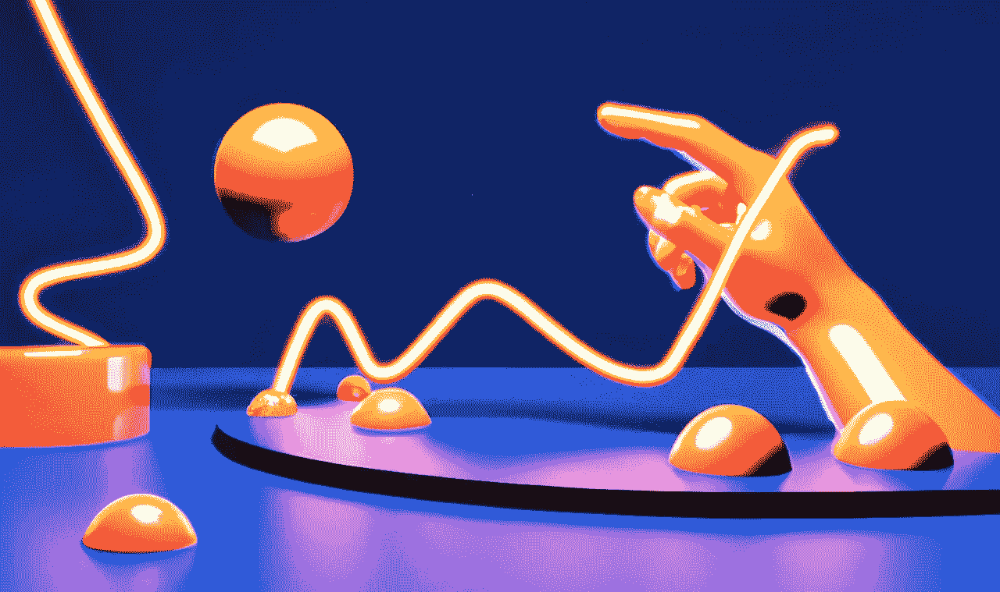

# 三维扩散模型

> 原文：<https://medium.com/mlearning-ai/3d-diffusion-models-22fd4ccc41a2?source=collection_archive---------0----------------------->

## [3D 内容创作的民主化|代码](https://mlearning.substack.com/p/democratization-of-3d-content-creation?r=z7zu8&utm_campaign=post&utm_medium=web)

## 从单一输入图像创建 3D 渲染的人工智能系统

[AI state-of-the-art method](https://mlearning.substack.com/p/ai-has-a-birds-eye-view?r=z7zu8&utm_campaign=post&utm_medium=web)

[传统的 2D 到 3D](/mlearning-ai/3d-from-2d-in-the-blink-of-an-ai-505b25cdf552) 方法会产生不想要的伪影，并且容易模糊。一种新颖的方法可以提供具有异常清晰的样本质量的大致 [3D](/mlearning-ai/how-to-make-3d-models-from-a-single-image-d0eccc9209ba) 一致的视图。