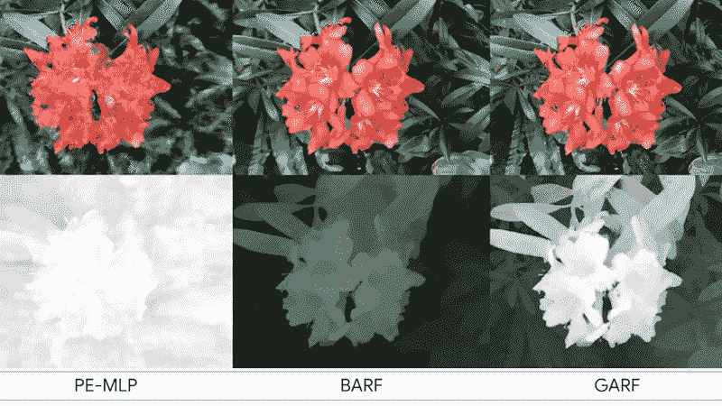

# 一眨眼的功夫，来自 2D 的 3D 影像

> 原文：<https://medium.com/mlearning-ai/3d-from-2d-in-the-blink-of-an-ai-505b25cdf552?source=collection_archive---------1----------------------->

## [机器学习艺术](https://mlearning.substack.com)

## GARF 最新的重建和姿态估计技术

[NeRF neural network](https://mlearning.substack.com)

## 你能把 2D 的图像转换成 3D 吗？

机器学习几乎可以瞬间构建一个 3D 场景。[作者](#56b6)创造了一种新方法，从一张 2D 图像中生成 3D 环境。GARF 出生了。可以…