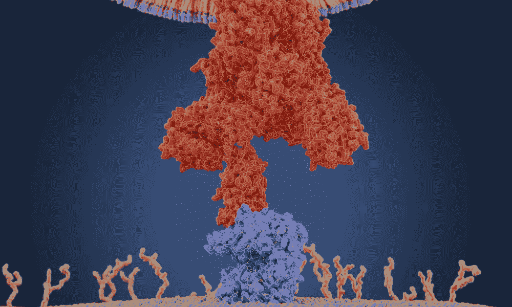

# 使用 Biopython 进行三维新型冠状病毒蛋白质可视化

> 原文：<https://medium.com/mlearning-ai/3d-sars-cov-2-protein-visualization-with-biopython-7c4f1955b1db?source=collection_archive---------2----------------------->

*A coronavirus uses a protein on its membrane — shown here in red in a molecular model — to bind to a receptor — shown in blue — on a human cell to enter the cell. Once inside, the virus uses the cells’ machinery to make more copies of itself. (Juan Gaertner / Science Source)*

# 介绍

在生命科学领域，可视化对于来自尖端实验技术的挑战性数据尤为重要，如 3D 基因组学、空间转录组学、3D 蛋白质组学、表皮蛋白质组学、高通量成像和宏基因组学([奥多诺格，2021](https://www.frontiersin.org/articles/10.3389/fbinf.2021.669186/full) )。数据可视化是研究交流的方式。它不再只是一个选项…