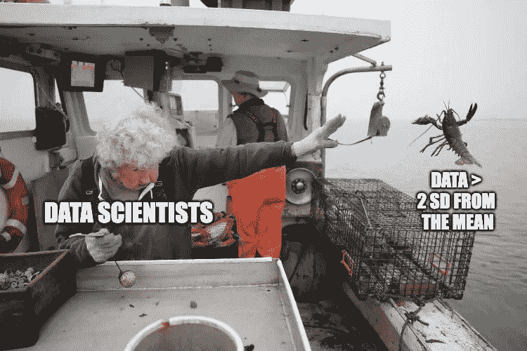

# 处理数据中异常值的 4 种简单方法

> 原文：<https://medium.com/mlearning-ai/4-easy-ways-to-handle-outliers-in-your-data-47f125a3f779?source=collection_archive---------3----------------------->

在这篇文章中，我将解释可靠地检测异常值的 3 种方法和合法正确地处理异常值的方法。(不要立即将它们从数据中删除)。

> 离群值就像数据中的害群之马——罕见，不同于其他人群，被数据科学家避开…