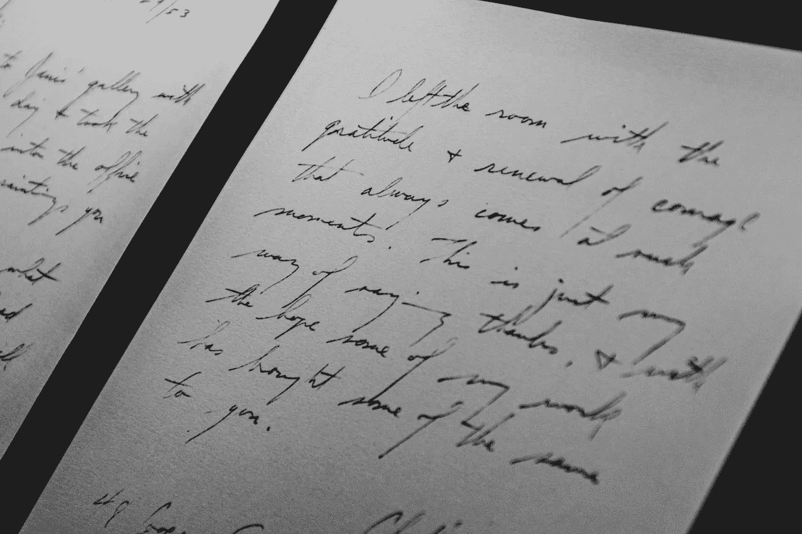

# 衡量文本文档可读性的 4 种流行技术

> 原文：<https://medium.com/mlearning-ai/4-popular-techniques-to-measure-the-readability-of-a-text-document-32a0882db6b2?source=collection_archive---------1----------------------->

## 讨论流行的文本可读性方法

Image from [Source](https://unsplash.com/photos/QfQJMlP1v6g)

长期以来，人们一直使用语言作为媒介来表达他们对任何特定话题或事物的想法和情感。此外，**不同的作者有不同的写作风格**，比如有些人可能会使用相当复杂的词汇，而有些人会使用普通的词汇来表达…