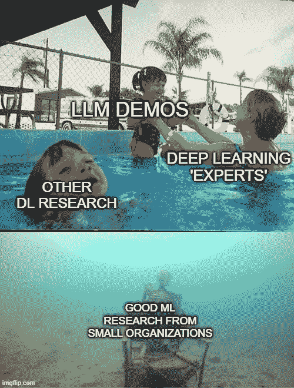
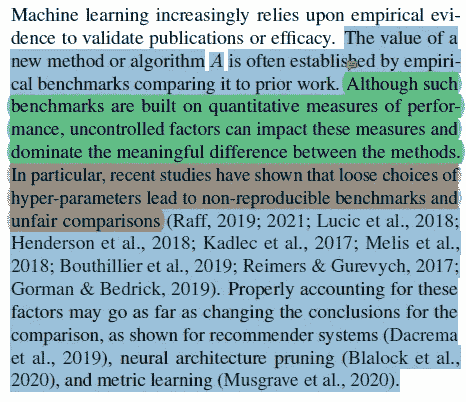
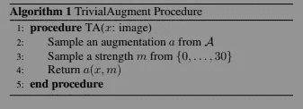
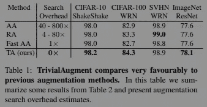
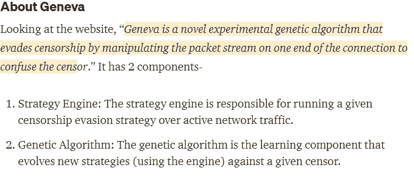
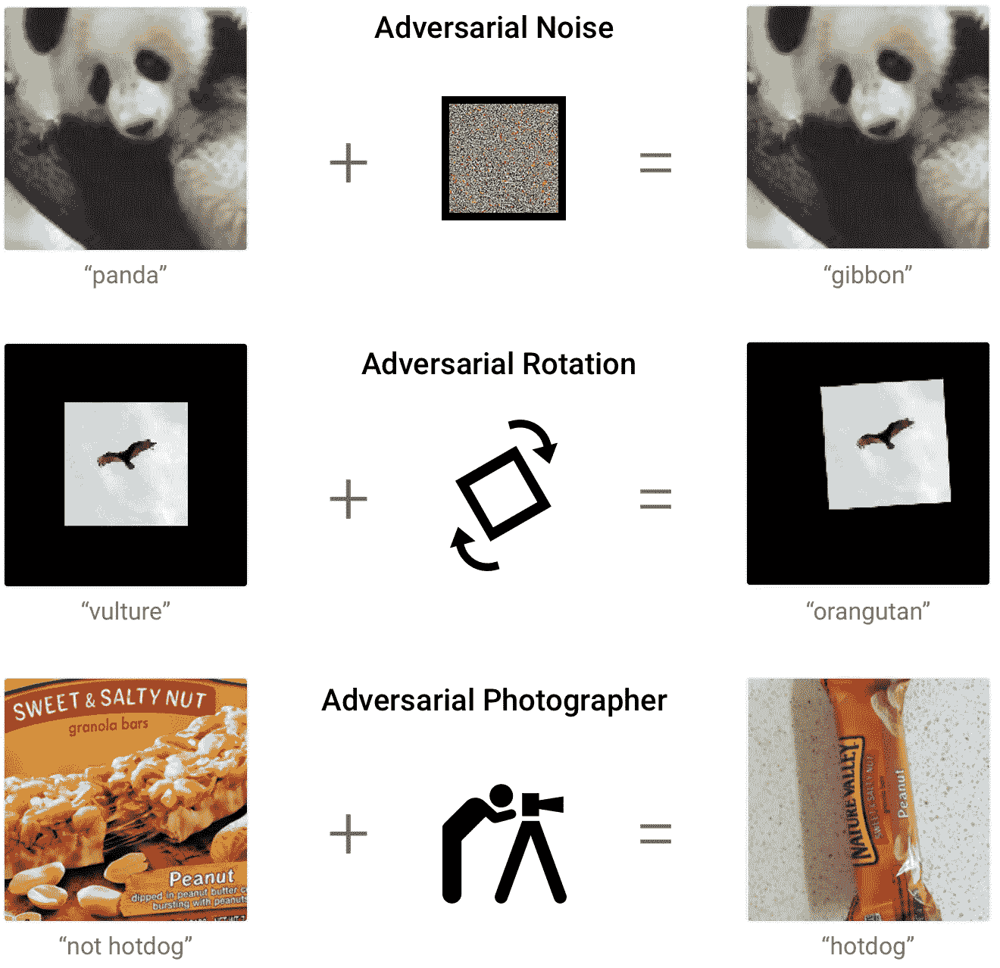
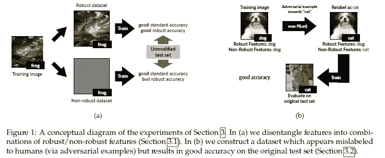
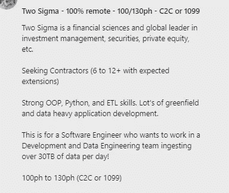

# 你应该读的 4 篇秘密机器学习论文(Pt。1)

> 原文：<https://medium.com/mlearning-ai/4-secret-machine-learning-papers-you-should-read-pt-1-2afb616c5d58?source=collection_archive---------2----------------------->

## 这些 4 毫升的纸将帮助你以不同的方式看世界

为了帮助我了解您[请填写此调查(匿名)](https://forms.gle/7MfQmKhEhyBTMDUD7)

随着围绕深度学习的所有资金、人才和宣传，有许多开创性的机器学习论文被发布。一些像 DALL-E 和[谷歌的“感知”LambDa 语言模型](https://youtu.be/6jXsZw49G5I)已经得到了很多主流的关注。其他来自主要组织的深度学习研究也吸引了机器学习社区相关人士的关注。然而，很多 ML 论文都被忽略了。在这篇文章中，我将分享 5 篇如此惊人的论文，需要更多的关注。这些论文帮助我在机器学习方面变得更好，并将使你成为更好的深度学习工程师。任何对数据科学、ML、深度学习工程或人工智能研究感兴趣的人都应该对此非常熟悉。

# 报纸

以下是我将在这篇文章中讨论的论文摘要-

1.  " [**说明机器学习基准测试中的差异**](https://arxiv.org/abs/2103.03098) " **-** 本文讨论了如何在**标准基准测试**上比较各种模型。事实证明，打乱完全任意的因素可以完全改变你的评估结果。他们的研究还显示了我们如何在培训成本减少 51 倍的情况下改进不完美的模型。
2.  [**TrivialAugment:免调优且最先进的数据扩充**](https://arxiv.org/abs/2103.10158) **-** 数据扩充已经成为深度学习领域的游戏规则改变者，尤其是在计算机视觉和自然语言处理领域。这导致了对非常复杂的数据增强策略的大量研究。TrivialAugment 达到最佳性能，同时拥有最低的培训成本。不相信我？请继续阅读。
3.  [**日内瓦:不断进化的审查规避策略**](https://geneva.cs.umd.edu/papers/geneva_ccs19.pdf) **-** 利用机器学习(进化算法)击败国家审查。还需要我多说吗？
4.  [**对抗性样本不是 bug，是特征**](https://arxiv.org/abs/1905.02175) **-** 对抗性样本一直是机器学习的一个一贯问题。*但是为什么复杂的深度学习模型在看起来与人类相同的图像上失败了*？这篇论文提出了一个令人信服的理论。这些原理可以扩展到不仅仅是计算机视觉分类任务。

这是一份你应该知道的令人印象深刻(也非常需要)的深度学习论文清单。让我们开始吧。

# 解释 ML 基准中的差异

回想一下你是如何比较 2 ML 型号的性能的。最有可能的是，您在相同的数据集上运行它们，并比较它们在相关任务中的性能。一切都好。

然而，事实证明，机器学习比大多数人意识到的要复杂和混乱得多。数据顺序等看似随意的因素可能会扭曲模型的性能。我们最终得到的结果是非常错误的。此外，有时超参数设置的微小变化(大多数人都没有意识到)会导致不公平和不准确的评估协议。想想像谷歌和网飞这样的公司会在他们的推荐系统上花多少钱。现在想象一下，告诉他们，他们的很多结果都是无效的，因为 ML 会变得混乱。这份报纸的疯子们说的还有很多。

Teams spend a lot of money building and training large models. Unfortunately, this leaves them without the proper amount of resources into evaluating their models properly. Burning a lot of money, and ending up with terrible results.

幸运的是，机器学习管道的智能设计将允许您避免这些问题，选择更好的模型，并最终创建最佳模型。本文的作者分享了实现这一目标的最佳实践。如果你有兴趣了解更多关于这篇论文的信息，请查看我对它的分类，标题是- [为什么你需要花更多时间评估你的机器学习模型](/mlearning-ai/why-you-need-to-spend-more-time-evaluating-your-machine-learning-models-e1e3258fe7d)。利用他们的知识创造出惊人的、实际可行的 ML 管道。而且不会破坏你的预算。

> 我们展示了一个与直觉相反的结果，即在不完美的估计量上增加更多的变异源可以更好地接近理想的估计量，而计算成本却降低了 51 倍。

# **TrivialAugment:免调优且最先进的数据扩充**

事实证明，越大并不总是越好。有时候，少即是多。TrivialAugment 是一个非常… *琐碎的*数据增强政策，在计算机视觉领域取得了惊人的成果。这是可以想象的最简单的数据扩充策略。以为我在开玩笑？这是完整的算法，如论文中所述-

This is literally it. I’m not joking.

在《什么是现代机器学习的完美隐喻》一书中，**介绍 TrivialAugement 的论文发表于 2021 年**。在测试这个想法之前，人们正在测试非常奇特的基于机器学习的政策**。更糟糕的是。TA 把他们都打败了。**

要了解这篇论文的更多信息，请查看 [TrivialAugment:数据增强的下一次发展](/geekculture/trivialaugment-the-next-evolution-in-data-augmentation-a218339a2687)。它更深入地分解了调查结果和学习内容。

# 日内瓦项目

对于那些对自由开放的互联网感兴趣的人来说，这篇论文是真正的游戏改变者。对我来说，这个项目是机器学习最有影响力的应用之一。日内瓦项目的团队正在使用机器学习来绕过实际政府进行的审查。他们的工作让世界各地的公民有更多的机会使用免费互联网。

From my article on this amazing project.

他们的项目有很多东西要教你，关于网络，网络安全，以及如何在没有可微解空间的问题中利用遗传算法。他们的工具是开源的，任何人都可以参与进来并尝试改进它。你可以运行它来了解你的国家正在实施的审查程序。如果你想了解这个项目的更多信息，我已经在这里介绍过了。

# **对立的例子不是错误，而是特征**

对抗训练是一种特殊的机器学习。它包括馈送 ML 分类器特别修改的输入、设计的输入。这种输入对人眼来说看起来正常，但会导致分类器崩溃并对图像进行错误分类。

A fantastic source on some ways we can make things adversarial. [Source](https://2.bp.blogspot.com/-u0kQgNLcDE0/W5mkeCR5EUI/AAAAAAAADU8/-X2_V_Xg9vwXRaZnutPfQgCrJ18csyXYQCLcBGAs/s1600/image1.png)

人们一直试图弄清楚为什么对抗性学习如此有效。一幅图像的一些变化(通常是察觉不到的)怎么会导致如此巨大的差异呢？麻省理工学院的一个团队有一个有趣的理论。

他们假设图像的特征可以分为两类——鲁棒的和非鲁棒的。如果您稍微调整了健壮的特征，分类器仍然会预测正确的标签。然而，对非健壮特征的微小改变，会搞乱你的分类器，并导致错误标记。

这篇论文非常有趣，因为它有几个有趣的含义。首先，在其他领域探索这种健壮特性的概念将是令人着迷的，并会带来巨大的成果。当谈到人工智能安全和健壮的人工智能时，这绝对值得探索。

其次，仅使用健壮的特性也将减少培训/测试成本。请记住，每项功能都会成倍增加培训成本。在规模很重要并且“很好但不是 99%”是可以接受的情况下(这是大多数 ML 解决方案)，那么**探索健壮的功能可能是构建安全的人工智能的一个很好的方式，它不会遭受维度的诅咒。**

[要了解这篇论文的更多信息，请阅读这篇文章。](/mlearning-ai/researchers-discover-possible-reason-why-adversarial-perturbation-works-f65e64d9eb7)

确保你花一些时间研究这些论文/项目。他们可能没有 DALL-E 或 GPT-3 的誓言因子，但所有提到的论文都有很多东西可以教你，让你更好地学习机器。当我读它们的时候，它们确实让我大吃一惊。

如果你想进入 ML，t [这篇文章给了你一个逐步提高机器学习能力的计划](/geekculture/how-to-learn-machine-learning-in-2022-9ef2ea904986)。它使用免费资源。与其他训练营/课程不同，该计划将帮助你发展基本技能，并为你在该领域的长期成功做好准备。

Notice how this offer requires Data Analysis, OOP, and Software Skills. Check out my newsletter for building your skills in all 3.

对于机器学习来说，软件工程、数学和计算机科学的基础至关重要。它将帮助你概念化，建立和优化你的 ML。我的每日时事通讯，[Technology interview simpled](https://codinginterviewsmadesimple.substack.com/)涵盖了算法设计、数学、最近的技术事件、软件工程等主题，让你成为更好的开发人员。 [**我目前正在进行一整年的八折优惠，一定要去看看。**](https://codinginterviewsmadesimple.substack.com/subscribe?coupon=1e0532f2)

我创造了[技术面试，使用通过指导多人进入顶级技术公司而发现的新技术，使面试变得简单。时事通讯旨在帮助你成功，避免你在 Leetcode 上浪费时间。我有一个 100%满意的政策，所以你可以尝试一下，没有任何风险。](https://codinginterviewsmadesimple.substack.com/p/faqs-and-about-this-newsletter?r=4tnbw&s=w&utm_campaign=post&utm_medium=web)[您可以阅读常见问题解答，并在此了解更多信息](https://codinginterviewsmadesimple.substack.com/p/faqs-and-about-this-newsletter?r=4tnbw&s=w&utm_campaign=post&utm_medium=web)

如果你也有任何有趣的工作/项目/想法给我，请随时联系我。总是很乐意听你说完。

# 向我伸出手

使用下面的链接查看我的其他内容，了解更多关于辅导的信息，或者只是打个招呼。另外，查看免费的罗宾汉推荐链接。我们都得到一个免费的股票(你不用放任何钱)，对你没有任何风险。所以不使用它就等于失去了免费的钱。

查看我在 Medium 上的其他文章。:【https://rb.gy/zn1aiu 

我的 YouTube:【https://rb.gy/88iwdd 

在 LinkedIn 上联系我。我们来连线:[https://rb.gy/m5ok2y](https://rb.gy/f7ltuj)

我的 insta gram:[https://rb.gy/gmvuy9](https://rb.gy/gmvuy9)

我的推特:[https://twitter.com/Machine01776819](https://twitter.com/Machine01776819)

如果你正在准备编码/技术面试:[https://codinginterviewsmadesimple.substack.com/](https://codinginterviewsmadesimple.substack.com/)

获得罗宾汉的免费股票:[https://join.robinhood.com/fnud75](https://join.robinhood.com/fnud75/)

 [## Mlearning.ai 提交建议

### 如何成为 Mlearning.ai 上的作家

medium.com](/mlearning-ai/mlearning-ai-submission-suggestions-b51e2b130bfb)