# 4 价值函数方法

> 原文：<https://medium.com/mlearning-ai/4-value-function-methods-17f2c898a00d?source=collection_archive---------3----------------------->

这是我总结 Sergey Levine 教授主持的 CS285 讲座系列文章的第四篇，所有的荣誉都归于他。所有图片均取自他的讲座。[我写的这篇文章](https://samuelebolotta.medium.com/1-an-introduction-to-deep-reinforcement-learning-c5ab792af013)是对深度强化学习的介绍。[演员-评论家算法](https://samuelebolotta.medium.com/3-actor-critic-algorithms-779f14465b74)建立在我们在[这篇文章](https://samuelebolotta.medium.com/2-deep-reinforcement-learning-policy-gradients-5a416a99700a)中讨论的政策梯度框架之上。最重要的是，它们还增加了学习价值函数和 Q 函数。

## **可以完全省略政策梯度吗？**

如果我们只是学习一个价值函数，然后尝试使用这个价值函数来计算如何行动呢？为什么这应该是可能的直觉是，价值函数告诉我们哪些状态比其他状态更好，所以如果我们简单地选择进入更好状态的动作，也许我们不再需要显式的策略神经网络。

以下是让这种直觉更正式一点的方法。优点是:

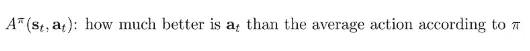

它是我们的 Q 值和我们的值之间的差，直观上，优势表明这个动作比根据策略的平均动作好多少。

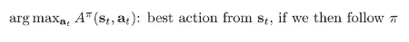

那么 arg max 是我们可以采取的最佳行动，如果我们在此后遵循该策略的话。这意味着 argmax 将至少与我们从当前策略中抽取的动作一样好。我们知道它至少一样好，因为它实际上是最好的。有趣的是，不管政策实际上是什么，这都是真的。这个 argmax 应该立即向我们建议，不管我们以前有哪种策略，即使它是一个非常糟糕的随机策略，我们也应该能够通过根据优势的 arg max 选择行动来改进它。

也许我们可以忘记显式表示策略，我们可以只使用这个 argmax。这是基于价值的方法的基础。我们将隐式地构造新的策略，因此在每次迭代中，我们可以构造一个新的策略，如果动作 a 是优势的 argmax，则为其分配概率 1，否则为 0。

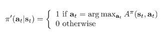

现在，我们不再对显式策略进行梯度上升，而是将隐式策略构造为 arg max，这样就不会发生实际的学习。

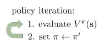

这被称为策略迭代。它被称为策略迭代，因为我们在第一步评估策略和第二步更新策略之间迭代。第二步非常简单，但是最大的难题是如何完成第一步。对于给定的先前策略，如何评估特定状态-动作元组的优势？

像之前一样，我们可以将优势表示为奖励加上 gamma 乘以下一时间步的期望值减去当前时间步的值。我们来评估一下价值。

## **动态编程**

为了评估策略迭代的这些优势，评估价值的一种方法是使用动态编程。现在让我们假设我们知道转移概率，让我们假设状态和动作都是离散的和小的。这不是我们通常在无模型 RL 中操作的设置，但我们现在假设这是我们的设置，以便我们可以导出简单的动态编程算法，然后在稍后将其转换为无模型算法。

我们可以想象，我们基本上可以枚举我们的整个状态和动作空间——我们可以用一个表格来表示它。例如，在这个 gridworld 中，有 16 个状态，每个状态有 4 个动作。

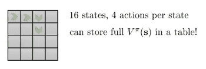

你的转移概率 T 用一个 16 乘 16 乘 4 的张量来表示。所以，当我们说我们在做表格强化学习或者表格动态编程的时候，我们真正指的是这样一个设置。

现在，我们可以根据这些显式的已知概率，写下上一篇文章中看到的 value 函数的引导更新。如果我们想要更新状态的值，我们可以将它设置为从奖励策略中采样的动作的期望值加上 gamma 乘以从下一个状态的值的转移概率中采样的下一个状态的期望值。

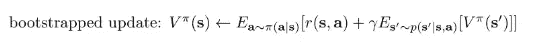

如果您有一个表格形式的 MDP，这意味着您有一个小的离散状态空间，并且您知道转移概率，则每个期望值可以通过对该随机变量的所有值求和，然后将括号内的值乘以其概率来计算。当然，我们需要知道下一个状态的值，所以我们只需要使用当前对这个值的估计。一旦我们以这种方式计算了一个价值函数，那么我们就可以通过将概率 1 分配给作为优势的 argmax 的动作来构造一个更好的策略 pi 素数。这也意味着我们的策略将是确定性的，因此关于这个策略的期望值将很容易计算。我们可以通过移除关于策略的期望并直接插入唯一具有非零概率的动作来简化我们的引导更新:

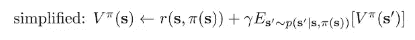

现在我们可以将这个过程插入到我们的策略迭代算法中，特别是在步骤 1 中，当我们评估状态的值时。你可以证明重复这个递归最终收敛到一个不动点并且这个不动点就是真值函数。

## **甚至更简单的动态编程**

您可能注意到了策略评估的工作方式:值在每次迭代中一致地传播，但是很慢。但是，即使我们在单次迭代后截断策略评估，我们仍然可以通过在策略评估的单次状态空间扫描后采用 Q 函数估计的贪婪策略来改进初始策略。这个算法是 RL 中的另一个基本算法:它被称为值迭代(VI)。VI 可以被认为是“贪婪地修改政策”，因为我们尽可能快地贪婪地计算贪婪的政策。VI 不会等到我们对策略有了一个准确的估计之后才进行改进，而是在一次状态扫描之后就终止了策略评估阶段。

从数学上讲，这个想法就是优势的 argmax 等于取 Q 函数的 argmax。因为如果你去掉状态的值，你可以这样做，因为 argmax 是关于动作的，那么你只得到 Q 函数。

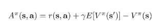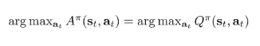

我们可以直接跳过恢复索引并获取值的步骤，而不是从优势的 argmax 中获取索引，然后将其插入 Q 函数以获取最高值。

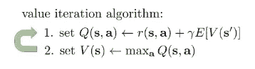

在第一步中，我们将 Q 值设置为奖励加上下一时间步的价值函数的期望值，然后在第二步中，我们将价值函数设置为 Q 函数表中动作的最大值。这里，跳过了显式策略计算，我们实际上从来没有显式地表示过策略，但是您可以将其视为在步骤 2 中隐式显示，因为将值设置为 Q 值表中操作的最大值类似于获取 argmax，然后将 argmax 的索引插入表中以恢复值。但是因为取 argmax 然后把它插入到表中与只取 max 是一样的，我们基本上可以简化这个步骤，得到这个过程

## **拟合值迭代和 Q 迭代**

到目前为止，我们讨论了如何学习以表格形式表示的值函数，所以没有神经网络。现在让我们来谈谈如何引入神经网络和函数逼近

首先，我们如何表示价值？到目前为止，我们讨论了如何将它表示为一个大表。然而，让我们假设你在玩一个基于图像的视频游戏:在这个视频游戏中，如果你有一个 200 乘 200 像素的图像，可能的状态数是 255，这是每个像素可以接受的值的数量，因为有三个颜色通道，所以它的三次方是 200 的 200 次方。维护一个包含这么多条目的表是不可能的:这比宇宙中的原子数量还要多。这就是众所周知的维数灾难:一个简单的事实是，如果你有一个多维的状态空间，你在表格强化学习中需要的条目数量是维数的指数。

所以我们会用一个函数逼近器。我们将有一个从状态映射到标量值的神经网络净值函数。我们可以通过对目标值进行最小二乘回归来拟合我们的神经网络净值函数，如果我们使用上一节中的值迭代过程，那么我们的目标值就是 Q 函数作用的最大值。

那么我们的拟合值迭代算法将如下所示:

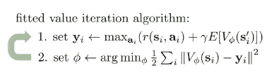

第一步，通过为每个采样状态下的每个可能的动作构造 Q 函数来计算你的目标值(我们仍然假设我们有一个离散的动作空间，所以我们可以精确地执行这个枚举)；对于每一个动作，我们把它的回报加上 gamma 乘以下一个状态的期望值。做最大值，得到我们的目标值，然后在第二步回归到这些目标值。

这是一个我们可以使用的合理算法，但它仍然需要我们知道跃迁动力学:

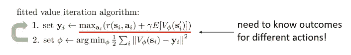

有两种方式需要转变动力学的知识。首先，它需要能够计算预期值，也许更重要的是，它需要我们能够从同一个状态尝试多个不同的操作，如果我们只能在环境中运行策略，而不是多次传送到一个状态并从同一个状态尝试多个操作，我们通常无法做到这一点

让我们回到政策迭代。在策略迭代中，我们交替评估 Q 函数，然后将策略设置为贪婪 argmax 策略。策略迭代中的第一步涉及策略评估，这需要重复应用这个价值函数递归，正如我们之前看到的。那么，如果我们不是应用价值函数递归来学习价值函数，而是以类似的方式直接构造 Q 函数递归，会怎么样呢？

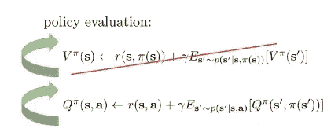

如果我想在一个特定的状态-动作元组中构造 Q 函数，我可以写完全相同的递归，除了现在因为 Q 函数是一个状态和动作的函数，我不需要在给定状态和策略的情况下计算下一个状态，我只需要在给定状态-动作元组的情况下计算下一个状态，我正在训练我的 Q 函数。乍一看，这似乎是一个非常微妙的区别，但这是一个非常重要的区别，因为现在随着我的策略改变，我需要对下一个状态进行采样的操作实际上并没有改变，这意味着如果我有一堆样本(状态、操作、下一个状态)，我可以使用这些样本来拟合我的 Q 函数，而不管我有什么策略。策略出现的唯一地方是作为下一个状态的 Q 函数的参数，在期望值内。事实证明，这个看起来非常简单的变化允许我们执行策略迭代式的算法，而不需要实际了解转换动态，只需要对一些元组进行采样，我们可以通过运行任何我们想要的策略来获得这些元组。如果我们在策略迭代的第一步这样做，我们将不再需要知道转移概率。

我们能再玩一次“麦克斯”的把戏吗？

现在我们似乎后退了一步，因为在我们推导策略迭代之前，我们简化了它，得到了值迭代，我们得到值迭代的方法是使用这个最大值技巧。在值迭代中，我们看到，当我们构建策略时，我们采用 argmax，但我们只是采用 argmax 操作的值，因此评估 arg max 的值就像采用 max 一样，因此我们可以放弃第二步，直接执行值迭代。

我们可以用 Q 函数做同样的 max 技巧吗？这是我们之前做的:

我们构造拟合 Q 迭代算法的方式非常类似于拟合值迭代。我们将我们的目标值构造为奖励加上 gamma 乘以下一个状态的价值函数的期望值。然后，在第二步中，我们简单地将 Q 函数回归到这些目标值上:

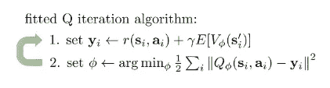

当然，诀窍是我们必须在不知道转移概率的情况下评估第一步。我们要做两件事:首先，我们要用 Q 函数中动作的最大值替换下一个状态的值:

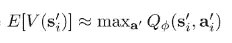

这是因为我们只是在逼近 Q 函数，而不是价值函数。

第二，我们不是对所有可能的下一个状态进行完全预期，而是使用生成样本时得到的采样状态。现在，我们运行该算法所需要的只是样本(状态、动作、下一个状态)，这些样本可以通过推出我们的策略来构建。这不需要模拟不同的操作，只需要您上次运行策略时实际采样的操作。

这甚至适用于不符合策略的样本，因此该算法不做任何假设，即动作实际上是从最新的策略中采样的，动作可能是从任何地方采样的。您可以存储迄今为止收集的所有数据，它不需要来自您的最新政策。

不幸的是，这个过程对于非线性函数逼近没有任何收敛保证；然而，如果你使用表格表示，它实际上是保证收敛的。

将这些片段放在一起，这是拟合的 Q 迭代算法:

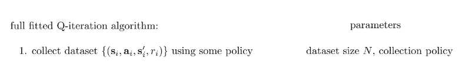

该算法适用于各种不同的策略。您必须选择的参数之一是您要收集的这种转换的数量。

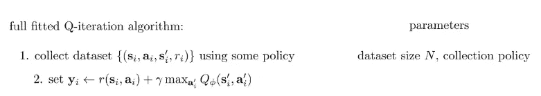

第二步，对于你采样的每个转换，计算一个目标值。

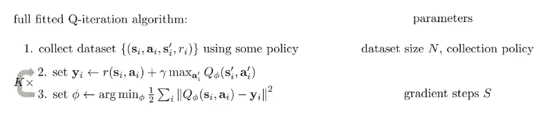

第三步，训练一个新的 Q 函数，这意味着通过最小化 Q 的值与对应的目标值之间的差来找到一个新的参数向量。您必须选择的一个参数是在执行优化时您将进行的梯度步骤的数量。做一次第三步实际上并不能得到最好的 Q 函数；在出去收集更多的数据之前，你可以将第二步和第三步交替进行几次。

## 从 Q 迭代到 Q 学习

让我们再多谈一点，拟合 Q 迭代作为一种非策略算法意味着什么。提醒一下:不符合策略意味着您不需要来自最新策略的样本来继续运行您的 RL 算法。通常，这意味着您可以对同一组样本采取许多梯度步骤，或者重用来自以前迭代的样本，因此您不必丢弃旧样本，并且可以继续使用它们，这实际上为您提供了更多的训练数据。

直观地说，fitted-Q 迭代允许我们使用非策略数据的主要原因是，使用策略的一个地方是利用 Q 函数，而不是通过模拟器步进。所以随着我们政策的改变，真正改变的是这个最大值:

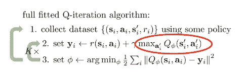

请记住，我们获得这个最大值的方法是获取 argmax，然后将其插回到 Q 值中，以获得策略的实际值。因此，在 max 内部，您可以对其进行解包，并假设它是下一个状态的 Q 函数和 Q 的 arg max。arg max 基本上是我们的策略，因此这是策略显示的唯一位置，并且非常方便地显示为 Q 函数的参数，这意味着随着我们的策略发生变化，我们不需要生成新的部署，您几乎可以将此视为一种模型。Q 函数可以让你模拟，如果你采取不同的行动，你会得到什么样的值，当然，如果你想最大程度地改善你的行为，你会采取最好的行动。这个最大值近似于我们在下一个状态的贪婪策略的值。

你可以从结构上考虑拟合 Q 迭代的一种方式是，你有一个不同跃迁的大桶，你要做的是备份每个跃迁的值，每个备份都会提高你的 Q 值，但你真的不太关心具体是哪些跃迁，只要它们能很好地覆盖所有可能跃迁的空间。所以你可以想象你有这个跃迁的数据集，你只是在这个数据集上不停地工作，运行拟合的 Q 迭代，每次循环时改进你的 Q 函数。

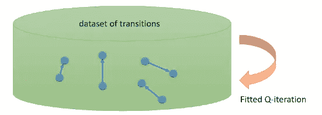

## **什么是拟合 Q 迭代优化？**

取最大值的步骤改进了您的策略，因此在表格中，这实际上是您的策略改进。您的第三步是最小化拟合误差，因此如果您有一个表格更新，您只需将这些目标直接写入您的表中

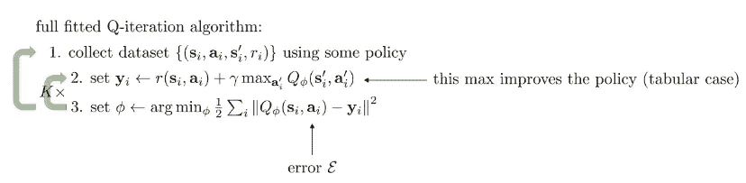

但是，因为你有一个神经网络，你必须执行一些优化，以尽量减少对这些 y 的误差。您可以将拟合 Q 迭代视为优化一个误差，该误差是贝尔曼误差——Q 函数和目标之间的差异。Tat 是最接近实际优化目标的一种，但当然，误差本身并不真正反映您策略的好坏，它只是您能够复制目标值的精确度。如果误差为零，那么你知道这是一个最优 Q 函数，但如果误差不为零，那么你真的不能说这个策略的性能。

现在我们来讨论几个特例。

## **在线 Q 学习算法**

您可以用对应于在线算法的那些超参数的特定选择来实例化先前算法的特例。在在线算法中，你正好采取一个动作并观察一个转变；然后在第二步中，你为你刚刚进行的过渡计算一个目标值，非常类似于你如何在在线演员-评论家中为你刚刚进行的一个过渡计算优势值；然后在第三步，你对你的 Q 值和你刚刚计算的目标值之间的误差进行梯度下降。

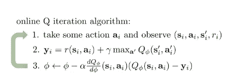

我这里的等式看起来有点复杂，但我基本上只是将概率链规则应用于第三步 argmin 中的目标。这些括号中的误差有时被称为时间差误差。

## **用 Q-learning 探索**

在学习过程中，使用贪婪策略可能不是一个好主意。原因是我们的 argmax 策略是确定性的，如果我们的初始 Q 函数很差，它就不是随机的，而是任意的。然后，它将在每次进入特定状态时，提交我们的 argmax 策略来采取相同的操作，如果该操作不是一个非常好的操作，我们可能会永久地采取那个糟糕的操作，并且我们可能永远不会发现更好的操作存在。因此，在实践中，当我们运行 fitted Q 迭代时，非常需要修改我们在第一步中使用的策略，不仅是 argmax 策略，而且要注入一些额外的随机性以产生更好的探索。我们在实践中做出了许多选择来促进这一点。

一个常见的选择叫做ε贪婪；这是一个最简单的探索规则，我们可以用在离散的行动中，它简单地说，概率为 1 减去ε，你会采取贪婪的行动，然后概率为ε，你会随机采取其他行动中的一个。

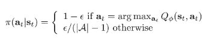

如果我们选择ε是某个小数字，这意味着大多数时候我们采取我们认为最好的行动，这通常是一个好主意——但我们总是有很小但非零的概率采取其他行动，这将确保如果我们的 Q 函数不好，最终我们会随机做一些更好的事情。一个非常常见的实际选择是在训练过程中改变ε的值，这很有意义，因为你预计 Q 函数最初会很差，此时你可能希望使用更大的ε。然后随着学习的进展，你的 Q 函数变得更好，然后你可以减少ε

你可以使用的另一个探索规则是玻尔兹曼探索，来选择你的行动，与你的 Q 值的一些正向转换成比例。一个特别流行的正变换是取幂。

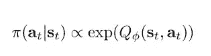

所以如果你采取的行动与 Q 值的指数成正比，将会发生的是，最佳行动将是最频繁的，几乎与最佳行动一样好的行动也将被频繁采取，因为它们有相似的高概率。但是如果某个行为的 Q 值极低，那么它几乎永远不会被采取。在某些情况下，这种探索规则可以优于ε贪婪，因为 1)对于ε贪婪，恰好是最大值的动作获得高得多的概率，并且如果有两个动作几乎一样好，则第二好的动作具有低得多的概率，而对于这种求幂规则，如果你真的有两个同样好的动作， 如果你有一个非常糟糕的行为，并且你已经知道这只是一个非常糟糕的行为，你可能不想浪费时间去探索它，而 epsilon greedy 不会利用这一点。

## **总结**

我们已经讨论了基于值的方法，这些方法不明确地学习策略，而只是学习一个值函数或 Q 函数。我们已经讨论了如果您有一个值函数，您如何使用 argmax 恢复策略，以及我们如何设计这种拟合的 Q 迭代方法，这种方法不需要了解转换动态，因此它是一种真正的无模型方法，我们可以以各种方式将其实例化为批处理模式、非策略方法或在线 Q 学习方法。

## **理论上的价值函数**

现在让我们深入一点理论来解释我之前说的基于值的神经网络方法通常不会收敛到最优解是什么意思。首先，让我们从之前讨论过的值迭代算法开始。

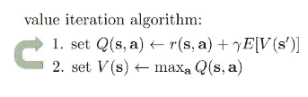

这是一个非常简单的算法，对我们来说更容易思考，但我们稍后会回到 Q 迭代方法。提醒大家，在价值迭代中，我们可以认为它有两个步骤。第一步，构建你的 Q 值表，作为奖励加上 gamma 乘以下一个状态的期望值；第二步，将你的值函数设置为表中各行的最大值。所以你可以把它想象成构造一个值表，然后迭代这个过程。我们可以问的问题是:这个算法收敛吗？如果它收敛了，它会收敛到什么？我们可以从这个分析开始的方法之一是，我们可以定义一个贝尔曼算子:

当应用于值函数时，该运算符执行以下操作:

*   首先，它采用 V 并应用运算符 T 下标 a，这是一个维数为 SxS 的矩阵，其中该矩阵中的每个条目都是给定当前状态和动作的下一个状态的概率，并且根据该最大值选择动作。这基本上就是计算期望值，这是一个线性算子。
*   我们把它乘以伽玛
*   我们添加了向量 r 下标 a，这是一个奖励向量，对于每个状态，你为相应的动作选择奖励，然后在此之外，你对该动作执行最大值。重要的是，这个最大值是每个元素的，所以对于每个状态，我们取一个最大值

这种编写贝尔曼备份的有趣方式基本上只是抓住了值迭代算法，它包括对向量 V 重复应用运算符 B

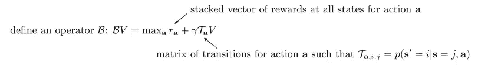

我们可以证明的一个有趣的性质是 v 星(最优策略的价值函数)是 b 的不动点。

如果我们找到满足这个等式的价值函数，我们就有了最优价值函数，如果我们使用 arg max 策略，我们将得到最优策略，即最大化总回报的策略。这意味着 V 星等于 B 乘以 V 星。这很好:如果我们找到 B 的一个不动点，那么我们就有了最优值函数。此外，也有可能证明 v 星一直存在。这个不动点总是存在的，它总是唯一的，并且总是对应于最优策略。所以我们剩下的唯一问题是:对 V 重复应用 B，真的能找到这个固定点吗？换句话说，不动点迭代算法收敛吗？如果它收敛，它将收敛到最优策略，并且它有唯一的解。我不会详细讨论这个证明，但是我们论证值迭代收敛背后的高层次草图是通过论证它是一个收缩。我们可以证明值迭代达到 v 星是因为 B 是收缩。收缩是什么意思？意思是如果你有任意两个向量 V 和 v bar，那么对 V 和 v bar 都应用 B 会让那些向量更靠近，意思是 BV 减去 B * V bar 的范数小于或者等于 V 减去 V bar 的范数。事实上，这是某种系数的收缩。那个系数恰好是γ，所以不仅 B*V 减 B * V 杠的范数小于或等于 V 减 V 杠的范数，而且也小于或等于 V 减 V 杠的范数乘以γ。所以，你会收缩，你会收缩一个不小的量，这意味着，当你对它们施加 B 时，V 和 V 杠会越来越近

## **非表格值函数学习**

正则值迭代可以非常简洁地写成重复应用这一步:V 到 BV。

现在，让我们去拟合值迭代算法。拟合值迭代算法有另一个操作；它有一个第二步，您可以根据参数执行 arg min。你可以认为监督学习的一种方式是，你有一些可以表示的价值函数。该集合是一个连续的集合，由所有可能的具有特定架构的神经网络组成，但具有不同的权重值。所以我们将集合表示为集合ω。在监督学习中，我们有时称之为假设集或假设空间。监督学习包括在你的假设空间中找到一个优化你的目标的元素，我们的目标是状态值和我们的目标值之间的平方差。现在，我们的目标值是多少？我们的目标价值基本是 BV。你可以把整个拟合值迭代算法想象成反复寻找一个新的值函数 v prime，它是 v prime 和 BV 的平方差的集合 omega 内部的自变量，其中 BV 是你之前的值函数

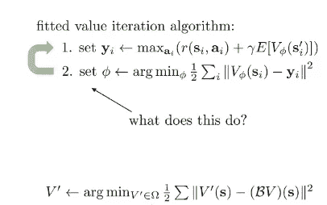

这个过程本身也是一种收缩。当你执行这种监督学习时，你可以把它看作是 L2 规范中的一个投影。你有你的旧 v，你有你的一组可能的神经网络，用这条线代表:

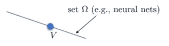

ω基本上就是那条线上的所有点。当我们构造 BV 时，我们可能会离开这条线，所以点 BV 不在集合ω中。当我们执行监督学习时，当我们执行拟合值迭代的第二步时，我们真正做的是在集合ω中找到一个尽可能接近 BV 的点。“尽可能接近”意味着它将是一个直角，所以我们将向下投影到集合ω上，这将是一个直角投影。那会给我们带来 v prime。

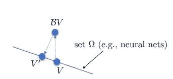

我们可以将此定义为新运算符。我们可以称这个算符π为“投影”,我们会说πV 就是这个目标的集合ω内的 argmin，这就是 L2 范数。

b 是关于无穷范数的收缩。π是相对于 L2 范数的收缩。

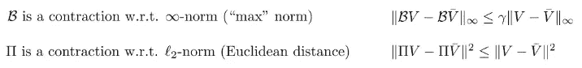

π是一个收缩的原因是，如果你在欧几里得空间中有任何两个点，并将它们投影到一条线上，它们只能彼此靠近，永远不能更远。不幸的是，πB 不是任何形式的收缩。

如果你想象蓝点是你的起点，黄星是最佳价值函数:

你迈出一步，那么你的正则值迭代会逐渐离星星越来越近:

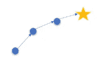

如果你有一个投影值迭代算法，一个拟合值迭代算法，那么你要把你的值函数限制在这条线的每一步，而你的贝尔曼备份会让你在无穷范数方面更接近恒星:

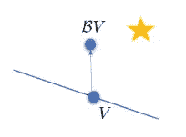

然后你的投影会把你移回到线上:

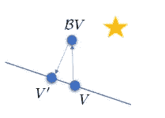

虽然这两个操作都是收缩，注意 V 撇现在实际上比 V 离恒星更远。你会遇到这样的情况，每一步都会让你离 V 星越来越远。

从所有这些中得出的令人悲伤的结论是:

*   在表格情况下，值迭代确实收敛
*   拟合值迭代一般不收敛，在实践中也经常不收敛
*   拟合 Q 迭代是一样的:πB 不是任何形式的收缩。

重要的是，有些人可能认为该算法中的步骤 3 可能只是梯度下降，它收敛于:

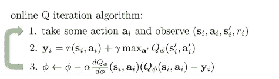

但是，Q-learning 不是梯度下降。它不是在一个明确定义的目标上采取梯度步骤，这是因为 Q-learning 的目标值本身取决于 Q 值——但你没有考虑通过这些目标值的梯度。所以你实际使用的梯度不是一个定义明确的函数的真正梯度，这就是为什么它可能不收敛。现在可能值得一提的是，你可以把这个算法变成一个梯度下降算法，通过实际计算这些目标值的梯度。更大的问题是，由此产生的算法被称为残差算法，它具有非常差的数值特性，并且不能很好地工作。

## **一个可悲的推论**

出于同样的原因，我们之前讨论的 actor-critic 算法也不能保证收敛于函数逼近。在这里，我们也做一个贝尔曼备份，当我们使用引导更新，我们做一个投影，当我们更新我们的价值函数。这些的串联不是收敛运算符，因此拟合的引导策略评估也不会收敛。

## **总结**

我们讨论了一些值迭代理论，我们讨论了用于备份的算子，用于投影的算子；我们讨论了备份是如何收缩的，以及我们的表格值迭代如何收敛。我们讨论了函数逼近的一些收敛性质，其中投影也是一种压缩，但因为它是不同范数下的压缩，所以投影后的备份实际上不是压缩，因此拟合值迭代一般不会收敛。以及它对 Q 学习的启示。我们将在下一篇文章中发现，在实践中，我们实际上可以使所有这些算法工作得非常好，但它们的理论性质留给我们许多需要改进的地方。

*随时给我留言或者:*

1.  通过[LinkedIn](https://www.linkedin.com/in/samuele-bolotta-841b16160/) 和 [Twitter](https://twitter.com/SamBolotta) 联系我
2.  在[媒体](/@samuelebolotta)上跟随我

 [## Mlearning.ai 提交建议

### 如何成为 Mlearning.ai 上的作家

medium.com](/mlearning-ai/mlearning-ai-submission-suggestions-b51e2b130bfb)