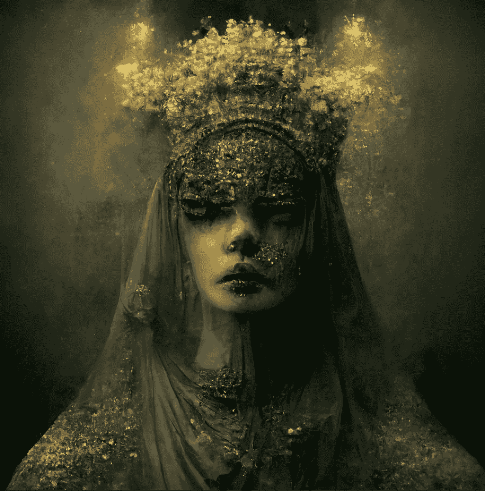

# 你应该知道的 5 个人工智能艺术发生器

> 原文：<https://medium.com/mlearning-ai/5-ai-art-generators-you-should-know-about-ed1591cee3b9?source=collection_archive---------0----------------------->

Image by [Author](/@jimclydemonge)

我跟随 AI 艺术引擎工具已经快一年了。似乎每个月都有新的技术突破，新的网络工具可供用户使用。

最新的趋势是人工智能艺术生成器，它采用简单的文本提示，并将它们转化为可怕的酷的照片级现实主义图像。如果你今天就想尝试一下，这里有 5 个最好的文本转艺术工具…