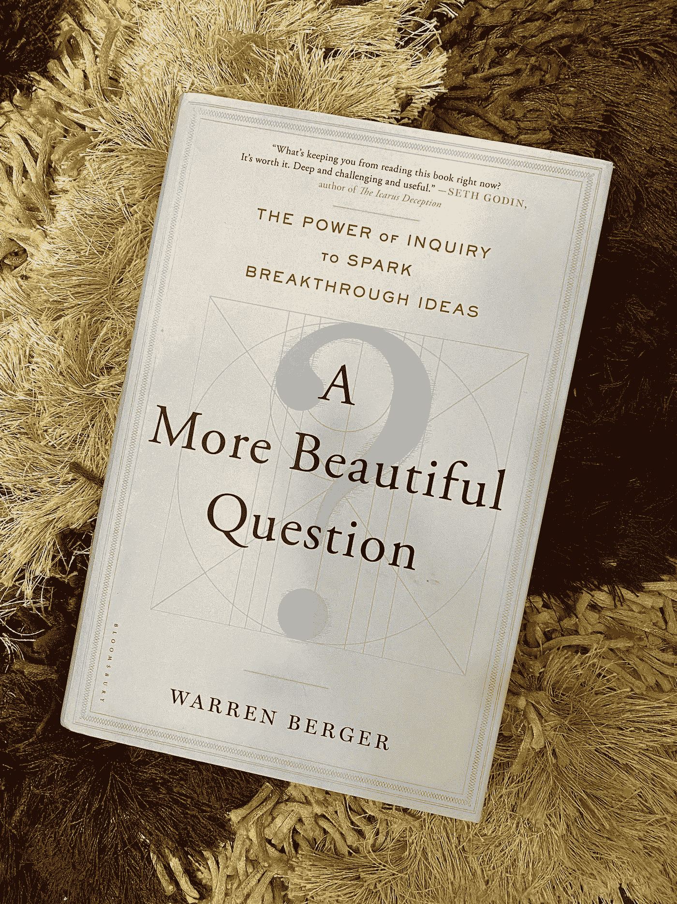
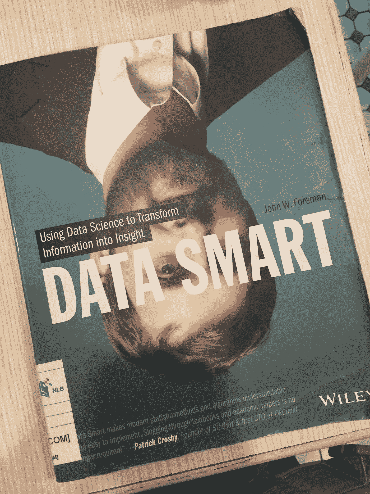
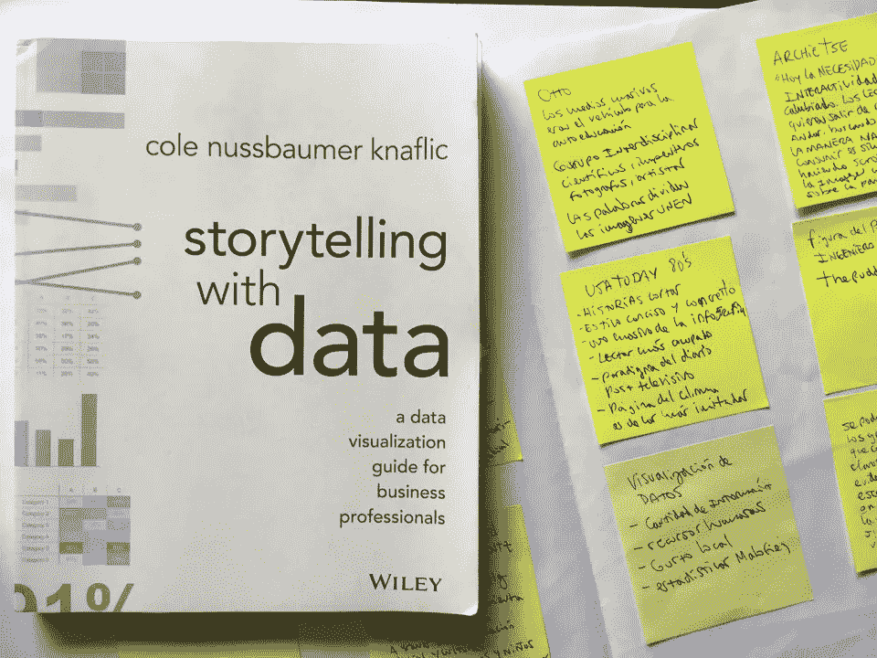
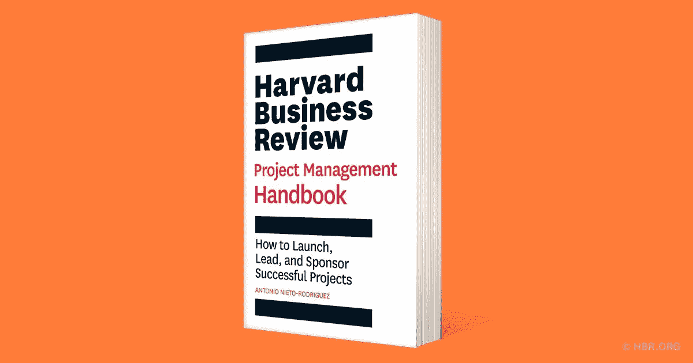

# 帮助您建立数据分析师核心能力的 5 本书

> 原文：<https://medium.com/mlearning-ai/5-books-to-help-you-build-core-competencies-as-a-data-analyst-d80b1820b8e9?source=collection_archive---------0----------------------->

## 数据分析师的工作描述可能因组织而异，但个人应该具备一系列核心能力，涵盖不同领域，例如技术、人际关系和业务管理。

*我将列出我认为的数据分析师的基本能力，当然还有更多，所以收集所有可用的数据点来构建你的见解。*

Photo by [Radu Marcusu](https://unsplash.com/es/@radu_marcusu?utm_source=medium&utm_medium=referral) on [Unsplash](https://unsplash.com?utm_source=medium&utm_medium=referral)

数据分析师需要具备多种能力才能在工作中取得成功。其中一些——我发现是基本的——是:从商业角度提出正确的问题，选择最佳的分析模型和工具来回答这些问题，使用正确的媒介和可视化方式向观众展示见解，应用良好的人际沟通技巧来获得高层领导的支持，以及能够领导一个从 0 到 100 的项目实施。接下来的书是帮助你建立它们的个人选择。

Photo by [Campaign Creators](https://unsplash.com/@campaign_creators?utm_source=medium&utm_medium=referral) on [Unsplash](https://unsplash.com?utm_source=medium&utm_medium=referral)

1.  **提出正确的问题:一个更好的问题，沃伦·伯杰**

任何数据分析师的出发点都是:业务需要了解或解决什么？从那以后，更多的问题将会出现，然而，并不是所有的问题都足够有价值。正如阿尔伯特·爱因斯坦所说:

> 不是所有能被计算的都有价值，也不是所有有价值的都可以被计算

沃伦·伯杰在本书中向我们展示了如何基于三个基本而美丽的问题提出更多更好的问题:为什么？如果呢？又是怎么做到的？虽然这看起来很基本，但你会注意到我们实际上不知道如何使用这些问题来更好地构建我们的想法，从而创造可操作的结果。你将学会寻求理解，想象可能性，并让事情发生。

Image by Asar Dhandala

2.**使用正确的工具和模型:数据智能，约翰·w·福尔曼**

一旦数据分析师理解了业务需求并将其转化为问题，她就该回答每一个问题了。正如生活中的许多事情一样，没有放之四海而皆准的方法，所以为了完成这项任务，拥有大量的工具和模型是非常必要的。

John W. Foreman (CPO 在讲台上)的 Data Smart 基本上是学习不同技术以将数据转化为见解的首选工具包。各章通过线性和非线性规划优化、k 均值聚类、通过逻辑回归或朴素贝叶斯分类、预测和异常值检测的实例进行了深入探讨。这本书最好的一点是，无论你对数据转换技术有什么样的了解，John 的叙述结果都很容易理解，甚至很幽默；更不用说第一部分将向您展示如何在 Excel 上执行这些方法，然后将进入 R 编程语言。

Image by huangchikai

3.**数据洞察交流:用数据讲故事，Cole Nussbaumer Knaflic**

我坚定地认为数据本身什么都不是，即使是以洞察力的形式。数据分析师需要将他发现的所有数字、使用的技术和对问题主题的深刻理解放入一个精心构建的、可靠的故事中。在我看来，这是分析师需要具备的最复杂的能力之一。为什么？因为即使使用最先进的技术来分析数据，并且发现的见解可以为企业带来 300%的投资回报，但如果它们没有得到适当的沟通并因此被受众理解，那么之前所做的一切都将是徒劳的。相信我，我见过伟大的分析和见解因为“简单”的东西而成为垃圾，比如用于显示数据的图表或写在幻灯片上的不清楚的标题。

但是你不应该害怕。Cole Knaflic(前谷歌人力分析经理)写了一本关于如何为你的数据展示一个强有力的故事的最好的书。你将学习讲故事的基础:了解背景和你的观众，根据你想要展示的情况选择最有效的视觉化，识别并抑制你的见解可能造成的混乱，使信息足够强大，以便能让你的听众留下印象。

Image by Raúl Rodríguez

4.**人际交往:如何赢得朋友&影响他人**

想象一下，数据分析师刚刚做了一个精彩的演示，房间里的每个人都了解上下文、机会领域和改进计划，但是，有几个高级经理对要走的路不太确信。这是因为在分享你的分析时，以一种可理解的方式呈现数据只是一半，另一半是对你的观众施加影响以实现你的想法。重要的是要说，人际交往不仅在演示的时候有用；这也有助于质疑利益相关者的业务表现，或者与你的老板讨论为什么你应该集中精力分析 B 而不是 a。

这本书出版于 80 多年前，但书中教授的 30 条原则仍然非常有效，原因很简单:我们仍然是人，因此，我们希望别人对我们感兴趣，或者尊重我们的意见。阅读卡耐基的出版物，你会学到与人相处的基本技巧，让人们喜欢你的 6 种方法，如何让人们接受你的思维方式，以及如何通过成为领导者来改变人们。老实说，这本书不仅能帮助你成为一名数据分析师，还能帮助你成为一个完整的人。

Image by Parentotheca

5.**项目管理:项目管理手册，安东尼奥·涅托-罗德里格斯**

正如我在故事开始时所说的，数据分析师的工作范围可能因公司而异，有些人将仅限于产生见解和构建管理层演示文稿，但有些人将在其控制范围内管理其建议的实施，在 98%的情况下，这将涉及到与多项任务和团队合作，以及紧迫的期限。为了做到这一点，建立项目管理的能力是很重要的。

Antonio Nieto-Rodríguez(全球战略实施顾问)的这本书包含了一个简单而强大的框架来增加项目成功的机会。您将了解如何识别不同的项目类型，如何将一个复杂的项目分解成单个的块，使您的项目不仅对您的利益相关者而且对高层领导来说都是可理解的，以及如何使用 Project Canvas，这是一个由作者设计的专注于项目基础的工具。

Image by Harvard Business Review

我希望这些书能在你成为一名伟大的数据分析师的道路上给你一点推动。记住，你的工作基本上是提供方向，如果做得不好，很容易迷路。正如杰弗里·摩尔所说:

> 没有大数据分析，公司就像瞎子和聋子，像高速公路上的小鹿一样在网络上游荡

 [## Mlearning.ai 提交建议

### 如何成为 Mlearning.ai 上的作家

medium.com](/mlearning-ai/mlearning-ai-submission-suggestions-b51e2b130bfb)