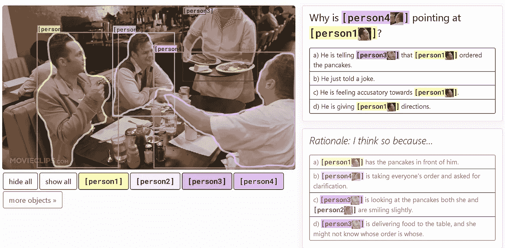
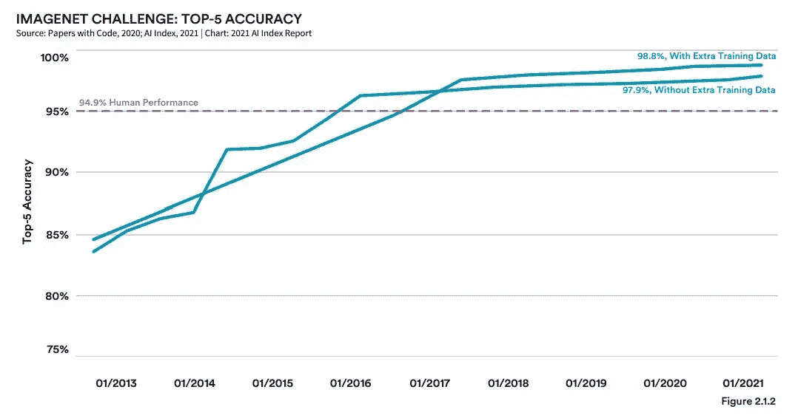
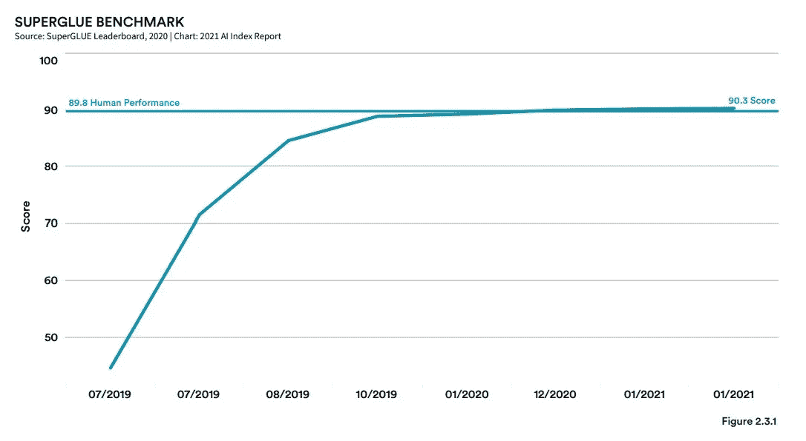
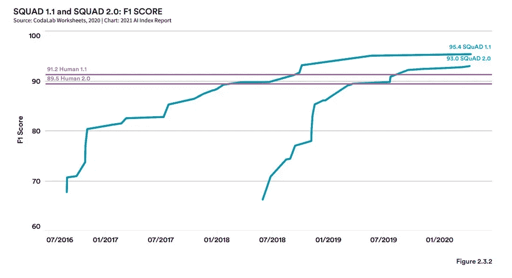
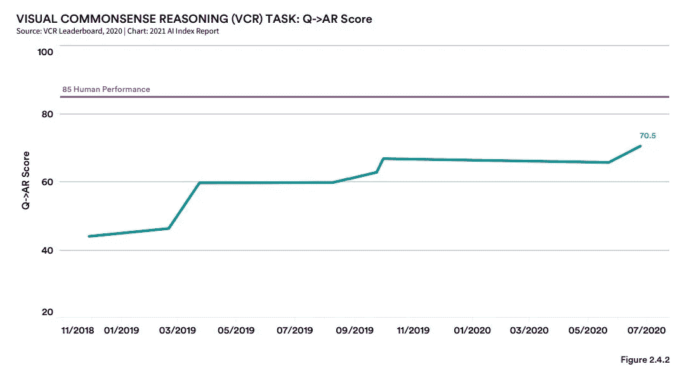
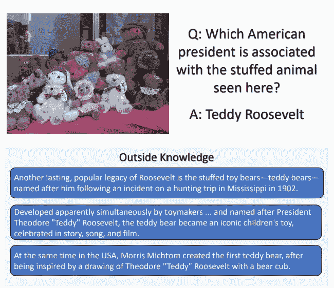
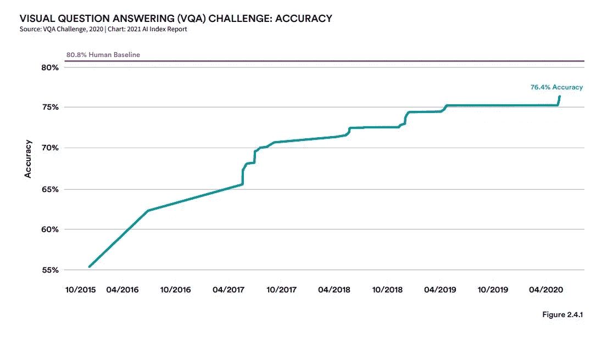

# 显示大型人工智能模型进展与人类基准对比的 5 个图表

> 原文：<https://medium.com/mlearning-ai/5-charts-showing-large-ai-model-progress-vs-human-benchmarks-a67326ae6de7?source=collection_archive---------5----------------------->

基准是人工智能领域进步的关键指标，已经取得了很大的进步。

将大型模型与大型问题、图像和任务测试集进行比较。作为对照，人类通过这些测试来设定与人工智能模型进行比较的基准。随着时间的推移，证明行业进步的最简单方法之一就是在这些基准上取得进展。在许多情况下，人工智能不仅满足，而且远远超过了人类的表现线，导致研究人员开发更新更难的基准。

因此，人工智能行业进步的一个更有趣的信号是我们衡量这些模型的标准逐渐提高。自然语言是一个模型不断进化的领域，在多次越来越难的测试(Squad，Squad 2，GLUE，super glue)中击败人类性能基准，这迫使研究人员不断为模型找到更难解决的任务。

提高人工智能的门槛并不是什么新鲜事，因为我们已经看到计算机模型从击败 90 年代最佳国际象棋选手(IBM 深蓝)到能够击败国际象棋、围棋和所有雅达利游戏的谷歌 DeepMind 的单一新模型。

(是的，但是它能打败我的大富翁兄弟知道他作弊吗？).

# 5 个图表中的基准示例

遵循这一趋势，我从斯坦福年度人工智能报告中提取了一些关键的基准图表，这些图表展示了人工智能不同领域的进展。

# 1.Imagenet

内容:Imagenet 是一个由标签图片组成的大型数据库。计算机视觉人工智能模型被要求陈述呈现的图片中有什么。

哇:视觉模型不仅很好，而且在高速下比人类水平的精确度好得多。虽然这是一项狭窄的人工智能任务，但其准确性使视觉模型能够非常容易地融入到行业中(识别缺陷或过程问题)。

# 2.超强力胶水

内容:SuperGLUE 是 GLUE(通用语言理解评估)基准测试的一种演变，之前被人工智能模型击败。GLUE benchmark 是九个不同语言理解任务的集合，测量对语言任务的共同理解，如“这是积极的还是消极的情绪？”，向前和向后提问，或要求总结。

哇:这个测试的问题是 SAT 阅读理解水平，所以相对广泛和具有挑战性。更重要的是，胶水模型于 2018 年发布，在实现人类平价后，2019 年发布了更硬的强力胶基准。人类平等现在已经实现了两次，一个新的基准正在制定中，以再次提高标准。

# 3.班

内容:斯坦福问答数据集 v1.1 是从维基百科中抽取的 10 万个众包阅读理解问题/答案对的集合。SQuAD2.0 于 2018 年推出，并以此为基础，提供了 50，000 个无法回答的问题，旨在看起来像可回答的问题。为了表现良好，NLP 模型必须确定正确答案何时不可用。(问题示例:[SQuAD——斯坦福问答数据集(rajpurkar.github.io)](https://rajpurkar.github.io/SQuAD-explorer/explore/v2.0/dev/Normans.html) )

哇:注意人类对等实现后的缓慢进展。在实践中，这最后几个精度点是非常昂贵的，并且经常涉及大量昂贵的计算来训练。

# 4.视觉常识推理

内容:VCR 数据集是 25 万个基于图片的问题，需要一些基本的推理。在上面换妻者的例子中，很明显，乔恩·费儒在指指点点，因为朗·里维斯顿拿到了煎饼。虽然人们普遍同意这些问题，但基本原理可能是基于通过经验学到的文化规范。(“你必须在那里”)

哇:相对于这个数据集，模型做得不好，但正在改进。该数据集展示了人类基于静态照片的经验播放场景的罕见能力。对于人工智能模型来说，这种做梦和一般理解迄今为止是一个令人难以置信的挑战性问题。

# 5.视觉问答

内容:VQA 测试集是一系列需要外部知识的问题，这些知识不在图片中。一个充分的模型需要广泛的一般或先验知识来完成任务。

哇:人类基准还没有在这个数据集上实现，证明了一般理解和预定义知识的复杂性。目前，让一个模型更通用的最好方法是在这个问题上投入大量的计算和预先训练。突破这一基准将是一项昂贵且具有挑战性的任务。

# 财务影响

在图像识别或翻译等狭窄的任务上，人工智能模型已经超过了人类的能力，并正在向基准的 100%准确性迈进。在这些领域，我们已经看到了很多行业采用。例如，视觉系统可以识别生产线中的缺陷，或者在实时团队会议中自动翻译和转录。这里的投资回报率很高，而且定义明确。

随着基准继续提高人工智能模型的门槛，它们包含了更多的一般理解和解决任务的先验知识。人类基准在这方面有持续的优势。然而，在语言任务上，像 GPT-3 这样的模型已经开始展示人类水平的 SAT 阅读理解能力。在未来，这些类型的更一般化的模型将能够增强人类在更复杂的任务上的能力，如记医疗笔记或总结会议。

# 结论

执行这些狭窄任务的人工智能模型的市场很大，而且定义明确，因为我们知道生产线上的质量保证或缺陷造成的美元损失等直接替换成本。这定义了“窄”人工智能井的总可寻址市场。

然而，更一般化的模型定义的市场规模要小得多。如果没有人浪费时间来写总结良好的会议，我们能获得多少生产力？无。很多。很难说。

虽然我们可以直觉地认为那里有价值，但这些更通用的人工智能模型实际上可能正在创造新的无成本市场，并从生产力中产生价值，而不是取代个体的、可衡量的任务。我相信，这个价值虽然模糊，但肯定大于狭义人工智能任务的明确定义的市场，并且是随着更多基准水平的实现，大型人工智能投资(主要是计算成本)将支付的总支出。

*由我在* [原创发布大卫·霍尔| LinkedIn](https://www.linkedin.com/in/david-hall-19160218/)；关于这个和其他人工智能金融的帖子，请在 Linkedin 上关注或联系我。