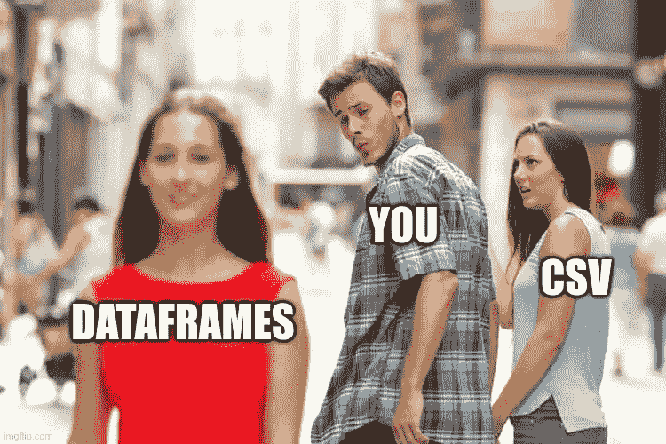

# 熊猫的 5 个数据帧技巧

> 原文：<https://medium.com/mlearning-ai/5-cool-dataframe-tricks-in-pandas-to-make-your-life-a-little-easier-5b8fe1362d39?source=collection_archive---------6----------------------->

1.  **当你有二进制特征时，使用替换进行一次热编码**

> 在您决定继续使用一个热编码或 get_dummies 分类特征之前。检查它是否是一个二元特征，如性别或是/否特征。然后，您可以使用 **replace()** 轻松地对分类特性进行编码。

Encoding categorical data with replace

**2。检查不平衡的列**

您不太可能会发现您的数据集在每个类别中都有相似数量的样本，因此这是一种使用 **unique()** 进行检查的快速方法

Counting the number of rows for a unique category for a column

**3。当数据集不平衡时，从有用的特征中随机选择样本**

> ***【sample()***pandas 并不像 SMOTE 那样创建人工样本，而是从原始数据集中随机抽取样本。您还可以使用可选参数 replace 来允许或禁止从同一行中采样，默认情况下它是禁用的。根据您的特定数据集的上下文，这可能没问题。

Using sample to make sure to have the same number of samples for each unique category for a feature. This can help in situations when the data set is class imbalanced.

**4。您的列车分割测试中的分层**

> 另一个不平衡数据集的技巧是确保类标签平均分布，因为这会影响训练。一些我最近才知道的事情。在这里了解更多信息[https://sci kit-learn . org/stable/modules/cross _ validation . html #分层](https://scikit-learn.org/stable/modules/cross_validation.html#stratification)

**5。编码非二进制的分类值**

> 当你遇到非简单二进制的分类值时。然后，您将需要创建虚拟变量，以便您的模型可以被训练。这可以通过使用 **pd.get_dummies()** 来完成

 [## Mlearning.ai 提交建议

### 如何成为 Mlearning.ai 上的作家

medium.com](/mlearning-ai/mlearning-ai-submission-suggestions-b51e2b130bfb)