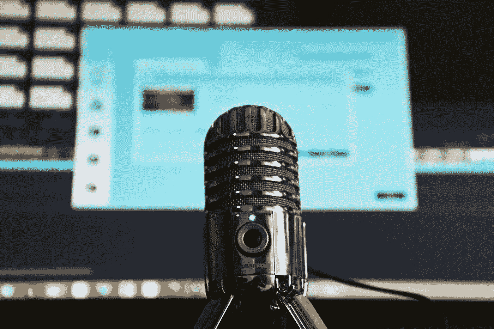

# 2022 年你应该听的 5 个数据科学播客

> 原文：<https://medium.com/mlearning-ai/5-data-science-podcasts-you-should-listen-to-in-2022-4f653ee440bb?source=collection_archive---------3----------------------->

## 关于人工智能、机器学习和数据可视化的播客集合。

Photo by [Magda Ehlers](https://www.pexels.com/@magda-ehlers-pexels/) via [Pexels](https://www.pexels.com/photo/selective-focus-photography-of-gray-stainless-steel-condenser-microphone-1054713/)

播客。它们为什么重要？为什么你应该喜欢听播客而不是浏览 YouTube？