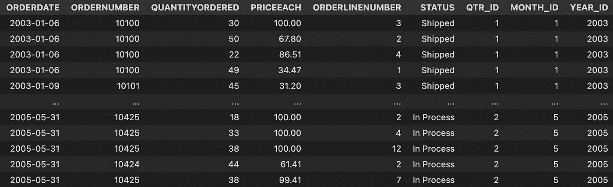
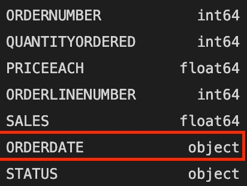
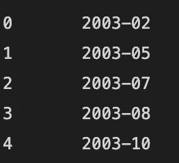

# 作为数据科学家，我每天都在使用 5 个日期时间函数

> 原文：<https://medium.com/mlearning-ai/5-datetime-functions-i-use-every-day-as-a-data-scientist-eb7c6d2dc1c8?source=collection_archive---------2----------------------->

在进行探索性数据分析时，发现临时数据是非常常见的，因此非常有必要了解如何使用 DateTime 函数来轻松操作数据并进行更好的分析。下面我将描述的函数是我在分析时态数据时经常使用的函数。



为了查看每个特性的实际用法，我将使用从 Kaggle 获得的销售数据

# 1.pd.to_datetime()

当我们使用 pandas 加载数据时，该包通常不能识别 date 类型的列。在这种情况下，pandas 将订单日期列识别为一个对象。使用函数 pd.to_datetime()，我们可以更改该列的类型，以便能够将它作为日期进行操作，如下所示



```
df["ORDERDATE"] = pd.to_datetime(df["ORDERDATE"])
```

# 2.日期至周期()

将列转换为日期时间后，我们可以在 pandas 中使用有用的函数。to_period()函数只能用于 DateTime 类型的列，用于将日期更改为某个所需的时间段。例如，完整日期可以更改为年月格式，如下所示

```
df["ORDERDATE"].dt.to_period('M')
```



# 3.np.timedelta64()

日期列对于计算有趣的统计数据也很有用。常见的数据分析任务是计算自客户上次购买或上次购买产品以来已经过去了多少个月。计算差值非常简单，只需像这样减去两列

```
df["ORDERDATE"]-df["PREV_ORDERDATE"]
```

但是熊猫默认给你天差。要将差值改为月份，我们可以使用 NumPy 的 timedelta64 函数，如下所示

```
(df["ORDERDATE"]-df["PREV_ORDERDATE"])/np.timedelta64(1,'M')
```

# 4.pd.to_timedelta()

有时，不仅需要找出日期差异，还需要在某个确定的日期上添加天数。为此，我们可以获取当前日期，并使用 to_timedelta 函数添加所需的日期

```
df["ORDERDATE"]+pd.to_timedelta(4,unit="D")
```

# 5.pd.date_range()

大多数时候，给定范围内的所有日期都不会在我们的数据表中。要创建一个包含给定范围内所有日期的列表，我们可以使用一个接收开始日期和结束日期的 pandas 函数来返回一个包含该范围内所有日期的 Pandas 系列

```
pd.date_range(start="13/4/2022",end="5/5/2022")
```

如果这篇文章有用的话，你可以关注我的个人资料，了解新的 Python 和数据科学文章。

代码可以在[我的 GitHub](https://github.com/danielguerreros/5-datetime-functions) 上的 jupyter 笔记本中找到。

[](/mlearning-ai/mlearning-ai-submission-suggestions-b51e2b130bfb) [## Mlearning.ai 提交建议

### 如何成为 Mlearning.ai 上的作家

medium.com](/mlearning-ai/mlearning-ai-submission-suggestions-b51e2b130bfb)