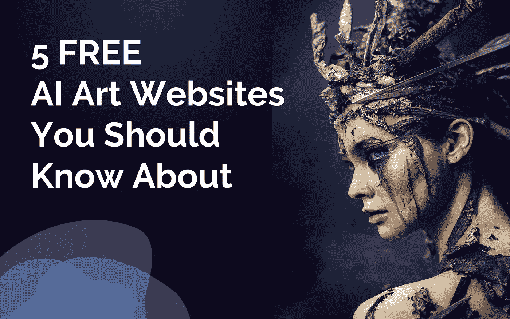

# 你应该知道的 5 个免费人工智能艺术网站

> 原文：<https://medium.com/mlearning-ai/5-free-ai-art-websites-you-should-know-about-523df4d5e7e3?source=collection_archive---------0----------------------->

Image by [Jim Clyde Monge](https://medium.com/u/819323b399ac?source=post_page-----523df4d5e7e3--------------------------------). Made with Canva and AI art by [SpiderWolve](https://www.midjourney.com/app/feed/335215753206824960/)

随着人工智能的最新改进，你现在可以使用简单的描述性文字在几秒钟内制作出逼真的或专业手工制作的艺术品。你不需要任何艺术技巧或技术天赋来完成它。

不难找到这些人工智能艺术生成器的免费版本，因为它们最近在互联网上大量涌现。