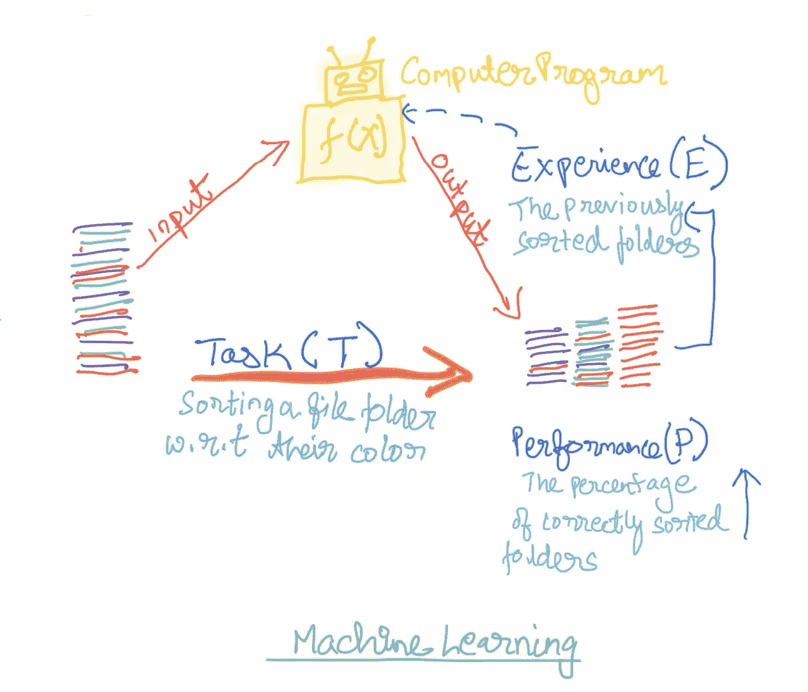
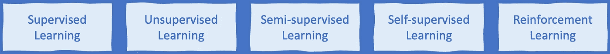
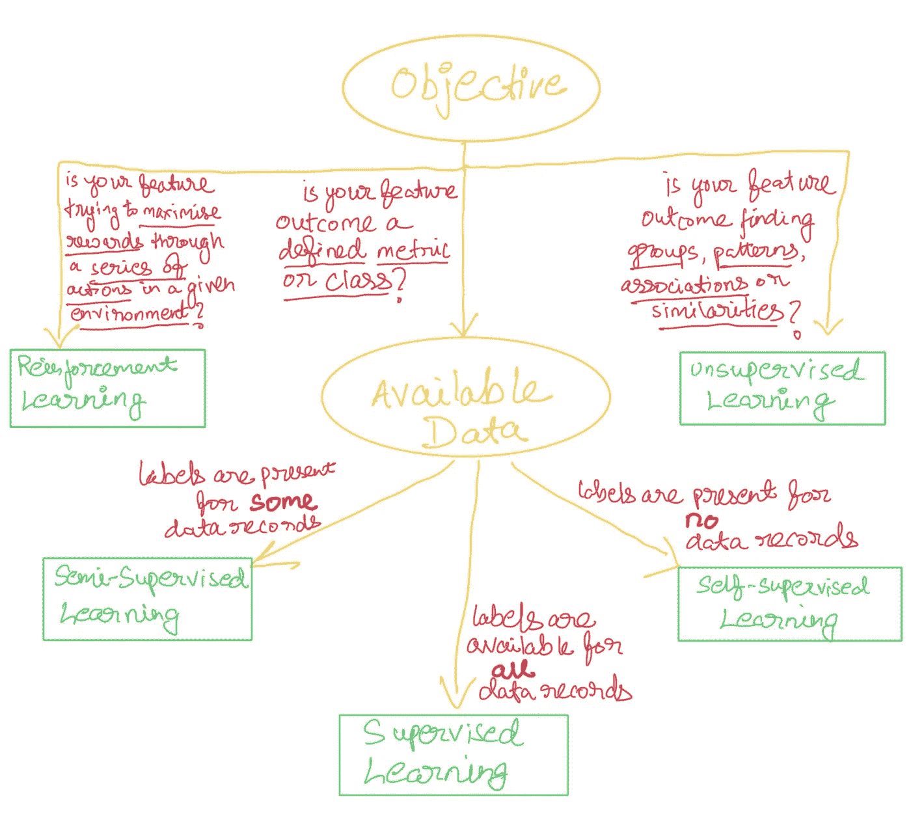

# 设计产品时要考虑的 5 种机器学习方法

> 原文：<https://medium.com/mlearning-ai/5-machine-learning-approaches-to-think-of-when-designing-products-b52b969afea1?source=collection_archive---------8----------------------->

# 什么是机器学习？

汤姆·米切尔对机器学习[的](https://towardsai.net/p/machine-learning/what-is-machine-learning-ml-b58162f97ec7)定义也许是最适合考虑这项技术的应用

> 如果计算机程序在 T 的任务中的**性能随着 P** 、**测量的**随着经验 E** 而提高，则称该计算机程序从关于某类任务 T 和性能测量 P 的经验 E 中学习**
> 
> —汤姆·米切尔

# 目标和可用数据

应用机器学习的方法取决于两个因素

**A .手头的问题或目标**

*   是否有一个特定的衡量标准(例如，产品的价格)或类别(例如，贷款违约与无违约)是您的功能的结果？

**或**

*   你的特写是否试图寻找模式、关联、相似性等。(如同类产品、用户群)？

**B .可用数据—**

*   您是否有衡量可用目标(如产品的历史价格、历史贷款违约)的历史指标(在 ML 行话中称为[标签](https://en.wikipedia.org/wiki/Labeled_data))？

# 机器学习方法

从广义上讲，机器学习问题可以通过 5 种不同的方式来解决，这是由目标和可用数据驱动的。

## **监督学习**

监督学习是机器学习最普遍的应用。它用于解决广泛的任务，从[贷款审批](https://towardsdatascience.com/predict-loan-eligibility-using-machine-learning-models-7a14ef904057)到[面部识别](https://www.pxl-vision.com/en/blog/machine-learning-and-how-it-applies-to-facial-recognition-technology)到[预测价格](https://towardsdatascience.com/mercari-price-suggestion-97ff15840dbd)。它为一个定义的目标工作，其结果是一个度量或一个决策类。这种方法要求数据被“标记”,这意味着对于训练数据的每个观察(把它想象成数据的每个记录),结果度量或类是可用的。例如，在信用卡数据中，为每个顾客呈现一个是否完成支付的标志。然后，该算法“学习”规则，预测新客户是否会付款。

## 无监督学习

无监督学习在[推荐引擎](https://towardsdatascience.com/recommendation-systems-explained-a42fc60591ed#:~:text=Recommendation%20engines%20are%20a%20subclass,returned%20back%20to%20the%20user.)和定义[实体段](https://www.analyticsvidhya.com/blog/2021/06/how-to-solve-customer-segmentation-problem-with-machine-learning/)中应用最为广泛。目标不是根据度量或类别来定义的，而是根据发现自然发生的模式和相似性来定义的。数据要求在“贴标签”方面没有限制，即没有附加到数据实例的结果指标或类别。无监督学习用于发现相似数据组(如用户群)、关联(如[购物篮](https://towardsdatascience.com/data-mining-market-basket-analysis-with-apriori-algorithm-970ff256a92c))、相似性(如产品推荐)，甚至用于发现不利的观察结果(如[欺诈](https://towardsdatascience.com/fraud-detection-unsupervised-anomaly-detection-df43d81fce67)或异常值检测)

## 半监督学习

半监督学习结合了无监督和有监督的学习方法。目标与监督学习完全相同，监督学习的结果是一个定义的度量或一个类。然而，数据“标签”仅可用于数据中的有限观察，这阻止了经典的监督学习方法的应用。因此，该方法的第一部分将相似的观察结果分组在一起，然后利用已经存在的“标签”，为未标记的数据生成标签。这解决了数据中每个观察值都存在标签的监督学习需求。这种方法的第二部分就像监督学习一样工作。这种方法最受欢迎的应用是用人名标记相册。在第一部分，该方法将相似的人脸分组在一起，然后即使有一些照片标签，该算法也可以标记相册中的所有人脸。

注意:在标记相册的情况下，有时应用程序会要求用户提供其识别的人脸的名称。用户然后输入这个名称标签。这种向用户询问标签的方法也被称为 [**主动学习**](https://en.wikipedia.org/wiki/Active_learning_(machine_learning))

## 自我监督学习

自监督学习可以想象为半监督学习方法的一种变体，其中[在训练数据中不存在](https://www.analyticssteps.com/blogs/self-supervised-learning-types-examples-and-applications)标签。(虽然，算法构造一点都不相似)。在这种方法中，算法本身为数据合成标签。这是一种相对较新的方法，已经在音频处理和[语音识别中得到应用。](https://arxiv.org/abs/2006.11477)

## 强化学习

强化学习方法是与前四种方法最分离的方法。当目标不是达到任务的单一结果，而是通过环境中的一系列动作最大化(或优化)度量时，使用强化学习。强化学习的要求是环境奖励(和惩罚)行动。然后，算法会根据环境发布的奖励和惩罚进行自我调整，以实现奖励的最大化。DeepMind 的 [AlphaGo](https://www.deepmind.com/research/highlighted-research/alphago) 算法击败了世界排名第一的围棋选手，该算法基于强化学习。强化学习在[实时竞价](https://arxiv.org/abs/1803.00259)广告中、在[医疗保健中慢性病的动态治疗机制](https://en.wikipedia.org/wiki/Dynamic_treatment_regime)中、在[交易](https://www.analyticsvidhya.com/blog/2021/01/bear-run-or-bull-run-can-reinforcement-learning-help-in-automated-trading/#:~:text=Reinforcement%20learning%20is%20a%20type,for%20training%20an%20AI%20model.)中的购买/持有/出售决策中以及其他应用中也越来越受欢迎。

# 什么时候用什么？

总之，您应用的目标和您拥有的数据将指导您在应用机器学习时可以采取的方法。

感谢你花时间阅读这篇文章。我希望您发现这些信息对于将机器学习应用于您的应用程序和功能非常有用。如果我错过了什么方法，或者你对上面提到的东西有什么看法，请在下面评论。

 [## Mlearning.ai 提交建议

### 如何成为 Mlearning.ai 上的作家

medium.com](/mlearning-ai/mlearning-ai-submission-suggestions-b51e2b130bfb)