# 作为一个完全的初学者，你需要知道熊猫的 5 个功能

> 原文：<https://medium.com/mlearning-ai/5-pandas-functions-you-need-to-know-as-a-complete-beginner-c0b38ec6435e?source=collection_archive---------2----------------------->

## 这是一个数据科学初学者使用 Pandas 和 Python 进行数据分析基础知识的快速指南，包括代码示例和备忘单(分类字段)。

[Pandas](http://pandas.pydata.org/) 库是数据科学家进行数据操作和分析的最流行工具之一，结合 [matplotlib](http://matplotlib.org/) 进行数据可视化，奠定了数据科学基础。


[https://unsplash.com/photos/4EajIuUxgAQ](https://unsplash.com/photos/4EajIuUxgAQ)

## **数据集**

我们将使用心脏病的个人关键指标数据集。它收集了与 40 万成年人健康状况相关的年度调查数据。

检测和预防对心脏病影响最大的因素在医疗保健中非常重要。机器学习方法在从数据中检测“模式”以预测患者的状况方面非常方便，通过这个数据集，我们拟合了一个分类模型，以预测给定患者数据的心脏病。

kaggle 笔记本参考此处[为](https://www.kaggle.com/code/gusarovma/pandas)。

## **1-数据熟悉:head()**

数据科学家花费大量时间了解他们的数据集、功能/属性和业务定义。而熊猫`head()`功能对开启探索之旅很有帮助。它返回给定数据集的所有要素和前 5 行。

```
hd.head()
```

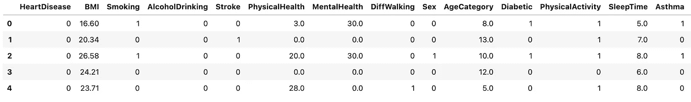

head()

有了这个，你马上就能掌握，数据集包含的特征:身体质量指数、中风、身体健康等。当您查看数据时，您开始询问有关这些功能的正确问题。例如，PhysicalHealth 在这个数据集中意味着什么？开始接触正确的资源，探索其中的意义。在本例中，请访问[数据源](https://www.kaggle.com/datasets/kamilpytlak/personal-key-indicators-of-heart-disease?datasetId=1936563&sortBy=voteCount)获取定义:

> 身体健康:现在想想你的身体健康，包括身体疾病和受伤，在过去的 30 天里有多少天。

您经常会在一个数据集中遇到几十或几百个要素，而`columns`函数可以方便地检查这些列:

```
hd.columns
```

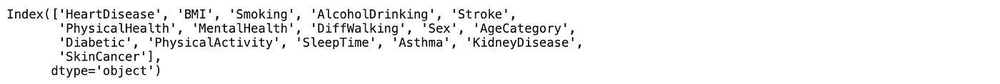

columns

## 2-分类目标:isin()

在检查数据集的时候，问问你自己我在这里必须完成的科学任务是什么？在分类目标下，我需要预测哪些类别，哪些类别对业务最重要？

例如，在这里，我们希望帮助医生预测给定患者数据的心脏病概率。您可能想花大量时间通过检查心脏病患者来了解导致心脏病的原因，而最简单的方法是结合 head()和 isin()函数。

```
hd[hd['HeartDisease'].isin([1])]
```


isin()

只有 2.7 万名心脏病患者(40 万人中)，这意味着这是一个不平衡的数据集，需要特别关注。我们可以开始构建一个心脏病患者的图像:身体质量指数高于 25，这不是一个健康的身体质量指数，许多患者吸烟，行走困难，患有糖尿病，他们的年龄往往更大。

虽然这可能不是非常准确，但它让我们对患者水平有了一目了然的了解。

## 3-了解关键驱动因素:描述()或说明()

要理解分类驱动因素，您可能需要查看聚合。使用`describe()`功能，您可以找出平均值、标准差和四分位数。

```
hd[hd['HeartDisease'].isin([1])].describe()
```

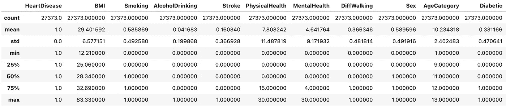

describe()

通过绘制这两类人群的总数:有和没有心脏病，你可以更好地了解人群差异，以及可能导致心脏病的因素。

```
hd[hd['HeartDisease'].isin([0])].describe()
```

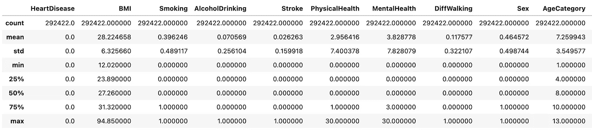

通过比较这两种观点，我们可以立即发现心脏病患者往往吸烟更多，身体状况更差，行走困难等等。

或者，我们可以用`mean()`函数构建一个比较视图:

```
hd[hd['HeartDisease'].isin([1])].mean()/hd[hd['HeartDisease'].isin([0])].mean()
```

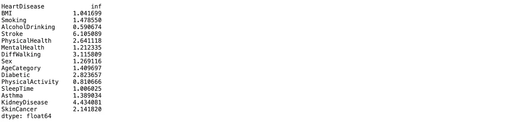

mean()

平均而言，心脏病患者中风次数(6.2)、肾病(4.4)、行走困难(3.1)、糖尿病(2.8)、身体健康问题(2.6)、吸烟更多(1.5)和年龄更大(1.4)的几率更高。

一方面，有意思的是，肾病患者更有可能患心脏病。这份[参考文献](https://www.cdc.gov/kidneydisease/publications-resources/link-between-ckd-diabetes-heart-disease.html)称，当肾脏工作不正常时，心脏会承受更大的压力。当有人患有肾脏疾病时，他们的心脏需要更努力地泵血才能将血液输送到肾脏。这会导致心脏病。另一方面，心脏病患者的肥胖/身体质量指数似乎并不更高。这些见解为下一步探索什么提供了一个好主意。

令人惊讶的是，我们还观察到，饮酒越多的患者患心脏病的几率越小。这可能并不意味着我们应该开始喝更多的酒来降低患心脏病的风险，尽管一些研究证实了这一矛盾。

## 4.功能级别聚合:groupby()

虽然平均值有助于理解人口差异，但由于其分布，它们无法很好地描述全球范围内的人口。特性集合将有助于进一步深入，您可以使用`groupby()`函数来实现。

```
hd.groupby(['KidneyDisease']).size()
hd.groupby(['Stroke']).size()
```

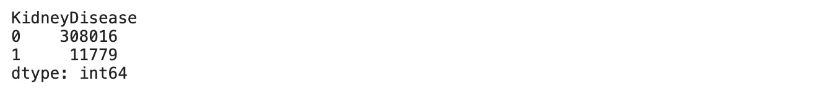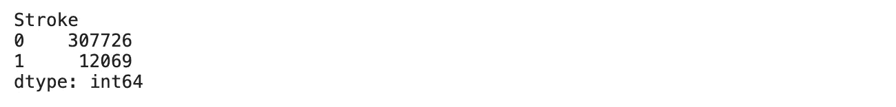

例如，我们可以看到中风和肾病非常罕见，不会成为分类器中的主要特征驱动因素。

你可以用不同的方式使用`groupby()`功能，例如，你可以清晰地想象:病人年龄越大——患心脏病的几率越高。这可能是模型中最重要的特征之一(尽管可能对医生没有太大帮助)。

```
hd_age = hd.groupby(['AgeCategory','HeartDisease'])['HeartDisease'].count()
hd_age = hd_age.groupby(level=0).apply(lambda x:
                                                 100 * x / float(x.sum()))
hd_age
```

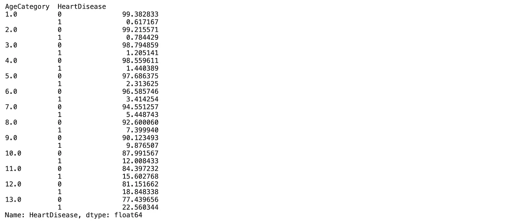

Age category younger towards 1.0 and older towards 13:0

## 5 个功能级别聚合:分组依据()+宁滨

我们发现，平均而言，身体质量指数在心脏病患者中并没有升高多少，这没有太大的意义。许多研究发现心脏病和身体质量指数之间有很强的相关性，如下图所示:

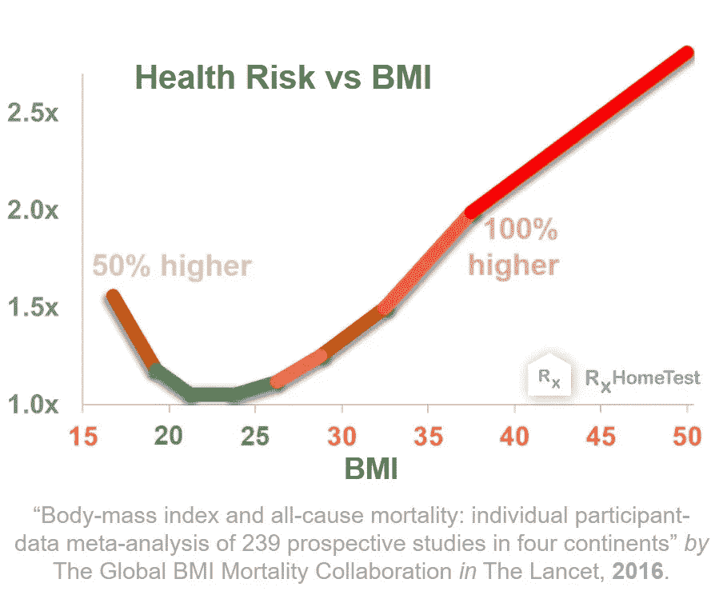

[https://rxhometest.com/article/obesity-heart-disease](https://rxhometest.com/article/obesity-heart-disease)

根据特征分布和其他因素，平均值可能会误导我们。为了更上一层楼，你可以在`groupby()`中使用宁滨技巧:

```
bins = [0, 15, 25, 35, 45, 100]
labels = ['0-15', '15-25', '25-35', '35-45','45-100']
hd['binned'] = pd.cut(hd['BMI'], bins=bins, labels=labels)
analyse_BMI = hd.groupby(['binned','HeartDisease'])['HeartDisease'].count()
analyse_BMI = analyse_BMI.groupby(level=0).apply(lambda x:
                                                 100 * x / float(x.sum())) 
analyse_BMI = analyse_BMI.unstack() 
analyse_BMI
```

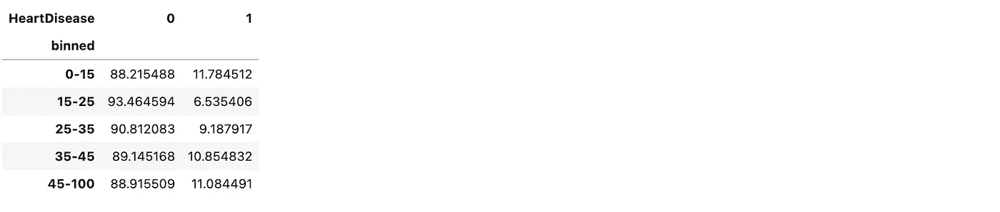

这清楚地证明了身体质量指数和心脏病之间的相关性，身体质量指数越高，患心脏病的几率越高——这看起来与之前的图表非常相似！

让我们结束分析。

从这些见解中，我们可以形成以下观点:患有肾脏疾病、行走困难、男性、糖尿病和高身体质量指数的 70 岁患者将属于心脏病的高危人群。

实际上，我们可以通过绘制特征重要性图表，快速验证我们通过使用带有简单分类器的 pandas 获得的理解:

```
from sklearn.model_selection import train_test_split
from sklearn.linear_model import LogisticRegression
from sklearn.metrics import confusion_matrix, precision_score, recall_score, auc,roc_curve
from sklearn.preprocessing import MinMaxScalerhd = hd.drop(columns = ['binned'], axis = 1)X = hd.drop('HeartDisease', axis=1)
y = hd[['HeartDisease']]
y = y.values.ravel()X_train, X_test, y_train, y_test = train_test_split(X, y, test_size=0.25, random_state=42, stratify=y)logreg = LogisticRegression(max_iter=1000)
logreg.fit(X_train, y_train)y_pred = logreg.predict(X_test)print('Accuracy of logistic regression classifier on train set: {:.2f}'.format(logreg.score(X_train, y_train)))
print('Accuracy of logistic regression classifier on test set: {:.2f}'.format(logreg.score(X_test, y_test)))import shap
shap.initjs()
explainer = shap.Explainer(logreg, X_train)
shap_values = explainer(X_test)
shap.plots.beeswarm(shap_values)
```

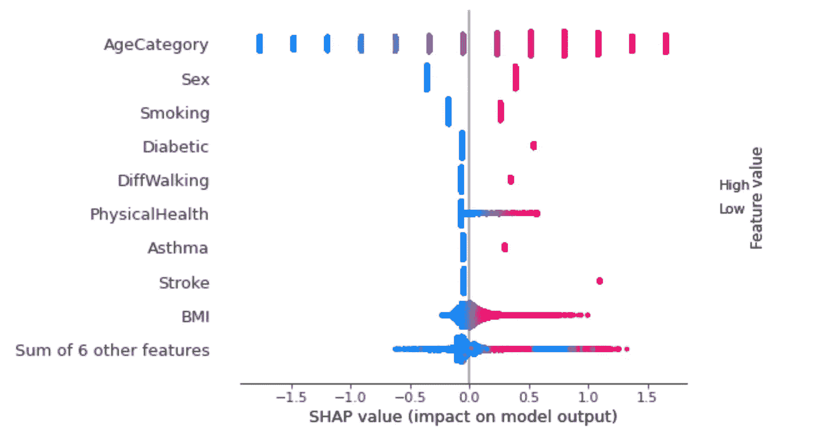

在此图表中:

1.  蓝色和红色代表特征值，例如年龄类别蓝色是较小的值(例如 1.0/更小)，红色是较大的值(例如 13.0/更大)。
2.  条的宽度代表观察的数量，例如中风特征包含大多数没有中风的病人和少数有中风的病人。
3.  x 轴负 SHAP 值代表可能**没有**心脏病的患者，右侧的正值代表可能**有**心脏病的患者。

我们从这张图表中学到了什么:

1.  5 个关键驾驶特征是:年龄类别、性别、吸烟、糖尿病和行走困难。
2.  通过关键特征，我们可以得出结论，我们通过使用熊猫获得的理解完全符合模型的可解释性:患者年龄越大，患心脏病的几率越高，男性/吸烟者/糖尿病患者患心脏病的几率往往更高，等等。

我们可以通过查看每个单独的(局部)预测来进一步验证我们的理解:

```
shap.plots.bar(shap_values[18])
```

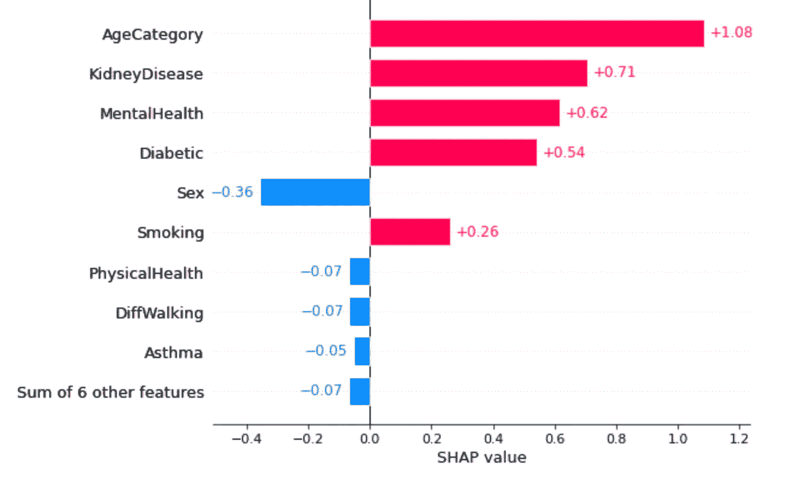

预测患有心脏病的患者和实际患有心脏病的患者的主要原因是:年龄较大、肾脏疾病、精神健康状况不佳和糖尿病。尽管患者没有身体健康和行走困难的问题，但年龄和肾脏疾病的结合使该病例极有可能患有心脏病。

与此相反，一个年轻的病人，不吸烟，并且有一个健康的身体质量指数，是不可能有心脏病的。

```
shap.plots.bar(shap_values[5])
```


作为一名数据科学家，一定要花时间去理解数据！它将帮助您构建更简单、更有意义的解决方案。

熊猫是一个令人兴奋的工具，为了释放它的全部潜力，请将备忘单放在手边！我遇到的一些很棒的小抄是[数据营](http://datacamp-community-prod.s3.amazonaws.com/f04456d7-8e61-482f-9cc9-da6f7f25fc9b)和[熊猫. pydata](https://pandas.pydata.org/Pandas_Cheat_Sheet.pdf) 。

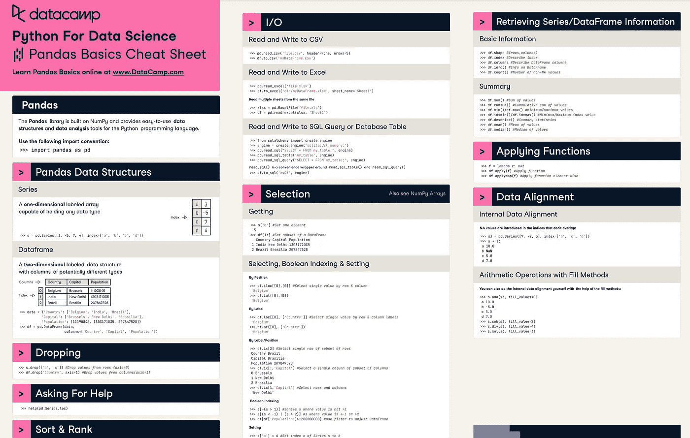

[http://datacamp-community-prod.s3.amazonaws.com/f04456d7-8e61-482f-9cc9-da6f7f25fc9b](http://datacamp-community-prod.s3.amazonaws.com/f04456d7-8e61-482f-9cc9-da6f7f25fc9b)

[](/mlearning-ai/mlearning-ai-submission-suggestions-b51e2b130bfb) [## Mlearning.ai 提交建议

### 如何成为 Mlearning.ai 上的作家

medium.com](/mlearning-ai/mlearning-ai-submission-suggestions-b51e2b130bfb)