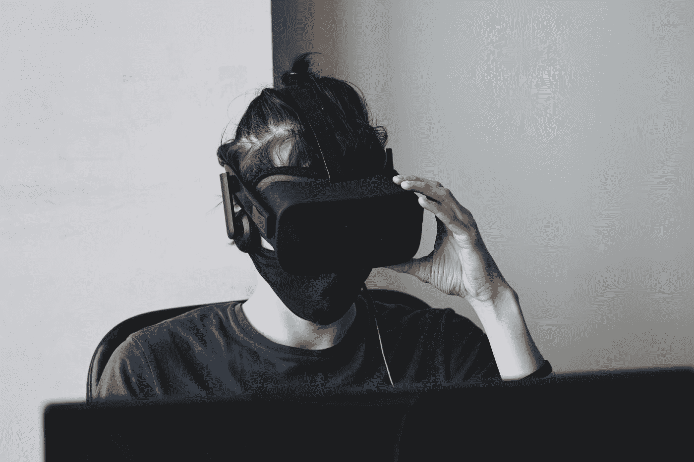

# 你应该停止担心人工智能的 5 个理由

> 原文：<https://medium.com/mlearning-ai/5-reasons-why-you-should-stop-worrying-about-ai-a1f2aea1162b?source=collection_archive---------12----------------------->

## 这不是你被告知的

Photo by [Maxim Tolchinskiy](https://unsplash.com/@shaikhulud?utm_source=medium&utm_medium=referral) on [Unsplash](https://unsplash.com/?utm_source=medium&utm_medium=referral)

# 我们没有人工智能

首先，我们没有人工智能，甚至没有接近人工智能。我们有深度神经网络，它处理数据集，寻找预测事物的最佳权重。这并不意味着它不强大，而是非常强大。