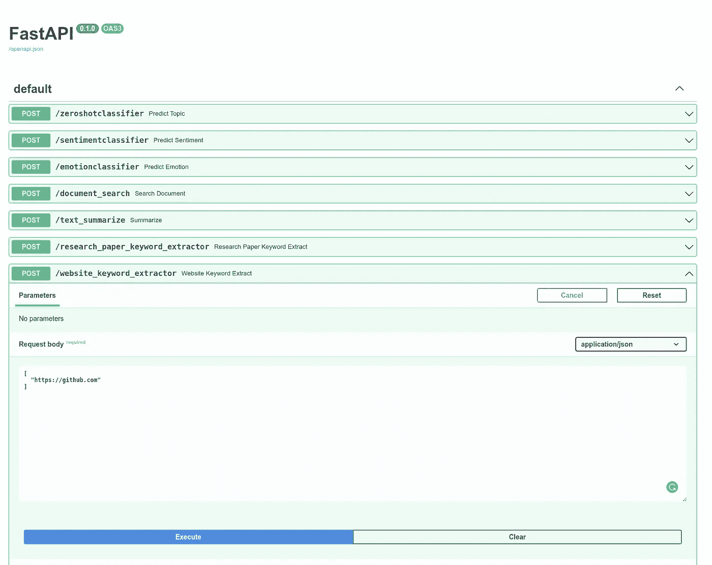
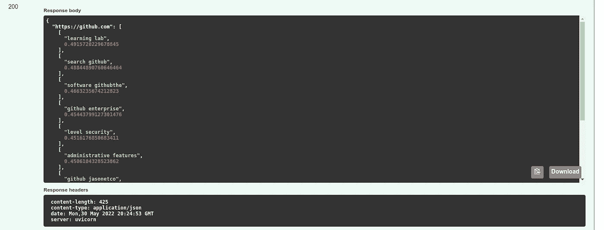
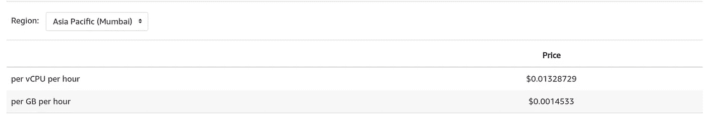
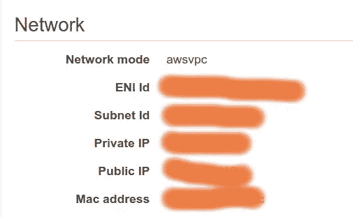
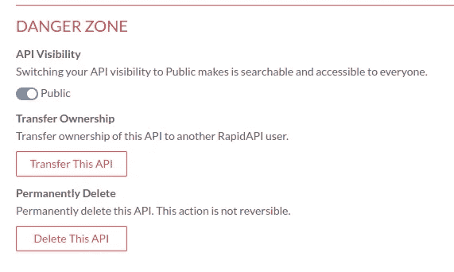
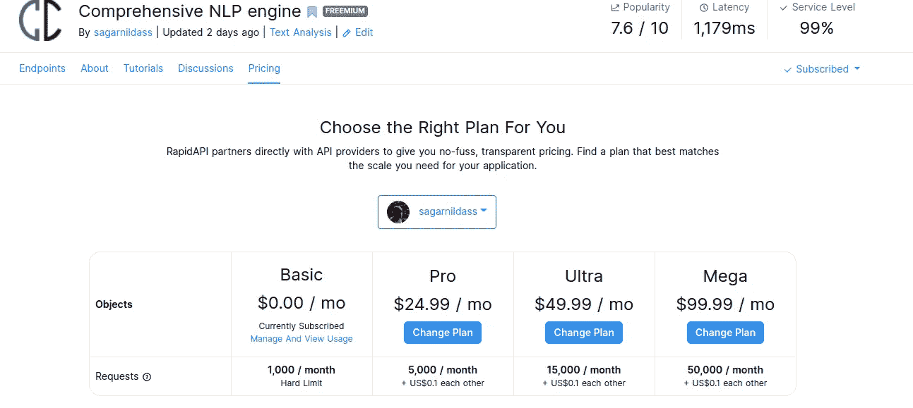

# 开始从你的 ML 模型中获得被动收入的 5 个简单步骤

> 原文：<https://medium.com/mlearning-ai/5-simple-steps-to-start-making-passive-income-from-your-ml-models-afb2a9cd20f4?source=collection_archive---------4----------------------->

## 通过 5 个简单的步骤将您的机器学习模型转换成美元


Picture Reference: [https://www.pexels.com/](https://www.pexels.com/)

# 该死的泡菜文件！

老实回答我，你电脑里有多少泡菜文件，占了几百 GB 的存储空间，坐在那里…等到你终于按下删除键…去清理一些急需的记忆回来？

听起来很熟悉？

这些年来，我们经常创建许多实用的机器学习模型。但是过了一段时间，你开始忙于一个新的项目，然后感叹……旧的项目变得像玻璃锤一样没用了。

但是如果我告诉你，有一个方法

1.  让这些模型准备出售？
2.  为你的商品定价？
3.  将你的模型作为被动收入来源来赚钱？

输入[](https://rapidapi.com/)**。**

**我将从头到尾一步一步地教你如何做这件事。**

**对此，我就以我的 [**综合 NLP app**](https://rapidapi.com/sagarnildass/api/comprehensive-nlp-engine1/) 为例。**

**这个应用程序可以执行 7 个 NLP 任务:**

1.  **[该模型将该问题视为多标记分类问题。所以一个文本可以属于多个类别/标签。](https://rapidapi.com/sagarnildass/api/comprehensive-nlp-engine1/)**
2.  **[**情感分析**](https://rapidapi.com/sagarnildass/api/comprehensive-nlp-engine1/) :给定一个句子列表，这个模型将它们分为“正面”或“负面”情感。所以一个文本可以以特定的概率属于这两种情感。该模型将该问题视为多标记分类问题。**
3.  **[**情绪检测**](https://rapidapi.com/sagarnildass/api/comprehensive-nlp-engine1/) :给定一个文本列表，这个模型将它们分类为 7 种情绪中的一种或多种:快乐、悲伤、愤怒、憎恨、中性、好奇和提供信息。在这里，一篇文章也可以传达一种以上的情感。**
4.  **[**文档搜索**](https://rapidapi.com/sagarnildass/api/comprehensive-nlp-engine1/) :给定文档和关键字的列表，这个模型计算关键字在每条记录中出现的次数。**
5.  **[**文本摘要**](https://rapidapi.com/sagarnildass/api/comprehensive-nlp-engine1/) :给定一个重要文本列表，这个模型对文本进行摘要。**
6.  **[**研究论文关键词提取器**](https://rapidapi.com/sagarnildass/api/comprehensive-nlp-engine1/) :给定任何研究论文/pdf 链接，这个模型解析文本，从文本中提取所有关键词。**
7.  **[**网站关键词提取器**](https://rapidapi.com/sagarnildass/api/comprehensive-nlp-engine1/) :该模型会提取给定任意网站链接(不具备屏蔽技术)的所有 SEO 关键词。**

**整个练习包括 5 个主要步骤:**

1.  ****从您的模型中创建一个 API****
2.  ****将 API 归档并推送到 AWS ECR****
3.  ****使用 AWS FARGATE + ECS 创建无服务器部署/应用****
4.  ****使用 RapidAPI 消费本 app****
5.  **让它下雨(MONEYYYY)**

# **步骤 1——从您的模型中创建一个 API**

**我将向你展示我的一个例子——即**网站关键词提取器。**该端点接收一个网站 URL，并提取该网站的 SEO 关键字。**

**首先，我们需要将模型包装在一个 API 中。为此，我们将使用 [FastAPI](https://fastapi.tiangolo.com/) 。**

**所以，在这个文件中，发生了以下事情。**

1.  **website_keyword_extract 函数接受 URL 列表。该函数在 API 的/website_keyword_extractor 端点可用。**
2.  **网站的 HTML 通过一些辅助函数进行提取和清理。**
3.  **之后，我们使用一个名为 KeywordExtractor()的自定义函数来预测网站的关键字。该函数加载已保存的预测模型。**
4.  **关键字以字典格式返回。**
5.  **最后，我们在端口 8080 上运行这个应用程序。**

**当我们运行这个应用程序并转到 0.0.0.0:8080/docs 时，我们会看到这样的屏幕。**

****

**当我们输入[https://github.com](https://github.com)并点击执行，我们会得到如下结果:**

****

# **第 2 步—将 API 归档并推送到 AWS ECR**

**接下来，我们需要对应用程序进行 dockerize，并将此容器推送到 AWS ECR。**

**我们可以用下面的 Dockerfile 对这个应用程序进行 dockerize。**

**我们可以使用以下命令对文件进行分类:**

```
docker build -t nlp_comprehensive:latest .
```

**构建 docker 容器后，我们可以运行图像并测试模型是否生成了预期的预测。**

```
docker run -p 8080:8080 nlp_comprehensive:latest
```

**当这个 docker 容器运行时，我们可以打开一个 IDE 并执行这段代码来测试 API。**

**这将产生以下输出**

**{ '[https://github . com '](https://github.com'):[['学习实验室'，0.4915720229678845]，【T2]['搜索 github '，0.488448907606464]，
['软件 githubthe '，0.4666323567426**

**因此，我们看到 API 运行良好。所以现在，我们将它推送到 AWS ECR。关于将 docker 图像推送到 AWS ECR 的步骤，您可以遵循本文档的[](https://docs.aws.amazon.com/AmazonECR/latest/userguide/docker-push-ecr-image.html)**。****

# ****步骤 3 —使用 AWS FARGATE + ECS 创建无服务器部署/应用程序****

****与其在 EC2 实例上部署这个应用程序，不如通过在 ECS 中创建一个任务定义来将其部署在 AWS FARGATE 上。这样做的好处是，你只有在有人使用你的 app 时才付费。****

****你可以在下图中看到这有多便宜！****

********

****Fargate Spot pricing for ECS****

****[**您可以跟随这篇优秀的文章，看看如何使用 FARGATE + ECS**](https://towardsdatascience.com/deploying-a-docker-container-with-ecs-and-fargate-7b0cbc9cd608) 部署这个 docker 容器。****

****部署完成后，您应该能够在 ECS 集群任务中获得 API 的公共 IP。****

********

****请注明你的公共 IP；您将在下一步中需要它。****

# ****第 4 步——使用 RapidAPI 将此应用货币化。****

****一旦你在 AWS 中部署了你的应用，并准备好了公共 IP，去[https://rapidapi.com/](https://rapidapi.com/)创建一个账户。****

****接下来，转到“我的 API”并单击“添加新 API”****

****然后按照逐步说明添加基本 URL(您的公共 IP、端口号)和端点。****

****一旦创建了基本 URL 和端点，请转到“全局设置”并公开 API。****

********

****而且是直播！****

****你也可以跟随这个 [**优秀视频**](https://www.youtube.com/watch?v=GK4Pl-GmPHk&t=3224s) 获得关于制作 RapidAPI API 的分步指导。****

# ****第五步——让它下雨(MONEYYY…)****

****现在是我们期待已久的时刻！将你的辛勤工作货币化。****

****转到“计划和定价”在这里，你可以设置你的 API 定价让全世界购买。****

****您可以基于每个价格请求(即，每个计划允许一定数量的请求)。****

****例如，我的定价结构是这样的。****

********

****所以每个计划每月都允许一定数量的请求。如果有人跨过这个门槛，他们必须为每个请求额外支付 0.1 美元。****

****在短短几个小时内，你可以看到我的应用程序已经达到了优秀的**人气评分** **7.6/10，**，我已经看到大量的流量涌入。是的。其中三个选择了**付费订阅**！****

****RapidAPI 的非凡之处在于，它们可以将您的 API 调用转换成近 20 种编程语言的代码，这样就可以随时随地调用它们。这些语言包括 C、Python、NodeJS、Java、PHP、JavaScript 和 HTTP 等等。****

# ****结论****

****不要让 ML 模型在你的计算机里变得陈旧，这样做。取你的任何作品(不一定是 ML 模型)，将其转换成 API，部署到某个地方(AWS、Azure、GCP)，并在[**RapidAPI**](https://rapidapi.com/)**中使用它，配合你的定制定价方案。******

******与世界分享你的 API，然后看看现金堆积起来！******

******如果你觉得这篇文章对你有帮助，我的 [**综合 NLP app**](https://rapidapi.com/sagarnildass/api/comprehensive-nlp-engine1/pricing) 对你的工作会有帮助，那就秀出点爱心来做 [**订阅吧**](https://rapidapi.com/sagarnildass/api/comprehensive-nlp-engine1/) ！免费版允许你每月请求 5000 次，这是一个好的开始。******

****[](/mlearning-ai/mlearning-ai-submission-suggestions-b51e2b130bfb) [## Mlearning.ai 提交建议

### 如何成为 Mlearning.ai 上的作家

medium.com](/mlearning-ai/mlearning-ai-submission-suggestions-b51e2b130bfb)****