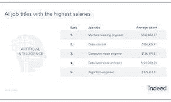
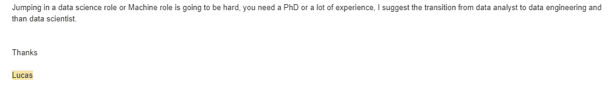
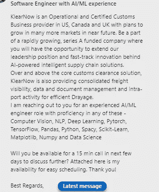
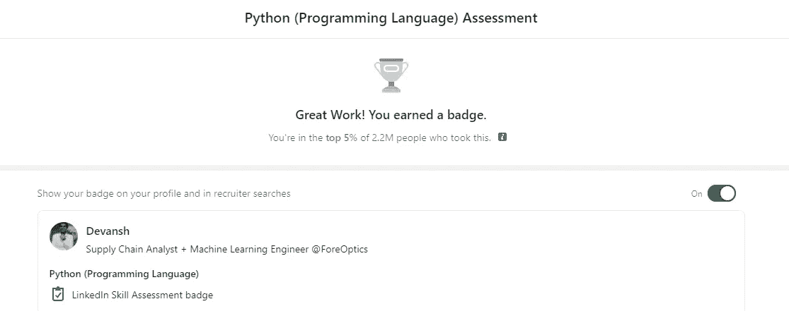
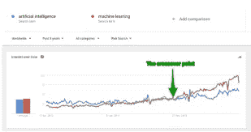
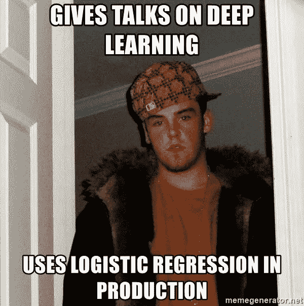

# 关于机器学习的 5 个不性感的事实

> 原文：<https://medium.com/mlearning-ai/5-unsexy-truths-about-working-in-machine-learning-d44369e1e088?source=collection_archive---------0----------------------->

## 我在过去 5-6 年学到的东西

为了帮助我了解您[请填写此调查(匿名)](https://forms.gle/7MfQmKhEhyBTMDUD7)

我从事机器学习。对于我作品的读者/观众来说，这并不奇怪。对于不了解我的人，请随意查看我的 LinkedIn/文章/视频，以便更好地了解我的技能/经验。我的专业是统计分析。我曾在道路安全、卫生系统分析、银行大数据分析、疾病检测、生物识别娱乐等领域工作过，目前从事供应链分析。

最近和一个关注者打了个 IG 电话。她刚开始大学二年级的学习，想进入机器学习领域。因此，我们进行了 20-30 分钟的通话，讨论她的技能，她为什么想进入 ML(金钱和工作保障 lmao)，她计划如何进行，等等。只是想看看她对这个领域了解多少，以及她对这个领域的预期。令我吃惊的是，她对工作的期望与我的经历大相径庭。

A lot of emphases is put on the money made

仔细想想，这种误解是有道理的。许多人对机器学习的第一次接触来自以下来源:关于机器学习工作将有多大的统计数据(见上图)或耸人听闻的新闻文章(还记得 AlphaGo 创造的嗡嗡声吗？我们现在看到生物机器学习中的一些炒作)。然后他们在 YouTube 上看几个关于建立深度学习模型的视频，上几门课程(如果有的话)就这样。

不幸的是，这大大简化了过程。它忽略了许多丑陋的细节。这很有道理。课程和视频无法涵盖整个过程的所有细节。见鬼，甚至我的文章也很少涵盖一篇论文/过程的所有相关细节。但是，认为你的机器学习体验将类似于课程是一个很大的错误。这就像认为克里斯蒂亚诺·罗纳尔多的足球生涯仅仅是在比赛中度过的。这些当然很重要。但他也要训练，要关心营养，还要做其他隐藏在幕后的事情。而且他在这些上面花的时间更多(他一周打 1-2 次，但是每天都要训练、吃饭、睡觉)。

Photo by [Fayas S](https://unsplash.com/@sfayas?utm_source=medium&utm_medium=referral) on [Unsplash](https://unsplash.com?utm_source=medium&utm_medium=referral)

在这篇文章中，我将分享一些见解/学习，这应该会让你对机器学习有一个更平衡的看法。请注意，虽然它可能是负面的，但我仍然相信机器学习是一个很好的工作/了解的领域。这就是为什么我开始我的内容(为大家民主化 ML)。我只是想确定你考虑了一些通常不会被提及的事情。

# 1:你不会赚很多钱

这会让你抓耳挠腮一秒钟。机器学习不都是为了赚大钱吗？是的，很多科技公司机器学习人员的起薪非常高。统计数据证实了这一点。然而，这隐藏了一个重要的事实。这些职位中的大多数至少需要硕士学位，通常还需要博士学位。这是我与卢卡斯的一段对话，他目前在该行业工作(为一家大银行工作)。他和这个领域的很多申请者都有过接触。

Note how he mentions a PhD

他提到，博士需要在大多数主要的机器学习角色中具有竞争力。他提到了两种选择。后者正在向工程领域过渡。工程将需要更先进的编码技能，并更加重视预处理/可视化部分。要了解更多信息，请查看这个 60 秒的视频，了解如何设计您的项目以获得机器学习/数据工程角色。在视频描述中，我详细介绍了一个完整的示例项目，您可以通过修改来构建它。

Like and Sub :)

前者是我走的路线。我的兴趣是统计分析和数学。所以我想从事分析和评估工作。在过去 5 年的大部分时间里，我一直在小型组织中担任合同工。由于个子小，他们不能付给我那么多钱。然而，它确实帮助我得到了一些钱和支付了一些账单。这最终导致越来越多的角色。现在我有了经验，我吸引了更多有利可图的角色。越来越多的招聘人员给我发来这样的信息。我跟她谈过，赔偿比较符合行业标准。

但这需要时间来建立。一开始，你会花很多时间从事勉强或略高于最低工资的工作。尤其是如果你做网上合同工作，你将与来自不同地理位置的人一起工作。

# 2:你需要擅长编程

不，我不是指编码花哨的管道或数据转换。也不意味着使用 Keras 和 Tensorflow 编写模型。我指的是软件工程类型的编码。使用不同的数据结构、计算线程和编写各种函数的折磨。我从未真正将 Python 作为一门语言来学习。我学到了无论我在做什么工作/项目，我都必须做些什么。所以想象一下，当我参加 LinkedIn 技能评估并得到以下结果时，我有多惊讶。

事实是，随着你进入机器学习，你将 ***必须*** 成为一名优秀的程序员。当然 autoML 工具存在(我自己已经创建了一个)。但是现在，你最有可能自己编程。您将进行大量的查询、转换、映射、排序和打印。像图、树、多维列表和字典这样的数据结构将会成为你最好的朋友。这个事实经常在教程/课程/文章中被掩盖，在那里所有的东西都是整齐有序的。但是 irl，你会有很多尝试和错误。

# 3:你会磨很多

你的大部分工作将是艰苦的。你将花费大量的时间把你的熊猫 df 变成一系列的数字阵列等等。将花费更多的时间通读打印语句，试图找出输出值不在预期范围内的原因。那么多精力会花在清洁上(print(df.head()出现在我的梦里)。尝试不同的网络架构。机器学习不仅仅是模型和聪明的评估指标。这是一份辛苦的全职工作。

# 4:你会走很多捷径

你知道谷歌是如何花费数百万次迭代进行训练的吗？GPT3 是怎么用全互联网训练出来的？哈哈，算了吧。你不会有那种数据和计算能力。如果这意味着支付你额外的 10 个小时，你的雇主很可能不想要最好的一套超参数和神经网络架构。你会发现自己没有做到完全彻底，走了很多捷径，或者只是对各种情况进行例外处理。这并不意味着你应该提交糟糕的作品。只是你会发现自己提交的作品可能会更好。**大多数雇主更喜欢便宜的 85%的分数，而不是非常昂贵的 95%的分数。**

# 5:你将不得不经常回到基础

More people try to learn Machine Learning than AI

机器学习突出。它是人工智能的一个子集。所以对我来说很有意思的是，ML 获得的搜索比 AI 多。最近，深度学习变得比 ML 更受搜索，即使 DL 是 ML 的非常小的一部分。表面上看，这没有太大意义。但这确实说明了人类心理学的一个要素。人们想要进入新的闪亮的事物，并且经常会忽略尝试进入它的基础。

当你开始在 ML 工作时，你会明白为什么基础是王道。它们通常更通用(通用神经网络比递归神经网络有更多的用例)。他们解决了大多数问题(记住关于便宜 85%的观点)。但是你真的必须从基础做起。学会阅读学习曲线。找出交叉验证和多指标评估。真正理解如何写奖励/成本函数，设计激励机制。这对你有很大帮助。

This meme is Machine Learning Gospel

当你开始理解基础知识时，你就可以开始处理更难的问题了。对神经网络的深入了解会让你明白什么时候应该增加额外的偏差或应用退出。你可以用任何你认为合适的方法来装袋或助推。熟悉基础知识会帮助你成功。我的拳击教练总是说你可以通过刺拳和动作成为世界冠军。或者以迪昂泰·怀尔德为例。他凭借自己非凡的右手和力量成为了一名精英。基础知识将是你在机器学习生涯中做好工作的最佳投资。

# 关闭

希望这篇文章能帮助你对机器学习有更多的了解。同样，这篇文章的目的不是阻止你进入这个领域，而只是给你另一个视角。

如果你喜欢这篇文章，看看我的其他内容。我定期在 Medium、YouTube、Twitter 和 Substack 上发帖(所有链接都在下面)。我专注于人工智能、机器学习、技术和软件开发。如果你正在准备编码面试，请查看:[编码面试变得简单](https://codinginterviewsmadesimple.substack.com/)。

为一次性支持我的工作，以下是我的 Venmo 和 Paypal。任何数额都值得赞赏，并有很大帮助:

https://account.venmo.com/u/FNU-Devansh

贝宝:【paypal.me/ISeeThings 

# 向我伸出手

如果那篇文章让你对联系我感兴趣，那么这一部分就是为你准备的。你可以在任何平台上联系我，或者查看我的其他内容。如果你想讨论家教，发短信给我。如果你想支持我的工作，使用我的免费罗宾汉推荐链接。我们都有免费的股票，对你没有风险。因此，不使用它只是失去免费的钱。

查看我在 Medium 上的其他文章。:[https://rb.gy/zn1aiu](https://rb.gy/oaojch)

我的 YouTube:[https://rb.gy/88iwdd](https://rb.gy/88iwdd)

在 LinkedIn 上联系我。我们来连线:[https://rb.gy/m5ok2y](https://rb.gy/f7ltuj)

我的 insta gram:[https://rb.gy/gmvuy9](https://rb.gy/gmvuy9)

我的推特:[https://twitter.com/Machine01776819](https://twitter.com/Machine01776819)

我的子任务:[https://codinginterviewsmadesimple.substack.com/](https://codinginterviewsmadesimple.substack.com/)

在罗宾汉上获得免费股票:【https://join.robinhood.com/fnud75 