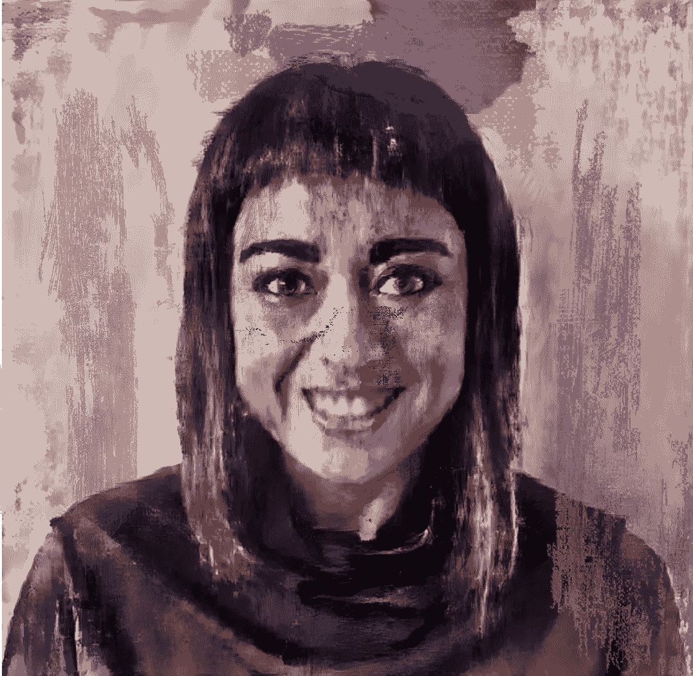
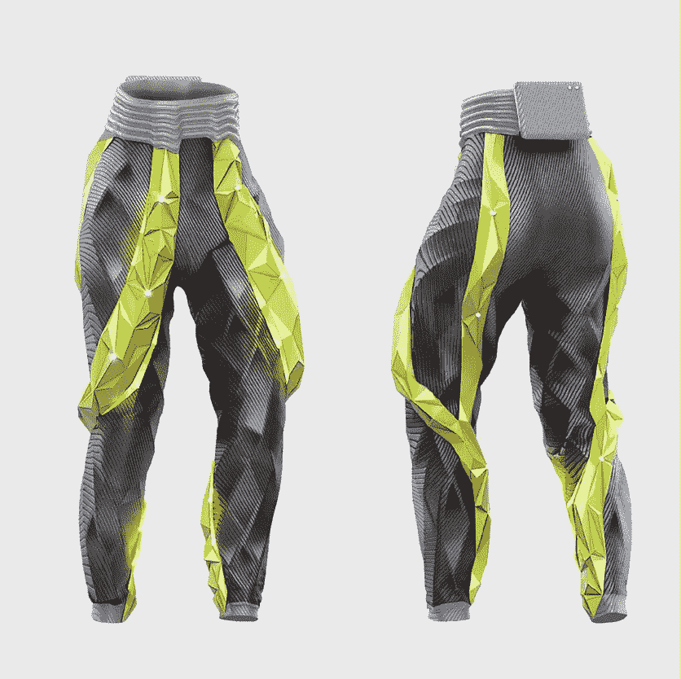

# 人工智能中的 50 位女性:健身和长寿的可穿戴机器人

> 原文：<https://medium.com/mlearning-ai/50-women-in-ai-wearable-robotics-for-fitness-and-longevity-ca4e2363a184?source=collection_archive---------7----------------------->

Hybrid AI generated portrait base image: photo portrait of Marianna Recchia + Adrian Ghenie’s (her selected artist) “Dr. Mengele” 2011 oil on canvas.

了解 Tonus Tech 首席执行官 Marianna Recchia，以及她如何通过可穿戴机器人技术使用人工智能和机器学习来增加运动寿命。项目的一部分:[AI 的 50 名妇女](https://clarity-cx.com/50-women-in-ai/)。一系列的采访展示了具有不同背景、角色和兴趣的女性，并非所有人都是程序员或工程师，但所有人都在这个正呈指数增长的领域工作。

> 我们致力于可穿戴机器人产品，帮助人们测量他们的运动质量，以学习运动，学习最好的运动方式，避免受伤，建立自己的肌肉质量和关节灵活性，即使在 45 岁以后也是如此！因为我们的目标是让人们保持更长时间的健康，所以我们的重点是运动寿命。
> 
> *~玛丽安娜·雷基亚*

我刚从阿尔卑斯山度完长假回来，在那里，中年人和古老的狗之间，有很多关于嘎吱声和疼痛的抱怨，导致活动列表更倾向于摄入卡路里而不是燃烧卡路里。毫无疑问，那个周末寻求阿尔卑斯山空气的其他团体不那么拥挤，也更流畅。或者，也许他们只是决定克服各种性能故障，继续前进。但无论是选择小睡、啤酒还是高峰，许多人都希望表现得更好。托纳斯科技可能有办法帮我们做到这一点。

# 背景:商业设计师，创新者，R&D 汽车工业

[Tonus Tech](https://www.tonus.tech/) 是一家总部位于英国的人工智能机器人初创公司，由首席执行官 Marianna Recchia 领导。玛丽安娜不是程序员、软件工程师或数据分析师。相反，Marianna 是一名企业家和创新者，将她在汽车自动化、汽车远程信息处理和研发方面的工业背景带到了机器人健康领域。她决定离开跨国公司，去追求一个更符合她让世界变得更美好的价值观的项目——这是一个新的、令人满意的挑战，她可以充分利用自己的创新背景。

我认识玛丽安娜很多年了。当她谈到建立一家创业公司，努力让我们的生活变得更好，特别是我们这些不再拥有年轻人的容光焕发和恢复能力，并希望保持活跃和不受伤害，继续享受我们热爱的活动的人时，她无处不在、富有感染力的热情闪闪发光。

我们打电话的时候，玛丽安娜在柏林，在丹麦的欧登塞机器人加速器工作了一年后，她回到了柏林，在柏林和伦敦之间来回奔波。在她北欧生活的间隙，她试图回到她的家乡普利亚看望家人，晒晒太阳。我们的电话是一个叙旧的机会，对我来说，可以了解更多关于她与 Tonus Tech 的旅程，他们如何应用人工智能以及他们面临的挑战。

当讨论 Tonus 的一些挑战时，一种坚定而实际的情绪通过缩放屏幕出现。虽然当我们谈论这些可穿戴机器人为那些寻求延长他们的活跃寿命(和提高性能)的人提供的所有酷的可能性时，她很快恢复了笑容，带着酒窝的笑容。).

## 下面是我们采访中的一些亮点。

# 可穿戴机器人

Tonus Tech 目前的产品是西装。这套衣服包含两种不同的传感器，可以提供关节和肌肉活动的深入信息。这些数据是从这些传感器收集的，人工智能和机器学习用于对动作进行分类和评分。通过机器学习，将人的运动质量与最佳运动进行对比分析，显示他们的位置与他们应该在的位置之间的差距，以提高效率，减少受伤的机会。

Tonus 还在研究使用软机器人技术，提供主动反馈或“指导”佩戴者的运动，以提高他们的运动质量和表现。

# 人工智能和机器学习可以减少伤害

Tonus Tech’s wearable robotics

通过机器学习分析，Tonus 团队正在寻找伤害风险因素。虽然专业运动员受益于对他们运动模式的详细检查，但业余运动员和周末勇士却没有这样的机会。

玛丽安娜指出:

例如，腿筋受伤，不仅仅是足球运动员的问题，也是人们日常生活中的一个大问题，尤其是 50 多岁的人。这是一个与女性相关的问题，所以对我们来说，发现这种伤害风险非常重要。以及一些疾病，如肌肉减少症(年龄相关的，骨骼肌质量和力量的不自觉损失。)人们可以在中年就开始发育，而不仅仅是在 70 多岁。这就是 ML 真正相关的地方。

# 收集数据——什么类型，从哪里收集？

除了首席执行官玛丽安娜，托纳斯的团队还包括一名医学博士、一名机器人工程师、一名软件工程师和一名数据科学家。随着对收集所需数据的高度重视，2022 年夏季推出了一系列产品测试。在生物力学实验室对他们的系统进行测试，他们还将比较机器人服装系统生成的数据和从外部来源(如相机)捕获的数据，比较不同来源的数据的价值和质量。

数据收集是其产品功效的关键。收集人工智能算法成功识别模式并生成有用信息所需的大量数据是一项挑战。

Tonus Tech 寻求所需数据的一种方式是与生物力学和运动科学专业的大学合作。纽卡斯尔大学就是这样一个机构，帮助 Tonus 了解他们需要什么样的数据。Marianna 培养了一种高度协作的方法，与包括健身房在内的组织建立关系，这些组织拥有所需的知识和用户基础，首先帮助他们识别有用的数据类型(例如识别疾病或伤害模式的数据)，然后找出如何最好地捕获这些数据。

# 数据收集的挑战

数据收集的其他障碍包括隐私，尤其是在卫生保健部门。Tonus 处理来自不同来源的数据，但是有些信息根本就不存在。他们穿着可穿戴机器人套装进入新的领域，他们需要数据来帮助他们分析运动，因此他们的试验将帮助他们建立数据库来训练他们的模型。Marianna 计划通过赠款申请来补充这些试验，使他们能够访问更大的生物力学数据库。

Marianna 指出，他们并不是唯一面临收集所需数据挑战的公司，许多公司都存在这个问题，因为他们还没有一个大型的数据库来存储所需的信息。如前所述，有些数据根本就不存在。她对这些案例中修改后的预期进行了评论:*一些模型也是新的，所以在这些案例中，我们并不期待一种完美的智能。*

关于她在寻找帮助降低伤害风险所需的数据方面所面临的挑战:

> 防止受伤并不容易，因此分析这些伤害风险因素对任何公司来说都是一个巨大的挑战，无论是在整形外科领域还是在运动科学领域，因此任何目前试图防止受伤的公司都在处理同样的问题。对于所有需要这样做的模型来说，这仍然是一种研发阶段。

从积极的方面来看，玛丽安娜认为，数据收集的挑战将导致新的合作商业模式，这将有助于所有在健康和运动技术领域工作的公司，以及更广泛的合作。

# 对我们所有人来说更长的积极生活

在写这篇文章的时候，36 岁的拉斐尔·纳达尔已经从伤病中恢复，并在法网击败了 23 岁的卡斯帕·路德。纳达尔的第 22 个大满贯冠军。纳达尔拥有世界上最好的资源来保持他的最佳状态，但即使是网球巨星也要应对身体上的挫折。然后是我们其余的人，他们必须前进，没有一个世界级的团队让我们前进。人工智能和 Tonus Tech 可穿戴机器人套装能帮助我们所有人在最近几十年保持活跃和健康吗？

我敢打赌，玛丽安娜的智慧、精力和热情将帮助我们避免被迫置身事外，让我们继续前进，享受我们热爱的活动。

可以通过 [marianna@tonus.tech](mailto:marianna@tonus.tech) 联系 Marianna。https://www.tonus.tech/

[*阅读更多关于 AI 项目中的 50 位女性。*](https://clarity-cx.com/2022/06/24/women-ai-post/)

 [## Mlearning.ai 提交建议

### 如何成为 Mlearning.ai 上的作家

medium.com](/mlearning-ai/mlearning-ai-submission-suggestions-b51e2b130bfb)