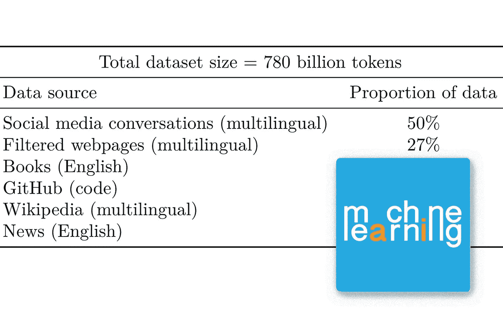

# 5400 亿参数 NLP 模型

> 原文：<https://medium.com/mlearning-ai/540-billion-parameter-nlp-model-43d74a387c0d?source=collection_archive---------3----------------------->

## [机器学习艺术](https://mlearning.substack.com)

## 大模特学习新技能

[https://mlearning.substack.com](https://mlearning.substack.com)

近年来， **NLP 模型**发展迅速。2020 年，[**【GPT-3**](/mlearning-ai/is-gpt-3-for-free-7ec8c2d904b6)**第一次表明，大型语言模型(LLM)可以用于少量学习，并且在没有大量训练或参数更新的情况下取得令人印象深刻的结果。最近的 LLM，如 GLaM，LaMDA 和…**