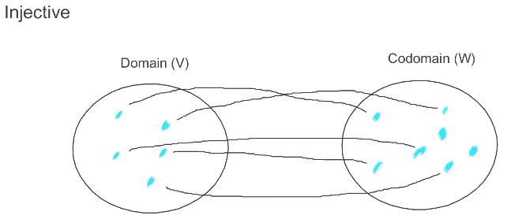
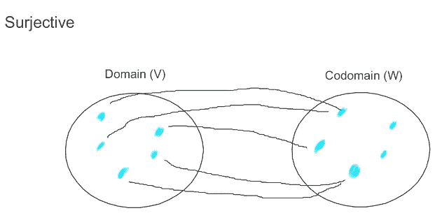
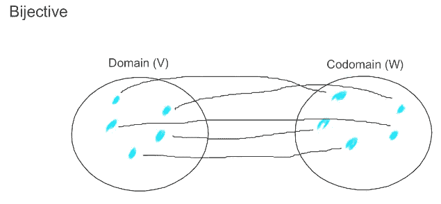
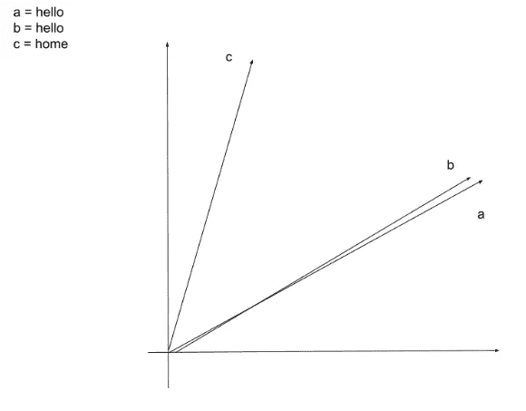
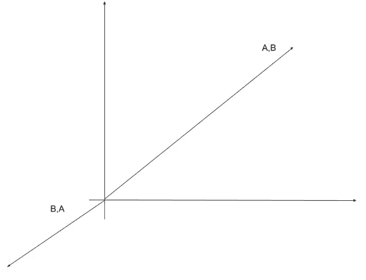

# 6.地图，地图类型和距离。

> 原文：<https://medium.com/mlearning-ai/6-map-maps-type-and-distance-50e840d7e7e0?source=collection_archive---------7----------------------->

ESO 378–1

*地图*

*地图类型*

*长度和距离*

# **地图**

映射对象的函数。

地图**是一个数学构造。**

我们将看到由矩阵组成的线性地图。

在本文中，我将使用:

小写希腊字母:常量。

大写希腊字母:地图或矩阵。

# **地图类型**

Injective Map

如你所见，V 中的每个元素都与 W 中的一个点相连，但 W 中的一些元素不与 V 相连，所以内射映射是当 V 中的每个元素只与 W 中的一个元素相连，但 W 中的一些元素不相连。

Surjective Map

V 中的每个元素都连接到 W 中的一个或多个元素，正如你在 W 中看到的，有一些元素没有连接。在这种情况下，V 的一个元素可以有多个映射。

Bijective Map

在这种情况下，V 的每个元素都与 w 的一个且仅一个元素相连。

# **长度和距离**

这是一个向量，你可以看到他有一个开始(尾部)和一个结束在头部。

好了，现在我们有了一个清晰的表示，什么是向量。

这是三个向量。两个(a 和 b)相等。而事实上，他们的地位是一样的。相反，c 是不同的，因为是一个不同的词。如果两个向量相似，它们就更近，如果向量差异大，它们就更远。这种应用是有用的，例如在数据科学中。

相反的向量。

这是两个相反向量的表示(注意它们是相反的而不是相反的)。

 [## Mlearning.ai 提交建议

### 如何成为 Mlearning.ai 上的作家

medium.com](/mlearning-ai/mlearning-ai-submission-suggestions-b51e2b130bfb)