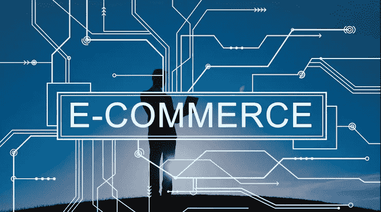

# 电子商务企业的 6 个重要机器学习策略

> 原文：<https://medium.com/mlearning-ai/6-significant-machine-learning-strategies-for-ecommerce-businesses-62e19192c917?source=collection_archive---------4----------------------->

电子商务是当今时代的必需品。诚然，我们都喜欢去购物中心或商店，并在“优质购物”上投入一些时间。但 COVID 改变了规则，将电子商务从一个选项变成了优先选项。

从最简单的家用物品到大型电器，电子商务商店拯救了所有人。但是电子商务的发展也引发了其他技术的发展和融合，尤其是机器学习(ML)。

ML 已经被搜索引擎和网络站点用于推断用户数据。但利基营销部门之间日益激烈的竞争和不断增加的电子商务流量，使得企业必须采用机器学习策略。

继续阅读这篇文章，了解可以改变你的电子商务企业命运的六个最有用的 ML 策略。但首先，让我们来看一些预测网上购物未来的数字。

## **知道数字**

- [Statista 报道](https://www.statista.com/statistics/266064/revenue-growth-in-e-commerce-for-selected-countries/)2022 年，电子商务销售额在亚洲、美洲和澳洲增长最快，其中新加坡和印尼领先。

-2022 年，阿里巴巴集团成为全球最大的电子商务零售商，年在线销售额约为 7800 亿美元，亚马逊以约 6900 亿美元的在线销售额位居第二。

- [Statista 报告还预测](https://www.statista.com/statistics/379046/worldwide-retail-e-commerce-sales/)到 2027 年，亚马逊将超过阿里巴巴，并将产生近 1.2 万亿美元的在线销售额。

-印度和菲律宾是电子商务销售额增长最快的两个亚洲国家。

很明显，电子商务正在蓬勃发展。因此，重要的是你要用最好的 ML 策略来准备你的网上商店，并让它们为市场做好准备。所以让我们进入主要讨论。

# 让你的电子商务生意更好的 ML 策略

## **优化以获得更好的搜索结果**

任何在线商店最基本的功能之一就是它的搜索功能。它对在线商店来说至关重要，因为它是向用户展示他们所需商品的关键。好的优化意味着用户获得了提炼关键词的选择权。

因此，如果有人搜索 mixer 和 grinder，那么他们会同时获得以他们的关键字开始的多个关键字的选项，例如，mixer 和 grinder 后跟最喜欢或搜索的公司名称，或者 mixer 和 grinder 后跟颜色。

使用 ML 算法可以通过分析客户的购买数据来优化这些搜索结果。ML 可以显示被搜索产品的相关关键词，也可以显示经常被放在一起的项目。这增加了提高点击率的机会，并导致转化。

## **产品推荐引擎**

当我们谈论推荐引擎的有效性时，网飞绝对需要一提。根据[麦肯锡的一篇文章](https://www.mckinsey.com/industries/retail/our-insights/how-retailers-can-keep-up-with-consumers)，观众观看的 75%的节目都是通过 ML 算法建议的。然而，推荐引擎的功能不仅仅是数据分析。

它不仅仅是观众观看的节目类型；该引擎还需要考虑位置，人口统计，顶级节目，趋势节目，当然，观众已经看过的节目。

电子商务也是如此。通过人工智能和人工智能算法，你的网站可以根据客户的喜好和口味为他们提供可行的产品推荐，从而增加销售的机会。

## **自动化客户支持**

当我们谈论自动化客户支持时，首先想到的是聊天机器人。但是自动化客户支持不仅仅是聊天机器人。当您下订单时，网站会向您发送一封确认邮件和一条短信。此外，它还会定期更新您所购买产品的状态。

但是聊天机器人引人注目，因为它们是自动化客户支持的进化版本。经过训练的算法可以帮助客户处理一些琐碎的事情，如跟踪食品订单，帮助交换和退款等。

然而，关键问题总是需要真实人类的协助。但是聊天机器人不仅提高了客户支持的效率，还帮助公司节省了成本和资源。

## **价格优化**

我们一点也不惊讶，是吗？定价是决定电子商务成功的关键因素之一。现在有很多方面影响定价。首先，你有竞争对手。

如果你的利润太高(包括运费、税费等等)，你的客户很有可能会离开你的应用。与此同时，你必须保持足够好的利润率，以获得自己的利润。

定价也是动态的，这意味着它会根据场合、销售季节、运输地点、供需链等而变化。机器学习服务可以帮助你分析和评估所有这些方面，并向你的客户显示更新的价格。

## **个性化和细分**

在进行传统购物时，你可能经常会遇到有经验的销售人员接近你，了解你的具体要求，并向你提供符合这些要求的商品。

说到网店，ML 算法也是这么做的。过滤器和预测分析再次投入使用。购买服装时，你可能会遇到颜色、袖子尺寸、面料等过滤因素。

这些偏好由 ML 算法跟踪和推断。因此，下次你搜索类似的服装时，商店会根据你过去的过滤条件显示产品。这种细分和个性化有能力影响用户的购买决策。

## **设计营销活动**

当你打开你最喜欢的在线杂志时，它通常会显示可能会增强你兴趣的文章和帖子。根据您阅读的内容类型、您保存的故事或您下载的文件，您的杂志会为您提供营销活动，增加您获得关注的机会。

电子商务企业利用[机器学习服务](https://www.hiddenbrains.com/machine-learning.html)为现有和潜在客户设计精确的营销活动。这些算法还会跟踪访问时间、打开和回复的营销电子邮件类型，以及客户购买的销售季节。

关键是，在线商店每天都会产生大量的数据，对这些数据集进行适当的评估可以导致使用相关产品和信息创建明智的营销活动。

**最终想法**

零售业的动态正在快速变化，为了跟上市场的步伐，零售商需要纳入 ML 机制，使他们能够充分利用日常数据。在可靠的发展伙伴的帮助下，电子商务企业可以充分利用这些数据，并获得丰厚的利润。

 [## Mlearning.ai 提交建议

### 如何成为 Mlearning.ai 上的作家

medium.com](/mlearning-ai/mlearning-ai-submission-suggestions-b51e2b130bfb)