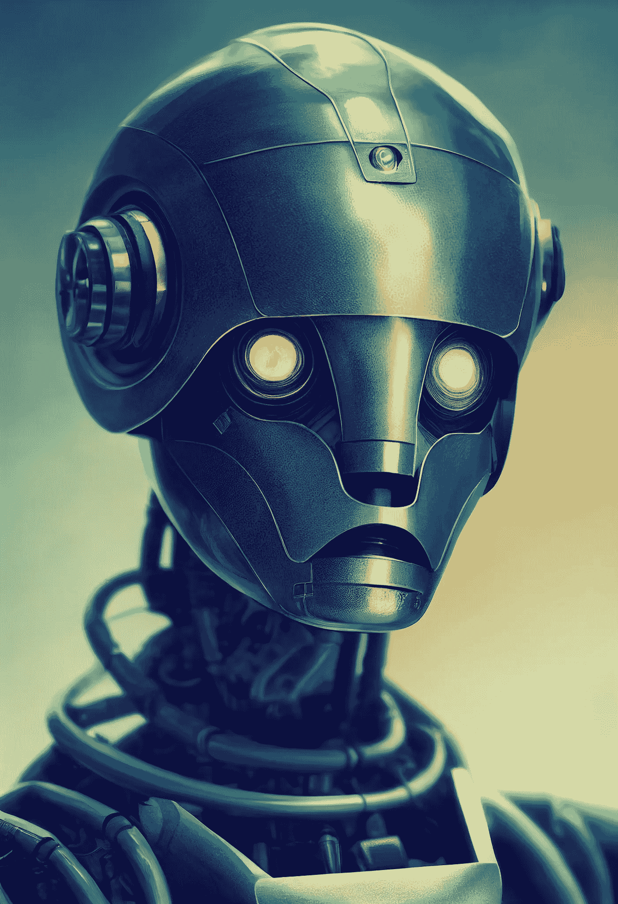

# 64%的互联网流量都是僵尸程序！

> 原文：<https://medium.com/mlearning-ai/64-of-internet-traffic-are-bots-136d4880fb5b?source=collection_archive---------5----------------------->

## 这对你的在线业务意味着什么？

Image by [Stella Sky](/@StellaSky)

今天，当我在 YouTube 上听到这句话时，我震惊了。Jean Nolan 在他的视频中说，机器人正在接管互联网，大约 64 %的机器人访问你的网站、你的社交媒体账户和你的广告，这些都是你付费的。